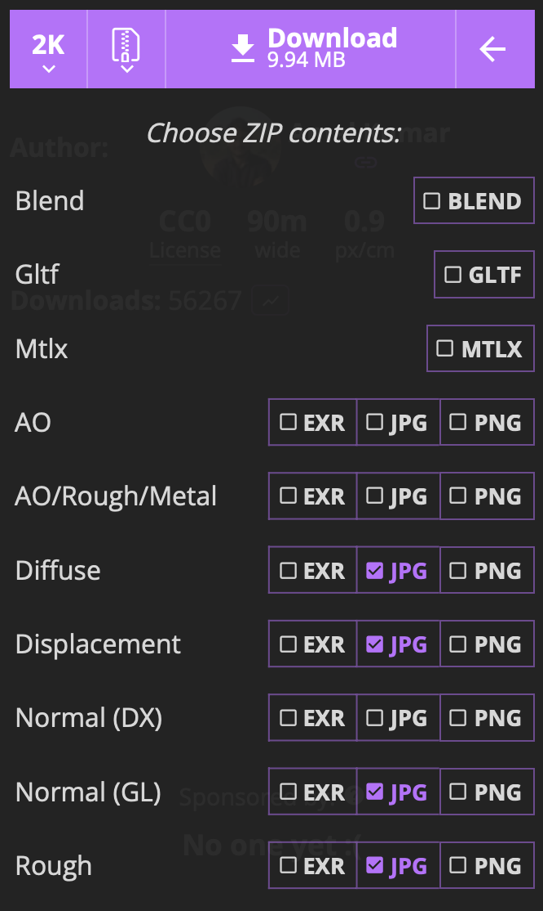

# Materials

> **Important!** Per veure els materials adequadament, assegura't de tenir el *Viewmode* a **Shaded** o bé **Shaded wireframe**.

Per posar colors als objectes d'una escena 3D, es defineix les propietats del material que les composa.

Originalment tots els objectes tenen un material per defecte:

 

## Metall

A la carpeta **"Assets > Materials"** crea un nou material amb:

*Create > Material*

Anomena al material **"Shine Blue"**.

Al *Inspector* del nou material veuràs les propietats d'aquest material. Defineix:

- Base Map: color blau
    - R: 25
    - G: 200
    - B: 240
    - A: 255 (opac)

Arrosega el material **"Shine blue"** a l'esfera.

Per fer que sigui més "shiny" (brillant) aumenta els valors de:

- Metalic map: 1
- Smoothness: 0.65
- Source: Metallic Alpha

Bàsicament hem creat un material metàlic, i per tant brillant.

Canvia els paràmetres anteriors per veure com respon el nou material a la llum.

 

**Aspectes habituals**

Alguns aspectes típics que pots aconseguir:

- **Metall polit**: Metallic = 1, Smoothness = 0.8–1.0
- **Metall envellit / rugós**: Metallic = 1, Smoothness = 0.2–0.5, més Normal map i textures d’oxidació
- **Plàstic brillant**: Metallic = 0, Smoothness = 0.5–0.7
- **Plàstic mat**: Metallic = 0, Smoothness = 0.1–0.3
- **Vidre / ceràmica**: Metallic = 0, Smoothness molt alt (0.8–1), i Albedo clar
- **Fusta**: Metallic = 0, Smoothness = 0.2–0.4 amb bona textura d’Albedo i Normal map
- **Pell**: Metallic = 0, Smoothness = 0.4–0.6, amb mapes de Subsurface scattering (millor a HDRP).

## Plàstic

A la carpeta **"Assets > Materials"** crea un nou material amb:

*Create > Material*

Anomena al material **"Mate Green"**.

- Base Map: color verd
    - R: 50
    - G: 240
    - B: 25
    - A: 255 (opac)

- Metalic map: 0
- Smoothness: 0.6
- Source: Metallic Alpha

A la pre-visualització del material (a baix de tot a l'inspector), mostra'l en forma d'esfera per veure com reflexa la llum.

 

Arrosega el nou material **"Mate green"** a la càpsula.

## Textures

A la pàgina:

[Poly Heaven](https://polyhaven.com)

Hi ha de recursos gratuïts per fer videojocs.

Descarregarem la textura **"Rock Wall 15"**:

[Poly Heaven - Rocky Terrain](https://polyhaven.com/a/rocky_terrain)

Escull per descarregar, i les opcions de la imatge:

- 2K
- Zip

 

Arrossega els materials descarregats a la carpeta: 

*Assets > Textures*

 

Cada una d'aquestes textures, informa d'unes propietats que fan falta per fer el material més realistic:

- **rocy_terrain_ao_2k**: 
- **rocy_terrain_arm_2k**: 
- **rocy_terrain_diff_2k**: 
- **rocy_terrain_disp_2k**: 