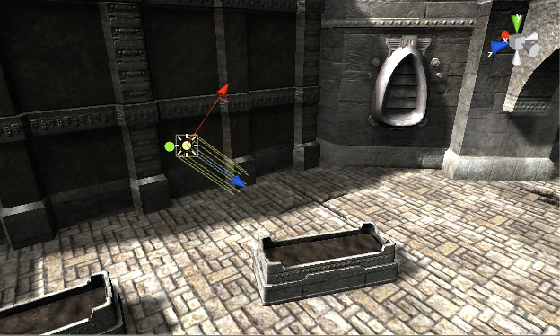
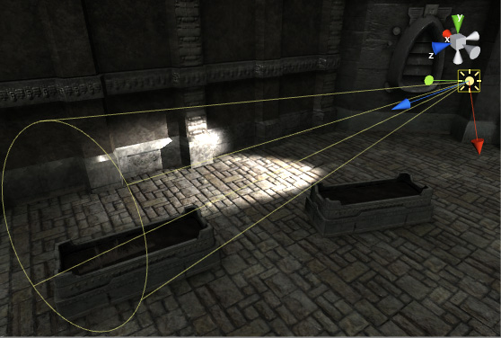
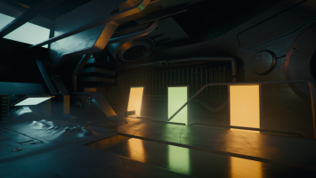
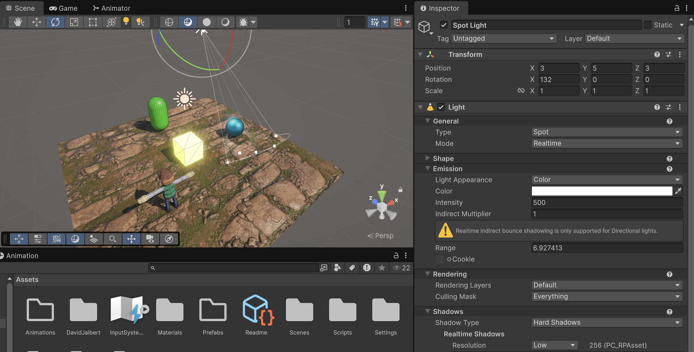
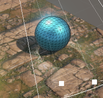
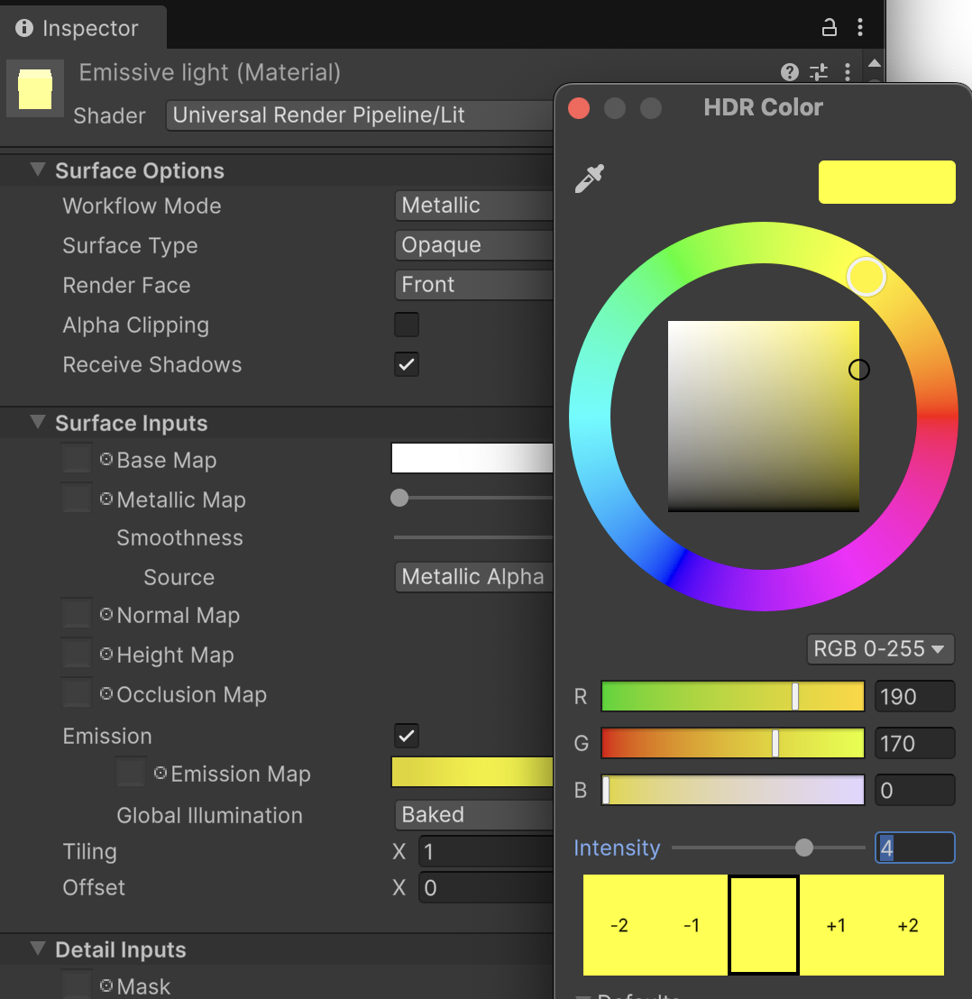
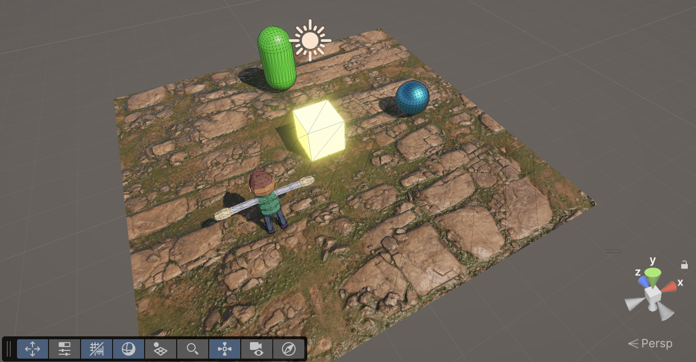
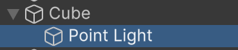
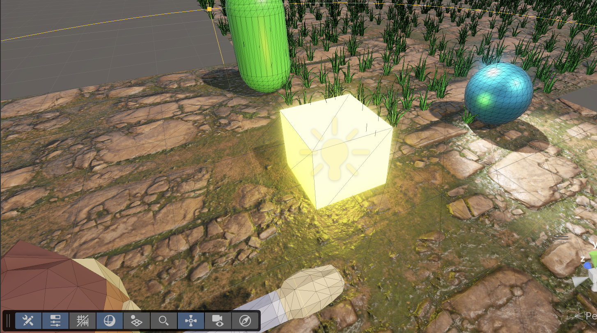

# LLums

Als motors 3D hi ha diferents tipus d'il·luminació:

## ☀️ Directional Light
Projecta raigs de llum **paral·lels** des d’una direcció infinita.
- **No té posició**, només **rotació**.  
- S’usa per simular **el Sol** o qualsevol font molt llunyana.  
- **Efecte**: il·lumina tota l’escena de manera uniforme, sense pèrdua d’intensitat amb la distància.  

 

## 💡 Point Light
Una llum que surt **en totes direccions** des d’un punt concret.  
- La intensitat **disminueix amb la distància** segons un radi d’atenuació.  
- S’usa per bombetes, focs, espelmes, faroles, etc.  
- **Efecte**: com una bombeta esfèrica.  

 

## 🔦 Spot Light
Una llum amb forma de **con**.  
- Té **posició** i una **direcció**, amb un **angle d’obertura** que pots ajustar.  
- També té un radi d’atenuació com la Point Light.  
- S’usa per focus de teatre, llanternes, fars de cotxe…  
- **Efecte**: un feix de llum concentrat.  

 

## 🟨 Area Light
Simula una **superfície lluminosa rectangular** (o en HDRP també disc).  
- No és un punt, sinó una àrea que emet llum.  
- En el render en temps real està limitat (no funciona en totes les pipelines sense baking).  
- S’usa per fluorescents, pantalles, finestres amb llum entrant…  
- **Efecte**: ombres més suaus i realistes perquè la llum ve d’una superfície gran, no d’un punt.  

 

# Spot Light amb sombres

Afegeix una *Light > Spot light* a l'escena, amb els paràmetres:

- Position X: 3
- Position Y: 5
- Position Z: 3
- Rotation X: 132
- Rotation Y: 0
- Rotation Z: 0
- Light > Emission > Intensity: 500
- Light > Shadows > Shadow Type: Hard Shadows
- Light > Shadows > Shadow Type > Resolution: Low

**Nota:** Fixa't que no ha mostrat la sombra fins que l'hem activat. *"Hard Shadows amb Resolution low"* requereix menys recursos que *"Soft Shadows amb Resolution High"*

**Nota:** Fixa't que ara l'esfera té dues sobres, la de la llum **"Directional Light"** de l'escena, i la de **"Spot Light"** que apunta l'esfera

 

 

## Materials emissius

No són pròpiament llums, però es pot fer que un material sembli que emet radiació llumínica.

A la carpeta **"Assets > Materials"** crea un nou material amb:

*Create > Material*

Anomena al material **"Emissive light"**. Amb propietats:

- Emission: (activat)
- Emission map:
    - Red: 190
    - Green: 170
    - Blue: 0
    - Intensity: 4

 

Assigna aquest nou material a l'objecte **"Cube"**

 

**Important!** Un material *"Emissive"* no emet sombres! Cal afegir algun tipus de llum aprop seu, que faci aquesta funció.

Afegeix una **"Light > Point Light"** com a filla de l'objecte **"Cube"**, amb paràmetres:

- Color: Groc
    - Red: 190
    - Green: 170
    - Blue: 0
- Intensity: 10
- Shadow Type: Hard Shadows
- Resolution: Low

 

Així quan el cub es mogui, iluminarà els objectes propers.

 
