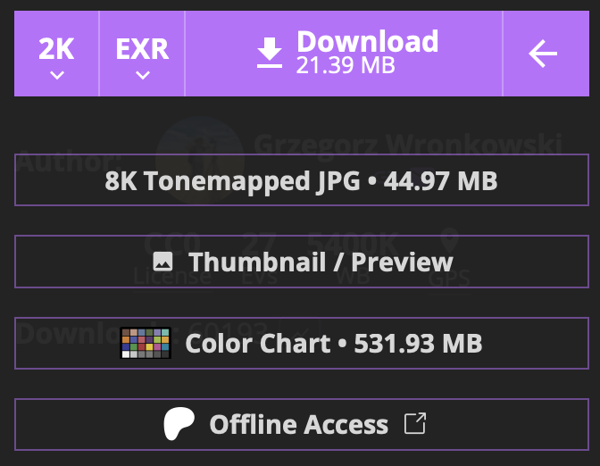
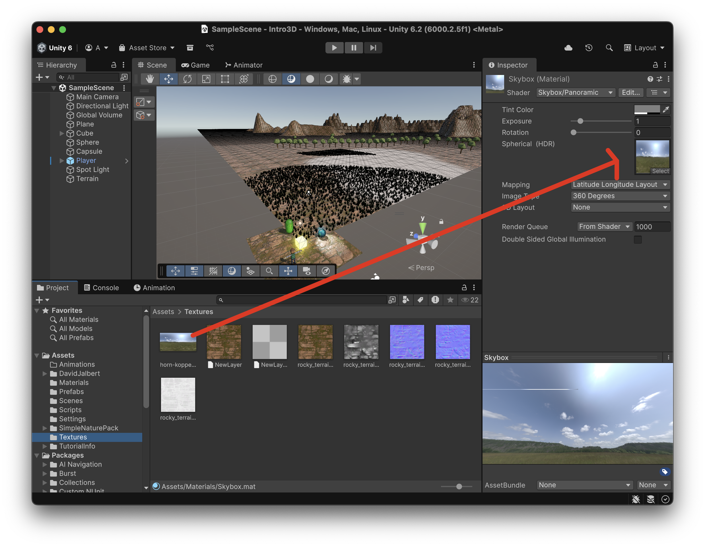
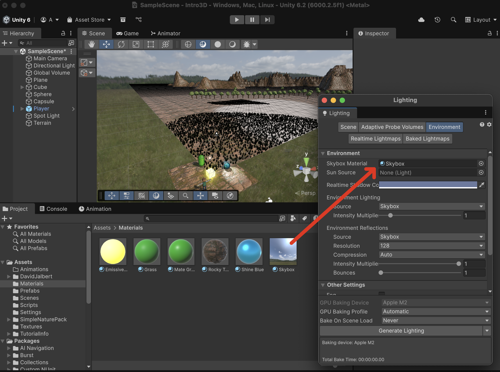
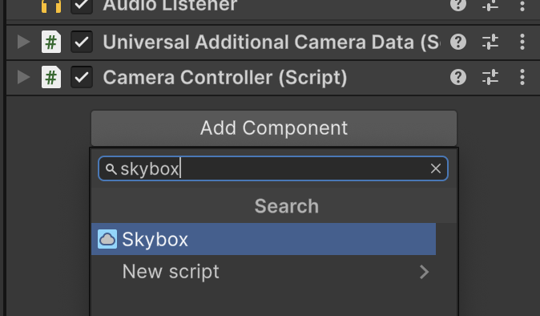
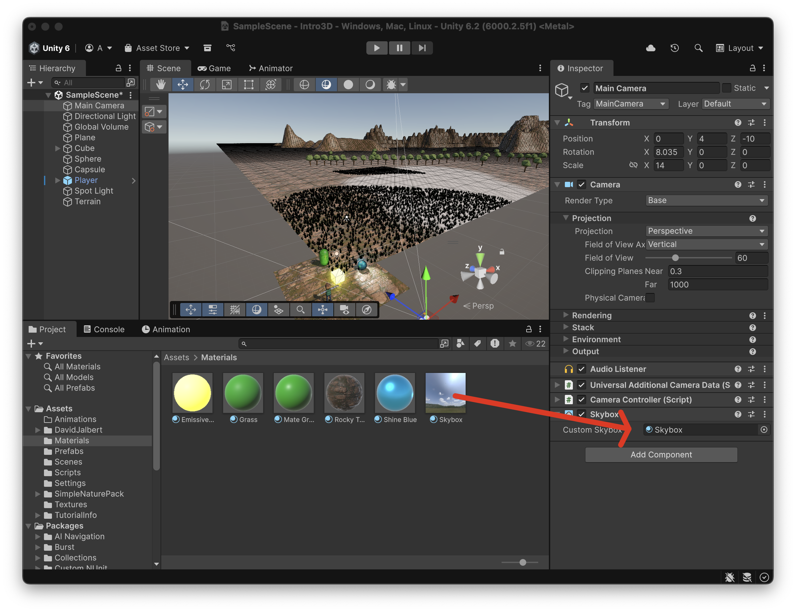

# Skybox

Per donar l'aspecte visual de l'horitzó (el cel), es fa servir **"Skyboxes"**, que són una o més imatges que la càmera dibuixa com a l'objecte més llunyà.

## Imatge

Hi ha diferents tipus d'imatge per fer materials tipus **"Skybox"**:

- **6 sided**: on cada cara és una imatge que respresenta el costat d'un cub
- **Panoramic 360º**: una imatge panoràmica projectada en una esfera
- **Procedural**: en lloc d'imatges un *shader* defineix el què es dibuixa

Descarrega aquesta imatge de 360º:

[Polyhaven Horn-koppe Sprint](https://polyhaven.com/a/horn-koppe_spring)

Escull el format:

- 2K
- EXR

 

Si no existeixen, crea les carpetes:

- Assets > Textures
- Assets > Materials

Aleshores:

- Arrossega la imatge descarregada a la carpeta **"Assets > Textures"**

- Crea un nou material a la carpeta **"Assets Textures"** anomenat **"Skybox"**

- A l'inspector del material **"Skybox"**

    - Desplega **"Shader"**
    - Busca **"Skybox"**
    - Escull **"Skybox Panoramic"**

skybox-dragetexture

    - Arrossega la textura de 360º descarregada a l'apartat **"Spherical (HDR)"**

## Skybox d'escena

Aquests materials no es fan servir sobre d'objectes, sinó que es configuren a l'escena.

- Anar a:

*Menu Window > Rendering > Lighting*

- Escull la pestanya **"Environment"**

 

## Skybox de càmera

Els **"Skybox"** es poden configurar a nivell de càmera, *(però per defecte agafen el de l'escena)*.

Escull la **"Main Camera"**:

- Afegeix un component tipus **"Skybox"**

 

- Arrossega el material **"Skybox"** cap al component **"Skybox > Custom Skybox"** de la càmera

 

