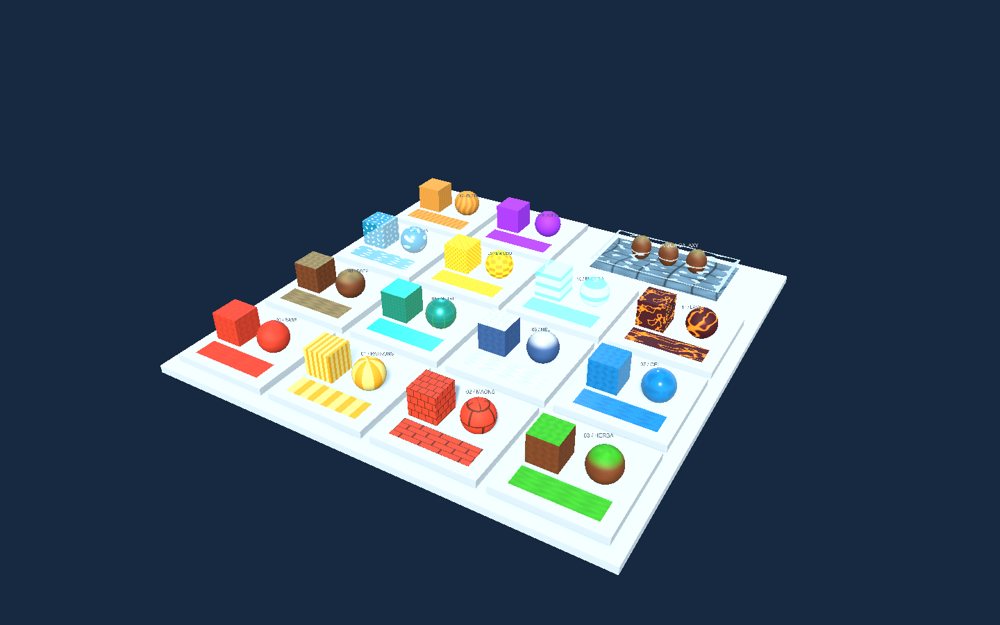
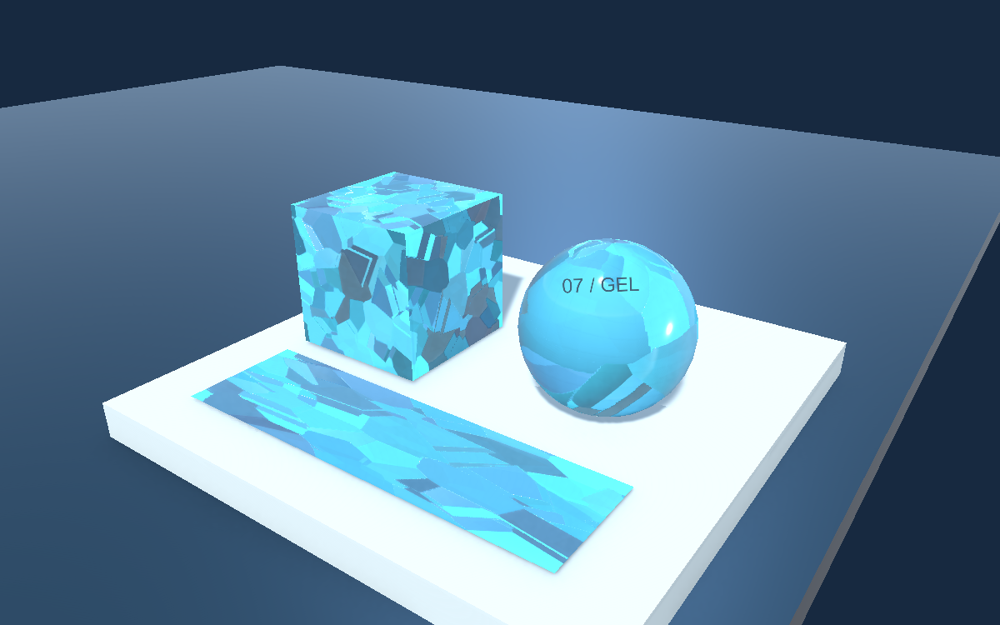
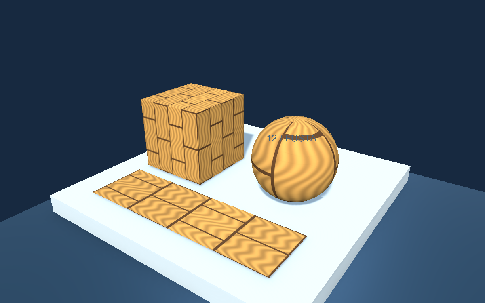
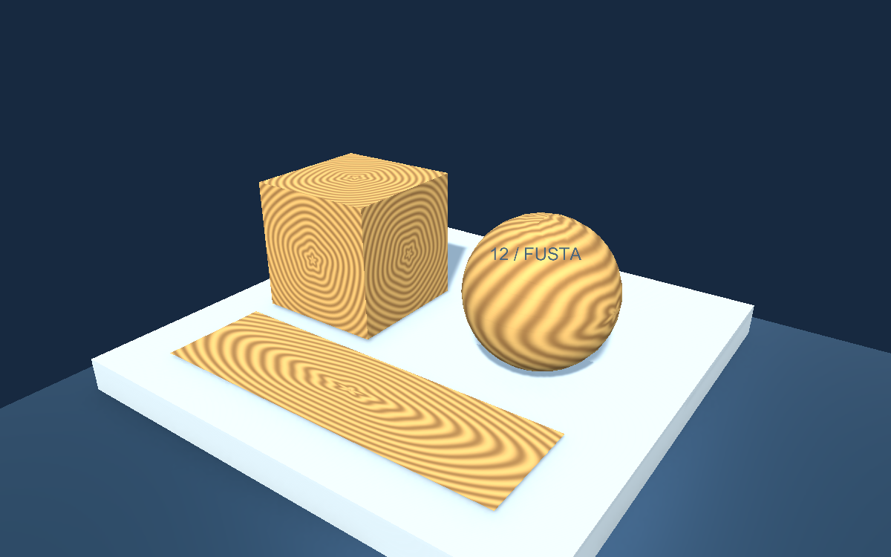
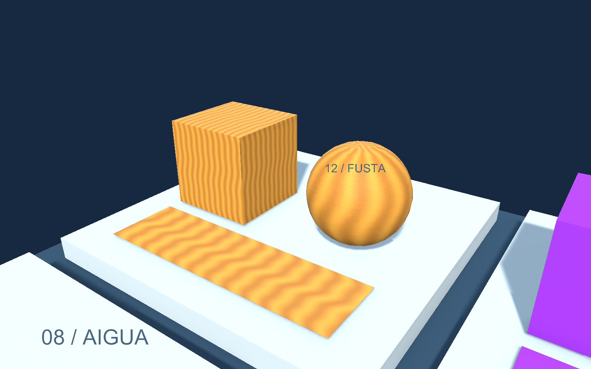
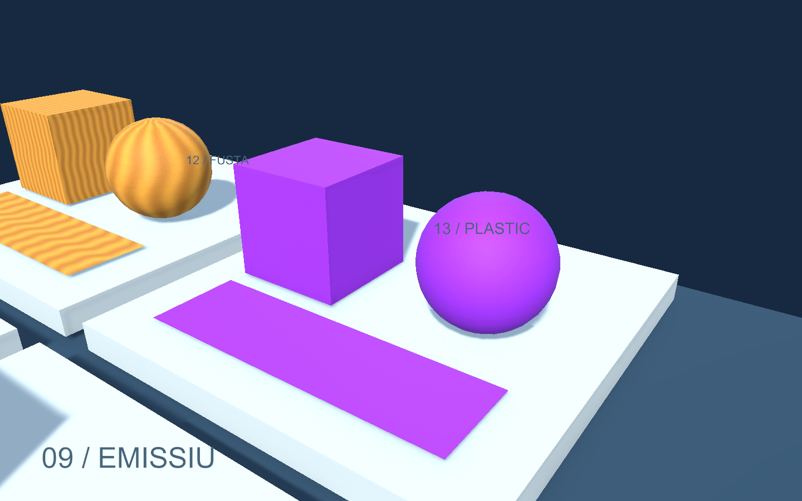

# Biblioteca de materials per a jocs

Una col·lecció de **14 famílies de materials estilitzats per a URP**, pensada per a jocs infantils: colors vius, textures suaus i paràmetres fàcils d’ajustar. Els Shader Graphs són editables i les textures s’han creat per a aquesta biblioteca. No conté recursos extrets de jocs comercials.

## Descàrregues

- [Projecte complet amb el catàleg — Biblioteca-Materials.zip](demos/Biblioteca-Materials.zip): per explorar els materials, comparar-los i editar els grafs.
- [Biblioteca importable — DAM-Shaders.unitypackage](demos/DAM-Shaders.unitypackage): per incorporar els materials a un altre projecte URP.



El catàleg conserva la càmera, la llum principal i Global Volume de **Universal 3D**. El ZIP s’ha revisat també el 9 d’octubre de 2026: obertura automàtica i prova de les 15 famílies per separat.

## Què inclou

| Família | Aspecte i ús | Paràmetres principals |
|---|---|---|
| **00 · Base** | Pintura de color amb gra suau; peces i plataformes | Color, escala, textura Gra, NormalSuau, relleu i brillantor |
| **01 · Patrons** | Línies, quadres o cercles; superfícies de joguina | ColorA, ColorB, Escala, Gruix i Mode: 0 línies, 1 quadres, 2 cercles |
| **02 · Maons** | Maons càlids amb juntes i relleu discret | Color, Junta, Escala, Relleu i Brillantor |
| **03 · Herba** | Terra amb verd a les cares que miren amunt | Base, Superior, Llindar, Escala i Relleu |
| **04 · Roca** | Pedra de tons càlids amb variació de textura | Base, Superior, Llindar, Escala i Relleu |
| **05 · Metall** | Metall pintat turquesa amb juntes lluminoses | Color, Metallic, ColorLlum, Intensitat i Brillantor |
| **06 · Neu** | Base blavosa i cobertura blanca a la part superior | Base, Superior, Llindar i Relleu |
| **07 · Gel** | Cristalls interiors amb paral·laxi de dues capes i facetes | MapaAltura, Color, ColorCristall, Profunditat, Esquerdes, Relleu i Brillantor |
| **08 · Aigua** | Aigua transparent amb reflexos animats | Color, Velocitat, Opacitat, EscumaContacte i AmpladaEscuma |
| **09 · Emissiu** | Franges lluminoses animades per a senyals i llums | Color, Intensitat, Velocitat, Escala i Brillantor |
| **10 · Energia** | Holograma blau amb franges i efecte de vora | Color, Frequencia, Velocitat, Opacitat i Intensitat |
| **11 · Lava** | Escorça de color pruna amb esquerdes taronja | Escorca, Calor, Intensitat, Velocitat i Escala |
| **12 · Fusta** | Veta suau de tons mel | Fosc, Clar, textura Fusta, Escala, Relleu i Brillantor |
| **13 · Plàstic** | Plàstic de color violeta, mat o brillant | Color i Brillantor |

S’inclouen materials preparats per als tres modes de Patrons, l’aigua amb escuma de contacte i el plàstic brillant. Canvia el Color per obtenir peces verdes, grogues, coralls o turqueses sense crear un shader nou.

També hi ha un **prefab d’aigua Galaxy**, amb dos grafs addicionals: un per als reflexos i l’escuma de la superfície, i un altre per a la distorsió, les càustiques i el tint del fons. En total són **16 Shader Graphs i 36 materials**.

Les animacions fan servir el node **Time** de Shader Graph: no necessiten DemoControls, cap script que actualitzi `_Temps` ni una escena especial. La càmera i els botons de navegació pertanyen només al catàleg.

## Obrir el projecte de catàleg

1. Descomprimeix **Biblioteca-Materials.zip**.
2. A Unity Hub, selecciona **Add > Add project from disk** i tria la carpeta que conté Assets, Packages i ProjectSettings.
3. Obre-la amb **Unity 6000.6.3f1**. El projecte utilitza **Universal RP i Shader Graph 17.6.0**, i **Input System 1.20.0** per als controls del catàleg.
4. Espera que Unity resolgui els paquets i importi els recursos.
5. S’obrirà automàticament **CatalegMaterials**. Prem Play. Per tornar-hi després, utilitza **Demo > Obrir escena principal**.
6. El catàleg comença amb Base aïllat. Clica una família per mostrar només els seus exemples i apropar-t’hi. Mantén el **botó dret** i arrossega per orbitar; utilitza la **roda** per fer zoom. **Home** recupera la vista general i **H** amaga el panell.

Cada família té un cub, una esfera i un pla. Són superfícies de prova: el material no afegeix geometria, col·lisions ni comportaments de joc. El gel no fa relliscar el personatge i la lava no causa dany per si sola.

## Organització de la Hierarchy

Els exemples estan agrupats sota l’objecte buit **Exemples**. Cada família té un grup propi: **00-Base**, **01-Patrons**, **02-Maons**, **03-Herba**, **04-Roca**, **05-Metall**, **06-Neu**, **07-Gel**, **08-Aigua**, **09-Emissiu**, **10-Energia**, **11-Lava**, **12-Fusta**, **13-Plastic** i **14-AiguaGalaxy**.

Cada grup conté el pedestal, el cub, l’esfera, el pla i l’etiqueta. El grup Galaxy conté el seu conjunt d’aigua, fons, roques i etiqueta. La càmera, les llums i la base general queden fora dels grups.

Selecciona un grup a la **Hierarchy** i marca o desmarca la casella d’activació al costat del nom, a dalt de l’**Inspector**. S’activarà o desactivarà tota la família. L’ull de la Hierarchy només controla la visibilitat de l’editor; per desactivar també el renderitzat durant Play, utilitza la casella de l’objecte. Fora de Play, desa l’escena per conservar la selecció de grups actius.

El taller i els botons del catàleg utilitzen aquests mateixos grups, amb referències assignades al component Cataleg. En entrar en Play, el catàleg comença mostrant Base; pots canviar de família amb el panell o activar altres grups manualment.

## Ajustar materials amb menys càrrega

Obre **DAM > Materials: taller individual** amb l’escena CatalegMaterials oberta. No cal Play per ajustar colors, textures, relleu o brillantor.

- **Botó amb el nom d’una família:** aïlla els seus objectes i mostra el material al taller.
- **Caselles:** combina diverses famílies per comparar-les, per exemple Fusta i Plastic.
- **Botons M_…:** seleccionen els materials i variants de la família. Galaxy ofereix superfície i fons.
- **Paràmetres del taller:** editen l’asset del material, amb Undo. Duplica el material abans si vols conservar l’original; assigna la còpia als objectes per veure-la aplicada.
- **Mostrar totes les famílies:** recupera el catàleg complet.

L’aïllament desactiva els objectes dels altres exemples; no només els deixa fora de la càmera. Fora de Play, els canvis de visibilitat formen part de l’escena i es poden desfer. En Play, el catàleg també aïlla la família seleccionada; Home recupera tots els exemples.

Per veure les animacions, entra en Play i selecciona la família al panell. La compilació inicial dels shaders pot continuar trigant. Si tens altres editors Unity executant demos en Play, també comparteixen els recursos de l’ordinador. L’aïllament s’ha comprovat amb les 15 famílies i amb combinacions; no s’ha mesurat un augment concret d’FPS.

## Importar el `.unitypackage` en un projecte dels alumnes

### 1. Preparar el projecte de destinació

Utilitza un projecte **Universal 3D / URP**. La biblioteca s’ha preparat amb les versions indicades més amunt; no és una biblioteca per a Built-in Render Pipeline ni HDRP. Importar el paquet no canvia el render pipeline del projecte.

Comprova al Package Manager que Universal RP i Shader Graph estan disponibles. El `.unitypackage` conté recursos, **no instal·la els paquets de Unity**. La biblioteca de materials no necessita Input System; aquesta dependència és només del catàleg complet.

### 2. Importar

1. Descarrega **DAM-Shaders.unitypackage**.
2. A l’editor del projecte de destinació, ves a **Assets > Import Package > Custom Package…**.
3. Selecciona el fitxer `.unitypackage`.
4. Deixa marcats tots els elements de **Assets/DAMShaders/Library** i prem **Import**. Els materials necessiten els seus grafs i textures.
5. Espera que Unity acabi la importació i la compilació dels shaders.

El paquet crea aquesta estructura:

```text
Assets/DAMShaders/Library/
├── Shaders/       # 16 Shader Graphs editables
├── Materials/     # 36 materials configurats
├── Textures/      # textures de color, màscares i normal
└── Prefabs/       # AiguaGalaxy.prefab
```

No inclou ProjectSettings, paquets, càmeres, llums, scripts ni l’escena de catàleg. Per tant, la importació no substitueix la configuració URP ni els controls del projecte dels alumnes.

### 3. Aplicar i personalitzar

1. Crea un cub o selecciona un objecte amb Mesh Renderer.
2. Arrossega, per exemple, **Materials/M_Plastic.mat** sobre l’objecte.
3. Per personalitzar-lo, selecciona el material i fes **Duplicate**. Mou la còpia a la carpeta de materials del teu joc i dona-li un nom, com `M_PlasticGroc`.
4. Canvia **Color** i **Brillantor** a l’Inspector. Els objectes que utilitzin la còpia compartiran aquests valors.
5. Per canviar la construcció de l’efecte, obre el `.shadergraph` corresponent. Si vols conservar l’original, duplica també el graf i assigna’l al material nou.

Modificar un material compartit afecta tots els objectes que l’utilitzen. Els paràmetres del material es conserven en sortir de Play només si els has editat com a assets; els canvis de components de l’escena fets durant Play són temporals.

### 4. Copiar la carpeta com a alternativa

També pots copiar **tota la carpeta Assets/DAMShaders/Library** del projecte de catàleg a la carpeta Assets d’un altre projecte URP. Conserva els arxius **`.meta`**, encara que el Finder els amagui: contenen els GUID amb què els materials troben els grafs i les textures.

Copia la carpeta sencera, no només els `.mat`. Si la biblioteca ja existeix al projecte, evita crear-ne una segona còpia amb els mateixos `.meta`. Conserva els materials personalitzats fora de la biblioteca abans d’actualitzar-la: reimportar el mateix paquet pot substituir els assets originals.

## Aigua i requisits especials

**M_Aigua** anima reflexos i transparència sense necessitar escuma de contacte. **M_AiguaEscuma** activa aquesta escuma: al projecte de destinació cal habilitar **Depth Texture** a l’URP Asset actiu i permetre que la càmera generi la textura de profunditat. Les roques i altres superfícies de contacte han de participar en la profunditat de l’escena; els materials transparents no acostumen a fer-ho.

Per a la variant Galaxy, arrossega **Prefabs/AiguaGalaxy.prefab** a l’escena. Porta superfície, fons i roques per veure el resultat immediatament. També necessita Depth Texture per a l’escuma al voltant de les roques. **NivellAigua** de M_GalaxyFons és l’altura Y del món de la superfície: el prefab es desa amb l’aigua a **Y = 0.8**. Si el mous verticalment, duplica el material del fons i ajusta aquest valor a l’altura nova.

La distorsió Galaxy deforma les UV del material del fons; no refracta automàticament qualsevol objecte submergit. L’escuma de la vora exterior utilitza les UV d’un pla rectangular. La biblioteca no simula fluids.

**Gel** és opac per facilitar-ne l’ús. **Aigua** i **Energia** són transparents: evita acumular moltes capes superposades. **Emissiu, Metall i Lava** poden produir colors més brillants; si vols un halo al voltant, activa Bloom al sistema de postprocessament del teu projecte. El material emissiu per si sol no substitueix una llum.

## Variants i textures

Les textures són PNG generades prèviament; no es recalculen amb Voronoi o soroll a cada píxel durant el joc. Pots substituir-les i ajustar els paràmetres del shader. Un shader procedural en temps real seria una alternativa més flexible, amb més cost de càlcul.

| Família | Variants addicionals |
|---|---|
| Fusta | VetaFina, Nusos, Taulons, Anells i Noguer (acabat fosc de Nusos) |
| Roca | Granit, Estrats i GraFi |
| Maons | Petits, Blocs i Allargats |
| Gel | Fi i Glacera, amb escala, profunditat i relleu diferents |

Al taller, selecciona una família, tria un botó **M_…** i prem **Aplicar aquest material als exemples**. Això canvia el material del cub, l’esfera i el pla. Fora de Play, el canvi de l’escena es pot desfer amb Undo; en Play és temporal. Editar els paràmetres de l’asset sí que modifica el material compartit.

El gel combina dues mostres de cristalls; la capa interior utilitza **Parallax Mapping**, amb MapaAltura i la direcció de la càmera en espai tangent. **Profunditat = 0** elimina aquest desplaçament. És una il·lusió de profunditat sobre un material opac, no una simulació de refracció o reflexions múltiples dins del volum. El normal map de facetes modifica els reflexos de la il·luminació. Fi i Glacera comparteixen els mapes del gel amb paràmetres diferents. Els materials GelCristallsV1, V2 i V3 porten tres jocs addicionals coordinats de cristalls, normals i altura.







## On són els mapes d’altura i les noves textures?

Tots són a **Assets/DAMShaders/Library/Textures**. Hi ha **84 PNG**, inclosos **22 mapes d’altura**. S’han afegit tres variants per cadascun dels 13 tipus següents. El sufix `-V1`, `-V2` o `-V3` identifica les noves textures; els originals es conserven.

| Tipus | Fitxers nous | Camp o ús |
|---|---|---|
| Càustiques | Caustiques-V1/V2/V3.png | TexturaCaustiques del fons Galaxy |
| Distorsió | Distorsio-V1/V2/V3.png | Distorsio del fons Galaxy; canals R/G |
| Reflexos d’aigua | Ripples-V1/V2/V3.png | Ripples d’Aigua o Galaxy |
| Gra | Gra-V1/V2/V3.png | Gra de Base, Herba i Neu |
| Fusta | Fusta-V1/V2/V3.png | Fusta |
| Roca | Roca-V1/V2/V3.png | Roca |
| Maons | Maons-V1/V2/V3.png | Maons |
| Metall | Metall-V1/V2/V3.png | Metall |
| Pedres del fons | Pedres-V1/V2/V3.png | Pedres del fons Galaxy |
| Patró de gel superficial | Gel-V1/V2/V3.png | Recursos per a grafs propis; el gel profund utilitza Cristalls |
| Normals suaus | NormalSuau-V1/V2/V3.png | NormalSuau de Base |
| Cristalls de gel | GelCristalls-V1/V2/V3.png | Cristalls de Gel |
| Normals de cristalls | GelFacetesNormal-V1/V2/V3.png | NormalFacetes de Gel |

Per provar una textura, duplica el material, selecciona’l al taller i arrossega el PNG al camp corresponent. Prem **Aplicar aquest material als exemples**. En Galaxy, tria el material del **fons** per provar càustiques, distorsió o pedres.

### Altura, normals i profunditat de l’escena

- **Mapa d’altura:** escala de grisos que descriu el relleu local. S’importa com a dades lineals, amb sRGB desactivat. El gel utilitza `GelAltura.png` o `GelAltura-V1/V2/V3.png` al camp **MapaAltura**. Les regions fosques representen cotes més baixes i les clares, més altes.
- **Mapa de normals:** modifica l’orientació aparent de la superfície i, per tant, els reflexos. Té importació **Normal map**. No substitueix el mapa d’altura.
- **Depth Texture de la càmera:** es genera durant el renderitzat per conèixer la profunditat de l’escena. L’aigua la utilitza per a l’escuma de contacte; no és un PNG de la biblioteca.

Hi ha 18 mapes auxiliars: `FustaAltura-V1/V2/V3`, `RocaAltura-V1/V2/V3`, `MaonsAltura-V1/V2/V3`, `MetallAltura-V1/V2/V3`, `PedresAltura-V1/V2/V3` i `GelSuperficieAltura-V1/V2/V3`. Corresponen a les textures del mateix tipus i variant. **Els shaders d’aquests materials no tenen encara una entrada independent per a aquests mapes:** es proporcionen per construir grafs amb Parallax Mapping o Normal From Height. Els shaders originals continuen obtenint el relleu del canal de la textura que ja tenien connectada.

### Gel amb profunditat exagerada

Prova **Profunditat = 0.28** al material Gel o **0.4** a Glacera, i orbita la càmera. Posa-la a **0** per comparar. El valor controla l’amplitud de l’efecte en UV, no centímetres físics de l’objecte. Valors elevats poden estirar les textures o mostrar discontinuïtats a les unions de les UV i en angles rasants.

Els tres materials **M_GelCristallsV1/V2/V3** ja tenen el mapa d’altura, els cristalls i les normals de la mateixa variant. Canviar només un mapa pot desalinear-los. L’efecte modifica l’interior aparent, no la silueta ni les col·lisions. És una aproximació visual al gel de la referència; no s’ha confirmat la tècnica del joc original.

## Fusta i plàstic



La fusta utilitza una textura de veta repetible. Per canviar la direcció de la veta, orienta les UV de la malla. Escala controla quantes vegades es repeteix; en una malla allargada, unes UV ben preparades eviten estiraments.



M_Plastic parteix d’un acabat suau; M_PlasticBrillant incrementa Brillantor. El plàstic no té resposta metàl·lica. La il·luminació de l’escena també determina com es veuen els reflexos.

## Si un material no es veu com al catàleg

- **Rosa:** comprova que el projecte és URP, que els paquets són compatibles i que no falten textures o grafs. Espera la compilació i consulta la consola.
- **Massa fosc:** comprova les llums i l’ambient. El catàleg utilitza il·luminació suau i clara; els materials Lit responen a les llums del teu joc.
- **Textura estirada:** revisa les UV de la malla i Escala. Els materials de la biblioteca no generen UV per a una malla que no en té.
- **Herba o neu al costat equivocat:** la cobertura utilitza la normal en espai de món. Girar l’objecte canvia quines cares miren amunt. Ajusta Llindar; mantén-lo per sota de 0.85 per conservar una transició suau.
- **No es veu l’animació:** prem Play i comprova que Velocitat no sigui zero. Una miniatura de material no és una prova fiable de l’animació de l’escena.
- **No hi ha halo emissiu:** configura Bloom; la biblioteca no modifica els volums de postprocessament del teu projecte.

## Comprovació

Provat amb Unity 6000.6.3f1 a macOS. S’han comprovat la compilació i les referències de textura dels 36 materials, i s’han renderitzat totes les variants de fusta, roca, maons i gel. El gel s’ha renderitzat des de dos angles i s’ha comparat amb Profunditat a zero: el paràmetre modifica el resultat. També s’ha comprovat l’aïllament de les 15 famílies i les combinacions al taller. No s’ha mesurat un guany concret d’FPS ni s’ha validat en Windows o Linux.

L’ampliació s’ha comprovat amb 84 textures i 36 materials: variants diferents, mapes d’altura lineals, importació dels normals i compilació dels shaders. El gel s’ha comparat amb profunditat zero i amb un mapa gris uniforme; tots dos canvis modifiquen el resultat. S’han renderitzat també els tres jocs nous de cristalls.
