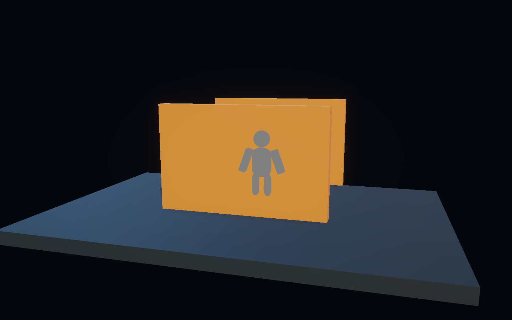
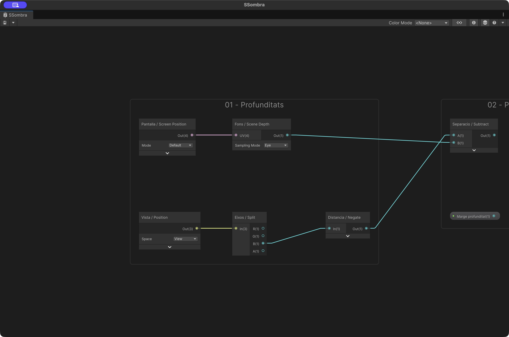
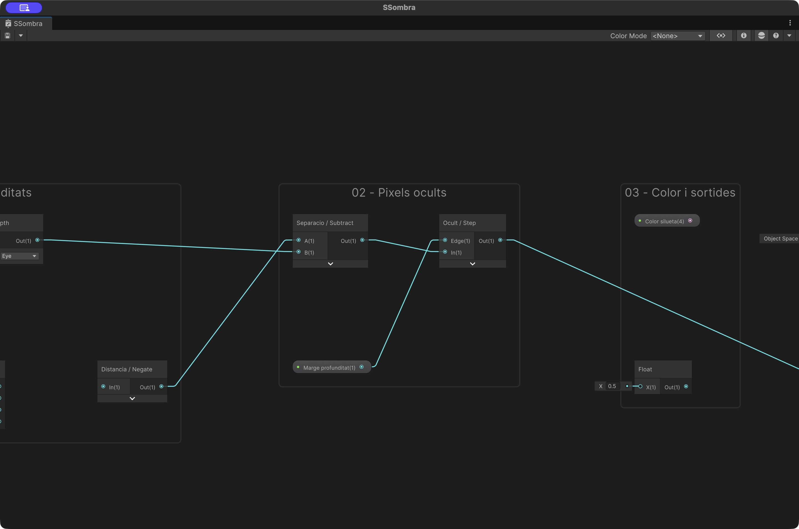
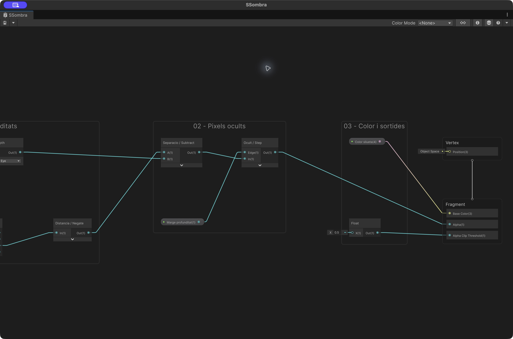
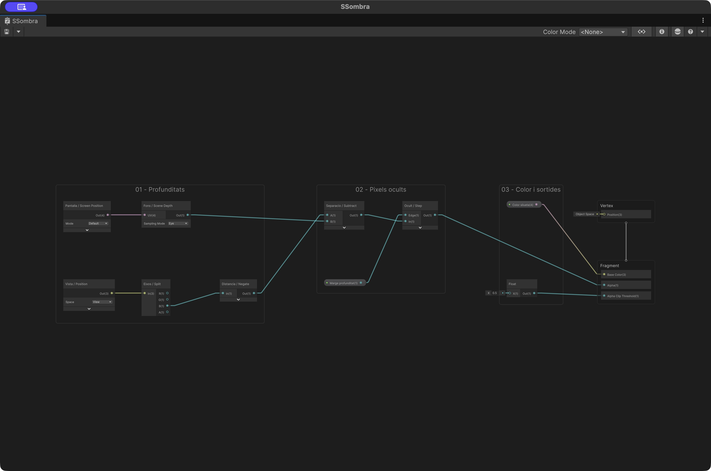
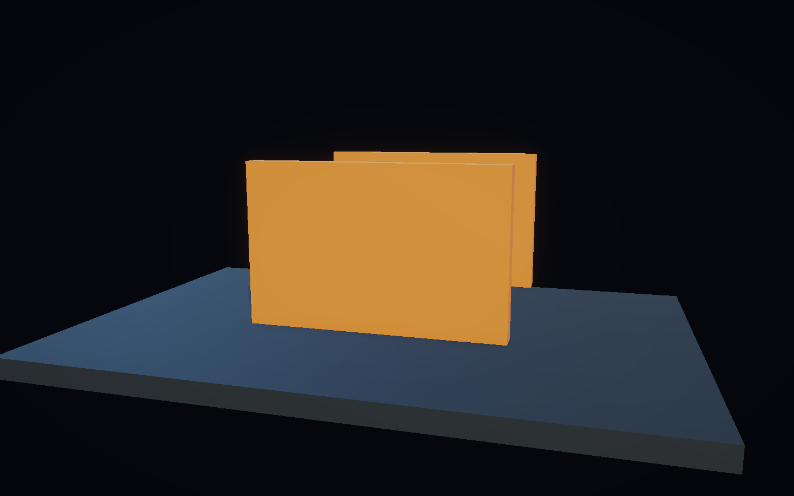
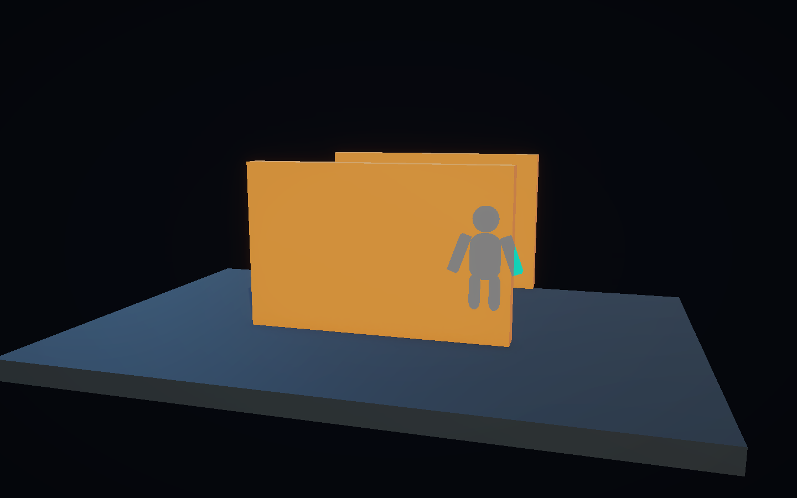
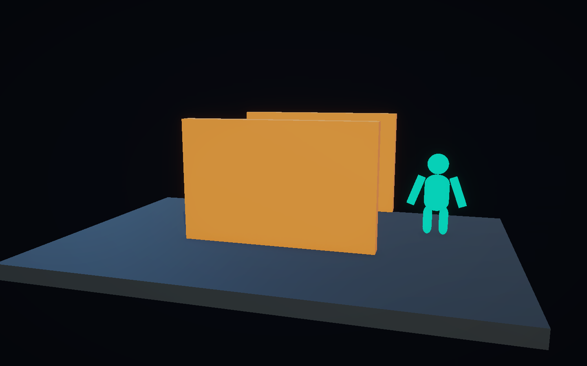

# Demo 7: Sombra — silueta del personatge darrere d’una paret

Quan una paret tapa el personatge, mostrarem la seva silueta plana emplenada en gris. La paret es manté opaca: no hi ha forat. Les parts que sobresurten de la paret continuen amb el color normal del personatge.

**Projecte acabat:** [Demo-7-Sombra.zip](demos/Demo-7-Sombra.zip). Descomprimeix-lo i afegeix la carpeta amb Assets, Packages i ProjectSettings a Unity Hub. La primera importació obre automàticament `Assets/Demos/Sombra/Scenes/DemoSombra.unity`. Prem Play i clica Game. Els materials poden trigar una estona a carregar-se.



## 1. Partir de Universal 3D

1. Amb **Unity 6000.6.3f1**, crea un projecte **Universal 3D (URP)**. Les demos utilitzen **Universal RP 17.6.0**, **Shader Graph 17.6.0** i **Input System 1.20.0**.
2. A **Edit > Project Settings > Player > Active Input Handling**, selecciona **Input System Package (New)**. Accepta el reinici si Unity el demana.
3. Crea **Assets/Demos/Sombra**, amb les carpetes **Shaders**, **Materials** i **Scenes**. Crea també **Assets/Common**.
4. Obre **Assets/Scenes/SampleScene**. Conserva **Main Camera**, **Directional Light** i **Global Volume**. Amb **File > Save As…**, desa una còpia com a **DemoSombra** dins de Scenes.
5. A **Project Settings > Quality**, comprova quin URP Asset utilitza el nivell actiu. Selecciona aquest asset al Project i activa **Depth Texture**. A la plantilla per a ordinador és **Assets/Settings/PC_RPAsset**. A Main Camera, activa també **Rendering > Depth Texture** si apareix l’opció específica de càmera; no la deixis desactivada.

## 2. Com funciona

Una segona còpia de la malla del personatge utilitza un material **Unlit**, gris i sense ombres. Aquesta còpia ocupa exactament el mateix lloc i segueix els mateixos pares. Unlit fa que el gris sigui pla: la il·luminació no li dona volum.

El shader compara dues profunditats en les mateixes unitats:

- **Scene Depth, mode Eye:** distància en l’eix de la vista de la superfície opaca dibuixada en aquell píxel.
- **Position, espai View, component Z negat:** distància en l’eix de la vista del fragment de la còpia del personatge.

```text
separacio = -PositionView.z - SceneDepthEye
alpha = Step(Marge, separacio)
```

Quan la paret és més a prop, separacio és positiva i Alpha val 1: dibuixem gris. Quan el personatge és visible, la textura de profunditat ja conté la seva malla original; la diferència és pràcticament zero i el shader descarta la còpia. El marge petit evita que es pinti gris sobre la seva pròpia superfície.

**Depth Test = Always** permet executar aquest dibuix encara que la paret sigui davant. **Depth Write = Force Disabled** evita que la còpia alteri la profunditat de l’escena. El shader mateix decideix quins píxels conservar amb Alpha Clipping.

El controlador consulta els colliders entre la càmera i el personatge i activa les còpies només quan alguna paret de la llista s’interposa. Consulta el tronc i el centre de les sis peces, per detectar també una oclusió parcial. És una comprovació física aproximada; la màscara del shader acaba de retallar cada píxel.

## 3. Crear el Shader Graph

A Shaders, utilitza **Create > Shader Graph > URP > Unlit Shader Graph**, amb nom **SSombra**. Obre’l i fixa aquestes opcions a **Graph Inspector > Graph Settings**:

| Opció | Valor |
|---|---|
| Target | Universal |
| Material | Unlit |
| Surface Type | Transparent |
| Blending Mode | Alpha |
| Alpha Clipping | Activat |
| Render Face | Front |
| Depth Write | Force Disabled |
| Depth Test | Always |
| Cast Shadows | Desactivat |

Transparent situa la còpia després de les superfícies opaques. L’alpha final només és 0 o 1, de manera que la silueta queda emplenada, sense transparència parcial.

Al Blackboard, crea aquestes propietats amb **Exposed** activat. Els colors són **RGB (0–255)**; mantén **Alpha = 255**.

| Nom | Tipus | Reference exacta | Valor inicial |
|---|---|---|---|
| Color silueta | Color | `_Color` | RGB (128,128,128) |
| Marge profunditat | Float | `_Marge` | 0.015 |

Arrossega-les al gràfic per crear els nodes Property. El node Llindar del pas 3 és una constant Float, no una tercera propietat del Blackboard.

### Pas 1. Profunditats

A les taules, `Nom:Out` identifica la sortida principal del node; en un node Property aquesta sortida porta el nom de la propietat. Crea els nodes de la taula. **Split** anomena els components R, G, B i A; el port **B** correspon al component Z de Position.



| ID | Node | Configuració i entrades |
|---|---|---|
| `Pantalla` | Screen Position | Mode = Default |
| `Fons` | Scene Depth | Mode = Eye; UV ← Pantalla:Out |
| `Vista` | Position | Space = View |
| `Eixos` | Split | In ← Vista:Out |
| `Distancia` | Negate | In ← Eixos:B |

### Pas 2. Píxels ocults



| ID | Node | Entrades |
|---|---|---|
| `Separacio` | Subtract | A ← Distancia:Out; B ← Fons:Out |
| `Marge` | Property: Marge profunditat | Propietat `_Marge` |
| `Ocult` | Step | Edge ← Marge:Out; In ← Separacio:Out |

No inverteixis A i B: volem un valor positiu quan el fragment del personatge queda darrere de la paret.

### Pas 3. Color i sortides



| ID | Node | Configuració |
|---|---|---|
| `Gris` | Property: Color silueta | Propietat `_Color` |
| `Llindar` | Float | X = 0.5 |

Connecta al **Fragment** del Master Stack:

| Sortida del node | Entrada del Fragment |
|---|---|
| `Gris:Out` | Base Color |
| `Ocult:Out` | Alpha |
| `Llindar:Out` | Alpha Clip Threshold |

Desa el Shader Graph. Els blocs de Vertex es mantenen amb els seus valors inicials.

### Connexions entre grups



| Origen | Destinació |
|---|---|
| 01 · `Distancia:Out` | 02 · `Separacio:A` |
| 01 · `Fons:Out` | 02 · `Separacio:B` |
| 02 · `Ocult:Out` | Master Stack · Fragment Alpha |
| 03 · `Gris:Out` | Master Stack · Fragment Base Color |
| 03 · `Llindar:Out` | Master Stack · Fragment Alpha Clip Threshold |

Selecciona un grup i prem **F** per enquadrar-lo; **A** enquadra tot el gràfic. Les captures provenen de l’editor de Unity, amb les previsualitzacions plegades per deixar llegir els ports.

## 4. Materials i escenari

A Materials, utilitza **Create > Rendering > Material** per a cada material:

| Material | Shader | Color i paràmetres |
|---|---|---|
| `MBase` | Universal Render Pipeline/Lit | Base Map RGB (20,42,57); Smoothness 0.25 |
| `MParet` | Universal Render Pipeline/Lit | Base Map RGB (255,158,64); Smoothness 0.25 |
| `MPersonatge` | Universal Render Pipeline/Unlit | Base Map RGB (5,255,204) |
| `MSilueta` | SSombra | Color silueta RGB (128,128,128); Marge profunditat 0.015 |

Per assignar SSombra, arrossega el Shader Graph del Project sobre MSilueta; al ZIP apareix com a **DAM Shaders/SSombra**. Les dues parets comparteixen MParet i totes les peces originals comparteixen MPersonatge.

Crea aquests objectes **a l’arrel de la jerarquia**, sense pares. Les rotacions són (0,0,0):

| Objecte | Tipus | Posició global | Escala | Material |
|---|---|---|---|---|
| Base | Cube | (0,-0.22,0) | (12,0.4,8) | MBase |
| ParetDavant | Cube | (0,1.65,-0.7) | (5.2,3.3,0.4) | MParet |
| ParetDarrera | Cube | (0,1.65,4) | (5.2,3.3,0.4) | MParet |
| Personatge | Empty | (0,0,1.5) | (1,1,1) | — |

A **Edit > Project Settings > Tags and Layers**, posa **DioramaWalls** a **User Layer 8**. Assigna aquesta capa només a ParetDavant i ParetDarrera. Conserva els seus **Box Collider**, amb Is Trigger desactivat.

Crea les sis peces com a **fills directes de Personatge**. Pots utilitzar **GameObject > 3D Object** i arrossegar-les a Personatge abans d’escriure els valors. Aquesta taula dona **posicions, rotacions i escales locals**, relatives a Personatge:

| Peça | Tipus | Posició local | Rotació local | Escala local |
|---|---|---|---|---|
| Cos | Capsule | (0,1.2,0) | (0,0,0) | (0.68,0.52,0.5) |
| Cap | Sphere | (0,2.02,0) | (0,0,0) | (0.58,0.58,0.58) |
| BracEsquerre | Cube | (-0.57,1.25,0) | (0,0,-20) | (0.22,0.82,0.3) |
| BracDret | Cube | (0.57,1.25,0) | (0,0,20) | (0.22,0.82,0.3) |
| CamaEsquerra | Capsule | (-0.22,0.4,0) | (0,0,0) | (0.25,0.4,0.3) |
| CamaDreta | Capsule | (0.22,0.4,0) | (0,0,0) | (0.25,0.4,0.3) |

Assigna MPersonatge a cada peça. No afegeixis Rigidbody: el controlador mou el grup com un marcador visual.

### Crear les còpies de silueta

Per a cadascuna de les sis peces:

1. Selecciona la peça original i duplica-la amb **Edit > Duplicate**. Fes-ho abans que tingui fills.
2. Anomena la còpia **Silueta** i arrossega-la perquè sigui **filla de la peça original**.
3. Al Transform de Silueta, escriu **Local Position (0,0,0)**, **Local Rotation (0,0,0)** i **Local Scale (1,1,1)**. No copiïs l’escala de la peça: ja l’hereta del pare.
4. Conserva Mesh Filter i Mesh Renderer, però elimina el **Collider** amb el menú del component **Remove Component**. Assigna **MSilueta** al Mesh Renderer.
5. A Mesh Renderer > Lighting, posa **Cast Shadows = Off** i desactiva **Receive Shadows**.

La jerarquia ha de ser:

```text
Personatge
├── Cos
│   └── Silueta
├── Cap
│   └── Silueta
├── BracEsquerre
│   └── Silueta
├── BracDret
│   └── Silueta
├── CamaEsquerra
│   └── Silueta
└── CamaDreta
    └── Silueta
```

La còpia usa la mateixa malla i transforma les posicions exactament com l’original. Així la forma projectada coincideix des de qualsevol angle.

## 5. Càmera, llum i controls

Ajusta la **Main Camera existent**:

- Position = (4,4,-13), Rotation = (10.26,-16.17,0), Field of View = 40.
- Background Type = Solid Color, color RGB (5,7,13).
- Depth Texture activada; Post Processing activat. Conserva Camera, Audio Listener i Universal Additional Camera Data.

Canvia el nom de **Directional Light** a **Key Light**. Rotation = (45,-30,0), Intensity = 2, Color RGB (255,224,189), Shadows = Soft Shadows. Afegeix una segona **Directional Light** com a **Fill Light**, Rotation = (25,140,0), Intensity = 1, Color RGB (89,171,255), Shadows = None.

A **Window > Rendering > Lighting > Environment**, fixa **Environment Lighting > Source = Color**, Ambient Color RGB (82,97,122). Conserva Global Volume amb el perfil de SampleScene. Si vols un perfil propi, duplica SampleSceneProfile a Demos/Sombra i assigna la còpia al volum; el ZIP inclou aquesta còpia com a DemoVolume.

Copia [DemoOrbitCamera.cs](demos/DemoOrbitCamera.cs) a **Assets/Common** i afegeix-lo a Main Camera. Configura **Center = (0,1.4,0.8)** i conserva els altres valors inicials. El script té ordre d’execució −100 per moure la càmera abans de detectar l’oclusió.

Crea **Assets/Common/SombraController.cs** amb aquest codi complet:

```csharp
using UnityEngine;
using UnityEngine.InputSystem;
using System.Collections.Generic;

// El codi detecta parets; el shader conserva només els píxels ocults del personatge.
public class SombraController : MonoBehaviour
{
    public Camera viewCamera;
    public Transform player;
    public Renderer[] walls;
    public Renderer[] silhouettes;
    public LayerMask wallMask = 1 << 8;
    public Vector3 targetOffset = new Vector3(0, 1.2f, 0);
    public bool effectEnabled = true;
    public bool autoMove = true;
    public bool showPanel = true;
    public int activeWalls;
    float elapsed;
    Vector3 initialPosition;

    void Awake()
    {
        initialPosition = player.position;
        var orbit = viewCamera.GetComponent<DemoOrbitCamera>();
        if (orbit) orbit.IsPointerOverControls = p => showPanel && new Rect(16, 16, 510, 114).Contains(p);
    }

    void Update()
    {
        elapsed += Time.deltaTime;
        var k = Keyboard.current;
        if (k != null)
        {
            if (k.fKey.wasPressedThisFrame) effectEnabled = !effectEnabled;
            if (k.spaceKey.wasPressedThisFrame) autoMove = !autoMove;
            if (k.hKey.wasPressedThisFrame) showPanel = !showPanel;
            float direction = (k.dKey.isPressed ? 1 : 0) - (k.aKey.isPressed ? 1 : 0);
            if (direction != 0)
            {
                autoMove = false;
                Vector3 p = player.position;
                p.x = Mathf.Clamp(p.x + direction * Time.deltaTime * 2, -4, 4);
                player.position = p;
            }
            if (k.rKey.wasPressedThisFrame) ResetDemo();
        }
        if (autoMove)
            player.position = new Vector3(initialPosition.x + Mathf.Sin(elapsed * .6f) * 4,
                initialPosition.y, initialPosition.z);
    }

    void LateUpdate() { RefreshSilhouette(); }

    public void ResetDemo()
    {
        elapsed = 0; autoMove = true; effectEnabled = true;
        player.position = initialPosition;
    }

    public void RefreshSilhouette()
    {
        Vector3 target = player.position + targetOffset;
        Physics.SyncTransforms();
        activeWalls = 0;
        if (effectEnabled && viewCamera.WorldToViewportPoint(target).z > 0)
        {
            // Prova el tronc i el centre de cada peça: també detecta braços o cames ocults.
            var targets = new List<Vector3> { target };
            foreach (Renderer silhouette in silhouettes)
                if (silhouette) targets.Add(silhouette.bounds.center);
            var blocked = new HashSet<Renderer>();
            foreach (Vector3 point in targets)
            {
                Vector3 segment = point - viewCamera.transform.position;
                var hits = Physics.RaycastAll(viewCamera.transform.position, segment.normalized,
                    segment.magnitude, wallMask, QueryTriggerInteraction.Ignore);
                foreach (RaycastHit hit in hits)
                    foreach (Renderer wall in walls)
                        if (wall && hit.collider.GetComponent<Renderer>() == wall) blocked.Add(wall);
            }
            activeWalls = blocked.Count;
        }
        foreach (Renderer silhouette in silhouettes)
            if (silhouette) silhouette.enabled = activeWalls > 0;
    }

    void OnDisable()
    {
        if (silhouettes == null) return;
        foreach (Renderer silhouette in silhouettes)
            if (silhouette) silhouette.enabled = false;
    }

    void OnGUI()
    {
        if (!showPanel) return;
        GUI.Box(new Rect(16, 16, 510, 114), "");
        GUILayout.BeginArea(new Rect(30, 25, 482, 94));
        GUILayout.Label("07 / SOMBRA — Parets davant: " + activeWalls);
        GUILayout.Label("A / D: moure | F: silueta | Espai: automatic | R: reinicia");
        GUILayout.Label("Boto dret: orbita | Roda: zoom | Home: vista inicial | H: panell");
        GUILayout.EndArea();
    }
}
```

Crea un objecte buit **ControlSombra**, amb transformació inicial, i afegeix-hi SombraController. Configura:

| Camp | Valor |
|---|---|
| View Camera | Main Camera |
| Player | Personatge, l’objecte buit pare |
| Walls · Size | 2 |
| Walls · Element 0 / 1 | ParetDavant / ParetDarrera |
| Silhouettes · Size | 6 |
| Silhouettes · Elements 0–5 | Mesh Renderer de cadascun dels sis fills Silueta |
| Wall Mask | Només DioramaWalls |
| Target Offset | (0,1.2,0) |
| Effect Enabled / Auto Move / Show Panel | Activats |

Per omplir Silhouettes, expandeix les peces de la jerarquia i arrossega **els fills Silueta**, no els originals. Són els renderers que el codi activarà i desactivarà. Desa l’escena.

## 6. Provar el resultat

1. Prem Play i clica Game. Prem **Espai** per aturar el moviment automàtic.
2. Amb el personatge darrere de ParetDavant, ha d’aparèixer una figura grisa plana amb cap, braços i cames. La paret manté el color taronja al voltant; ParetDarrera no activa l’efecte quan és darrere del personatge.
3. Prem **F**: la silueta desapareix i la paret continua tapant el personatge. Torna a prémer F per activar-la.
4. Mou-lo amb **A/D** fins que surti pel costat. Durant l’oclusió parcial, les parts visibles són turquesa i les ocultes grises. Fora de la paret, tot el personatge torna a ser turquesa.
5. Orbita amb **botó dret + arrossegar**, fes zoom amb la **roda** i recupera la vista amb **Home**. La silueta segueix la forma projectada del personatge.
6. **R** reinicia el moviment i activa l’efecte; **H** amaga el panell.
7. Atura Play per conservar els canvis que facis al material. Ajusta Color silueta i Marge profunditat a MSilueta. Un marge massa gran elimina parts ocultes molt properes a la paret; un marge zero pot pintar la superfície visible del personatge.







## 7. Reutilitzar l’efecte

Copia el Shader Graph, MSilueta i els scripts a un altre projecte URP. Activa Depth Texture, crea les còpies de les malles i assigna les referències de càmera, personatge, parets i renderers. Les parets han de ser opaques i tenir Collider a la capa que consulta el controlador.

Aquesta demo usa **Mesh Renderer** amb primitives. Un personatge amb **Skinned Mesh Renderer** necessita una còpia amb la mateixa malla, ossos i Root Bone perquè la silueta segueixi la deformació; duplicar només Mesh Filter no serveix. Les parets transparents no formen part de la textura de profunditat opaca que utilitza aquest shader.
