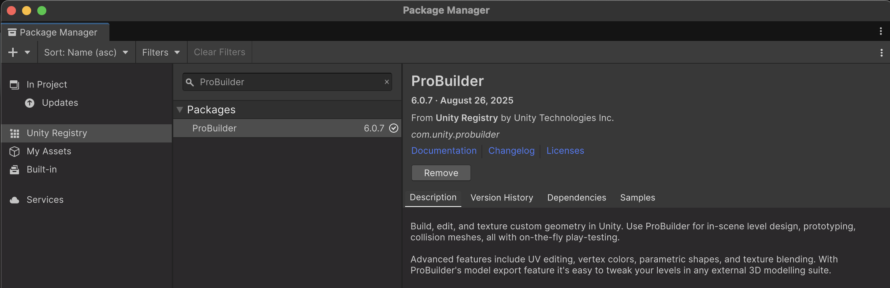
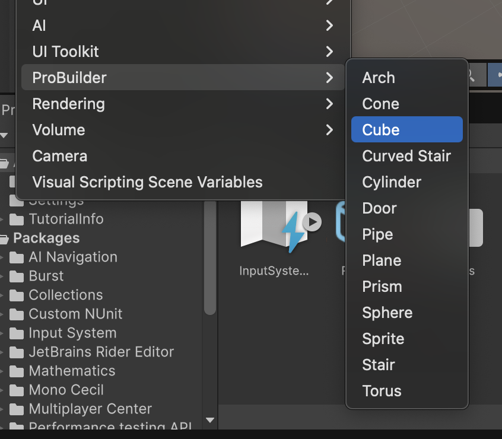
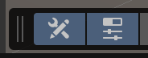
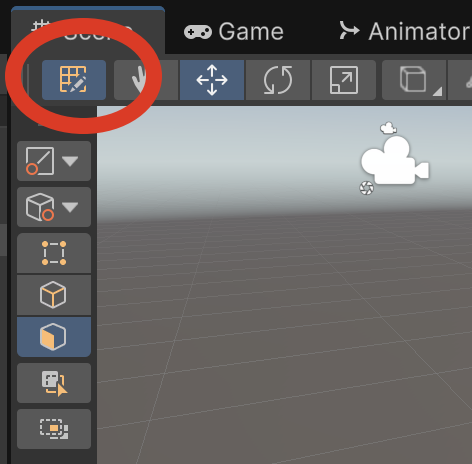

# ProBuilder

L'eina **ProBuilder** permet dissenyar objectes.

Crea un nou projecte tipus **"Universal 3D"** i anomena'l **"Objectes"**

## Instal·lació

- Des del **"Package Manager"**, afegeix el **"ProBuilder"** al projecte.

*Menú Window > Package Management > Package Manager*

- Escollir la opció **"Unity Registry"** i buscar **"ProBuilder"**

- Fer **Install**

 

## Objectes "ProBuilder"

L'eina **"ProBuilder"** permet afegir objectes amb capacitat de ser manipulats fàcilment.

Per poder crear objectes manipulables, s'han de crear com a **"ProBuilder"**

- Al **"Hierarchy"** afegeix un nou **"Cube"** tipus **"ProBuilder"**

 

Assegura't que tens aquestes dues icones de la vista actives:

 

- La primera és per veure les eines generals
- La segona és per veure les eines de configuració

Amb els objectes **"ProBuilder"** a la barra d'eines veuràs un icona taronja, si l'apretes, a la barra de configuració apereixen icones per manipular l'objecte.

 

Aquesta barra, permet fer modificacions bàsiques als objectes, per canviar-ne la forma:

- Vertex
- Cantons
- Cares

<video src="./assets/probuilder-modifybasics.mov" width="600" controls></video>

## Moure la càmera

Per poder modificar objectes, és necessari veure bé certes parts d'aquests objectes.

Per rotar al voltant d'un objecte:

- Sel·leccionar l'objecte que volem enfocar
- Apretar la tecla **F**
- Mantenir apretat Mayus+Alt (Mayus+Option)
- Mantenir el botó esquerra del mouse aptretat
- Moure el mouse

 

<video src="./assets/probuilder-focus.mov" width="600" controls></video>

## Modificar Objectes

Entre altres, les principals opcions disponibles per modificar objectes són:

- **Extrude**, afegir cares
- **Bevel**, arrodonir cantonades
- **Subdivide faces**, dividir una cara
- **Merge faces**, unir cares
- **Delete Face**, fer forats
- **Cut Tool**, dividir segons polígon

### Extrude

La opció **"Extrude"** permet agafar una cara d’un objecte i estirar-la per crear volum nou.

Un cop tenim una cara sel·leccionada, escollim extrude al menú o l'estirem amb la tecla **"Mayus"** apretada:

<video src="./assets/probuilder-modifyextrude.mov" width="600" controls></video>

### Bevel

La opció **"Bevel"** permet arrodonir cantonades

<video src="./assets/probuilder-modifybeveledges.mov" width="600" controls></video>

### Subdivide faces

La opció **"Subdivide faces"** permet dividir una cara en parts.

<video src="./assets/probuilder-modifysubdivideface.mov" width="600" controls></video>

> *Nota:* A l'exemple anterior, primer es fa un **"Subdivide"** i després un **"Extrude"**

### Merge faces

La opció **"Merge faces"** permet unir cares.

<video src="./assets/probuilder-modifymergefaces.mov" width="600" controls></video>

### Delete face

La opció **"Delete face"** esborrar una cara, per fer forats.

<video src="./assets/probuilder-modifydeleteface.mov" width="600" controls></video>

### Cut Tool

La eina **"Cut Tool"** permet dividir cares de manera personalitzada.

<video src="./assets/probuilder-modifycuttool.mov" width="600" controls></video>

> *Nota:* A l'exemple anterior, primer es fa servir **"Cut Tool"** i després un **"Extrude"**

## Canviar la posició del Pivot

A Unity, el **pivot point** és el punt de referència a partir del qual un objecte:

- Rota (rotacions al voltant del pivot).
- Escala (s’expandeix o es contrau respecte al pivot).
- Es mou si estàs editant en modes especials.

És bàsicament l’origen de coordenades local de l’objecte.

Per canviar la posició del *pivot* amb **ProBuilder**:

- Sel·lecciona l'objecte
- Canvia a mode edició de cares
- Ctrl+A per sel·leccionar totes les cares
- Mou l'objecte respecte la referència inicial

 

<video src="./assets/probuilder-pivot.mov" width="600" controls></video>

