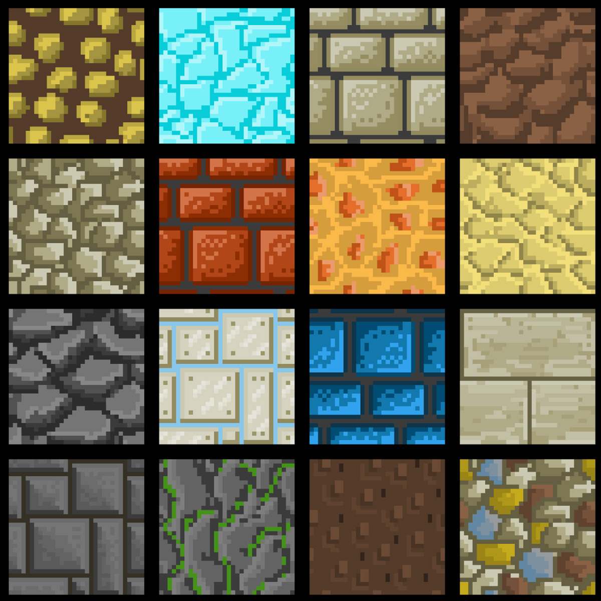

# Textures UV

A part de la forma de l'objecte, l'aparença també depèn dels materials de l'objecte, i en concret de les textures que es dibuixen a les cares de l'objecte.

Farem servir aquesta textura:

[Wall Textures](https://www.freepik.com/free-vector/different-wall-textures_959312.htm#fromView=keyword&page=1&position=1&uuid=df66f88c-b4c2-43cf-a603-40915279bf63&query=Minecraft+texture+tutorial)

 

- Copia la textura anterior a la carpeta **"Assets"**

- Crea un nou material anomenat **"Test"**

- Assigna la textura com a **"Base Map"** del nou material.

 

- Assigna el material a l'objecte, arrossegant-lo al damunt.

 

## UV Mapping

Quan apliquem una textura (una imatge 2D) a un model 3D, cal indicar com s’enganxa aquesta imatge sobre la superfície de l’objecte.

Aquest procés es diu **UV mapping**

**Per què es diu UV?**

A les coordenades d’un model 3D fem servir X, Y, Z.
Per a les coordenades de la imatge 2D fem servir U, V (per no confondre amb X, Y).

Així, U = ample de la imatge i V = alt de la imatge.

**Com funciona**

Tens una imatge 2D (per exemple, un maó).
A l’objecte 3D, cada vèrtex té associades unes coordenades UV.

Aquestes coordenades indiquen quina part de la imatge li correspon a cada vèrtex.
Unity “estira” la textura sobre la geometria seguint aquests punts.

## UV Editor

La eina **ProBuilder** té un editor que permet decidir com es veuen les textures a les cares d'un objecte.

*Menú Tools > ProBuilder > Editors > Open UV Editor*

 

- Arrossega la pestanya **"UV Editor"** a la zona de l'inspector.

- Sel·lecciona la cara que vols modificar la textura, veuràs que automàticament apareix la configuració actual al editor:

 

Fixa't com afecta cada propietat a la textura de l'objecte:

<video src="./assets/uv-texturesplay.mov" width="600" controls></video>

- *Fill mode*:
    - *Fit*: Escala i centra la textura perquè quedi encaixada exactament dins dels límits de la cara.
    - *Tile*: Manté la proporció original de la textura i la repeteix (tiling) dins de la cara fins que la cobreix.
    - *Strech*: Força la textura a omplir tota la cara exactament, encara que s’hagi de deformar.
- **Offset**: mou la base de la textura
- **Rotation**: gira la textura
- **Tiling**: canvia la mida de la textura provocant repeticions (si cal)

Defineix els valors com a:

- Offset X: -0.25
- Offset Y: 0.25
- Rotation: 0
- Tiling X: 0.25
- Tiling Y: 0.25

Fixa't que ara la cara de l'objecte mostra la part seleccionada de la textura:

 

> *Nota:* En aquest cas la textura és quadrada com el costat del cub, altres textures s'han d'adaptar a la cara on s'han de mostrar.

> *Nota:* Per no tenir molts arxius de textura i aprofitar memòria, un mateix arxiu de textura, pot contenir diverses imatges per diferents objectes/materials

### Subdivisions

Divideix la cara sel·leccionada en 4 cares:

*Botó dret > Subdivide Faces*

Fixa't que la textura continua afectant les 4 cares, encara que en sel·leccionis només una.

<video src="./assets/uv-texturesubdivideko.mov" width="600" controls></video>

Per evitar-ho, a l'eina **"UV Editor"** apreta el botó **"Break Selected Groups"**, i aquella cara tindrà les seves pròpies coordenades UV desvinculades del grup.

<video src="./assets/uv-texturesubdivideok.mov" width="600" controls></video>

