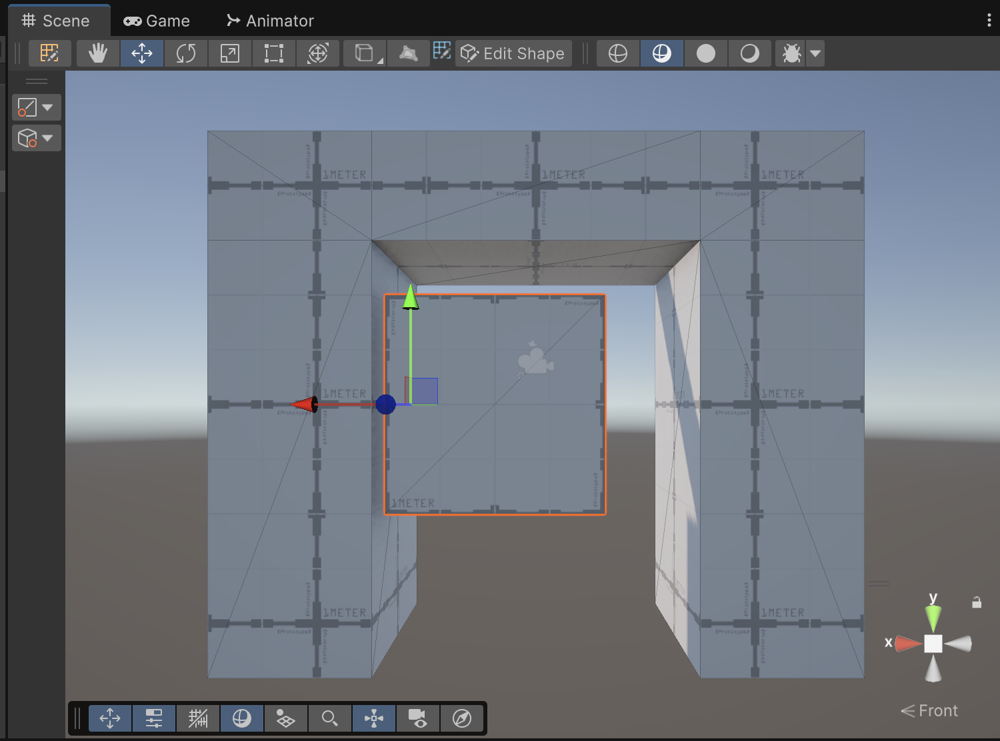

# Animacions

## Crear un objecte per animar (porta)

Per fer aquesta part cal tenir **ProBuilder** instal·lat.

Desde *"Window > Package Management > Package Manager > Unity Registry > Busca ProBuilder"*

Amb *ProBuilder* afegeix un objecte a la *Hierarchy*:

*ProBuilder > Door*

Anomena l'objecte *"DoorFrame"*

 

Afegeix un cub, i mou-lo dins del doorframe:

*ProBuilder > Cube*

Anomena l'objecte *"Door"*

 

- Escull l'objecte *"Door"* i entra al mode d'edició de *"ProBuilder"*

 

- Escull la opció d'editar cares:

 

- Fes Ctrl+A per escollir totes les cares de l'objecte
- Fes servir la **"fletxa vermella"** per desplaçar horitzontament totes les cares fins al centre de coordenades (més o menys)

 

- Torna al mode d'edició normal, i comprova que l'origen de coordenades és a l'esquerra del cub.

 

- Fes servir la **"fletxa vermella"** per desplaçar horitzontament el cub sencer cap a l'esquerra. Gairebé tocant la paret del marc de la porta.

 

- Posa el punt de vista superior apretant el **"cono verd (y)"**
- Escull la eina d'escalat
- Fes servir el **"quadre blau"** per treure profunditat al cub, transformant-lo en una *porta*
- Fes servir el **"quadre vermell"** per allargar l'ample de la *porta*

 

<video src="./assets/animacions-scalecube.mov" width="400" controls></video>

- Entra al mode d'edició de *"ProBuilder"*
- Apreta el botó d'editar cares
- Fes Ctrl+A per escollir totes les cares
- Fes servir la **"fletxa verda"** per moure el polígon cap amunt

 

- Torna al mode d'edició normal i comprova que l'origen està a baix a l'esquerra

 

- Canvia a perspectiva isomètrica apretant 

 

- Mou l'objecte perquè quedi alineat a baix amb el marc de la porta 

 

- Escull la eina d'escalat
- Fes servir el **"quadrat verd"** per escalar la porta fins a dalt

 

- Torna a la perspectiva normal

## Animar la porta

- Si no existeix, crea la carpeta **"Animations"** dins dels **"Assets"**

- Obre la finestra d'animacions: *Menú Window > Animation > Animation*

- Escull l'objecte **"Door"**

Per poder posar animacions a un objecte, cal definir-li un **"Animator"**

- Apreta el botó **"Create"** per crear un objecte **"Animator"**, guarda la primera animació a la carpeta **"Animations"** com a **"OpenDoor"**

 

 

 

> **Una animació és la definició dels valors d'algunes propietats en moments determinats**

Per definir una animació, afegirem les propietats que volem animar, en aquest cas la **rotació a l'eix Y**

- Apreta **"Add Property"**
- Escull **"Transform Rotation"**
- Apreta el símbol **"+"**

 

Originalment, s'han introduit **keyframes** automàticament a les posicions 0:00 o 1:00

Els **keyframes** són les posicions clau, on es defineixen els valors de l'animació.

- Marca el **rombo** de la fila **"Rotation Y"** a la posició **"1:00"**
- Defineix el valor de **"Rotation Y"** a 90
- Comprova que l'animació obre la porta

 

- Escull la pestanya **"Curves"**

 

- Amb el **"botó dret"** afegeix una **"key"** a la curva i deixa-la així:

 

> **Nota:** Fixa't que ara l'animació obre la porta més ràpid al principi, i fa com un rebot al final. Les curves serveixen perquè les animacions no es comportin de manera lineal, fent-le més naturals

- Escull la opció **"Create new clip"** dins del menú desplegable:

 

- Crea un nou clip d'animació a la carpeta **"Animations"** i anomena'l **"CloseDoor"**

- Apreta **"Add Property"**
- Escull **"Transform Rotation"**
- Apreta el símbol **"+"**

Aquest cop cal canviar la posició al valor de temps 0:00

- Marca el **rombo** de la fila **"Rotation Y"** a la posició **"0:00"**
- Defineix el valor de **"Rotation Y"** a 90
- Comprova que l'animació tanca la porta

