# Humanoides

Animar persones és complicat, i normalment es fa amb eines de captura de moviment.

**Unity Editor** permet fer compartir animacions entre personatges tipus *Humanoid*.

Per fer-ho, tant el personatge com les animacions han de ser compatibles.

## FBX Exporter

Sovint tenim personatges i animacions per separat, per poder-los tranformar en humanoides necessitem exportar-los amb **FBX Exporter** i crear un arxiu **.fbx**

Amb el **Package Manager** instal·la **FBX Exporter**

- *Window > Package Management > Package Manager*

- Pestanya: *"Unity Registry"*

- Busca: *"FBX Exporter"*

- Afegeix el paquet

 

## Animacions humanoides

A vegades, descarreguem personatges que no tenen definides les animacions, ni un tipus humanoide, tot i ser-ne compatibles.

Importa al projecte aquest personatge:

[Low Poly People by David Jalbert](https://assetstore.unity.com/packages/3d/characters/humanoids/low-poly-people-by-david-jalbert-274814)

Com que té una versió antiga de "Pipeline", cal arreglar-los:

- *Window > Rendering > Render Pipeline Convertor*
- Activa totes les opcions
- Escull: *Initialize and Convert*

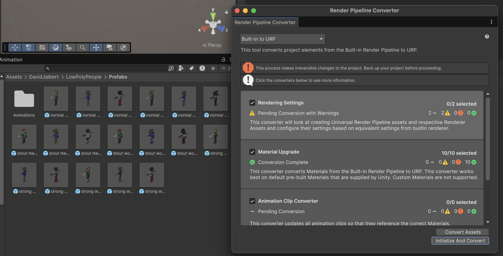

 

Navega a la carpeta:

*"Assets > David Jalbert > Low Poly People > Prefabs"*

Arrossega un personatge cap a la jerarquia.
 

<video src="./assets/humanoides-defaultanim.mov" width="600" controls></video>

Veuràs que l'animació funciona, però no és un humanoide perquè a l'inspector no fa servir cap *"Avatar"*

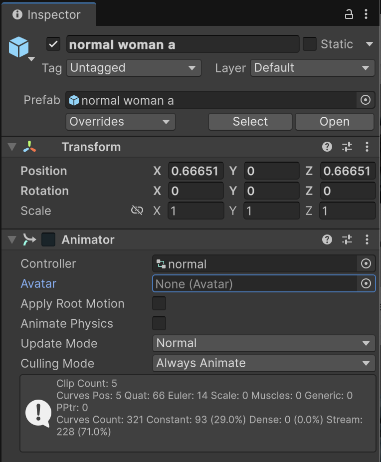

 

Exportarem aquest objecte a format *.fbx* per poder transformar les animacions a **humanoide**

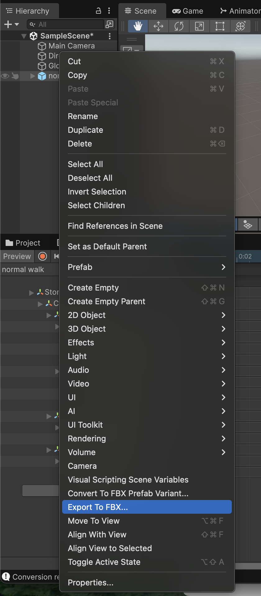

 

És important que escullis:

- Include: "Model(s) + Animation"

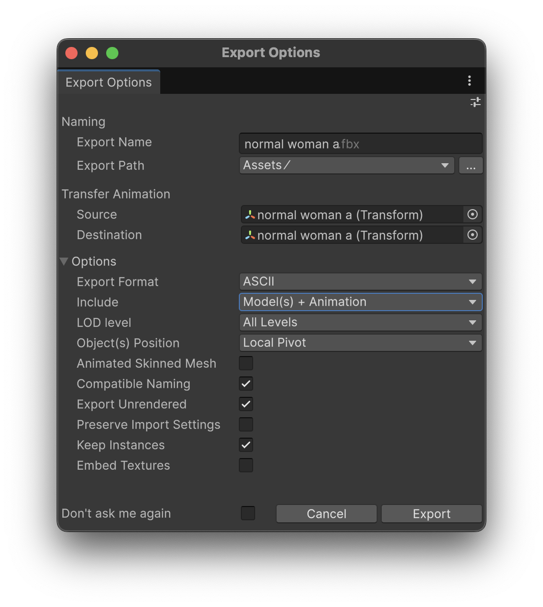

 

A la carpeta **"Assets"** hi ha el nou objecte, sel·lecciona'l, i a la pestana **"Inspector"** escull:

- Pestanya: **"Rig"**
- Animation Type: **"Humanoid"**
- Avatar Definition: **"Create From This Model"**
- Apreta **"Apply"**
- Fixa't que s'ha activat el botó **"Configure"**

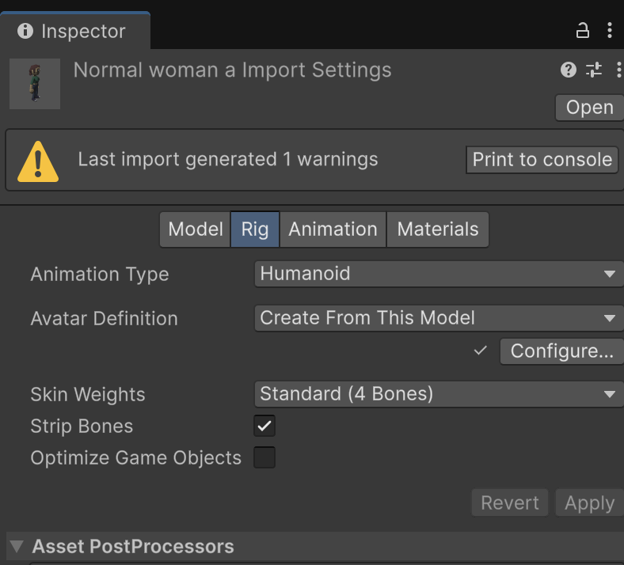

 

- Apreta el botó **"Configure"**
- Escull la opció **"Pose > Enfoce T-Pose"**

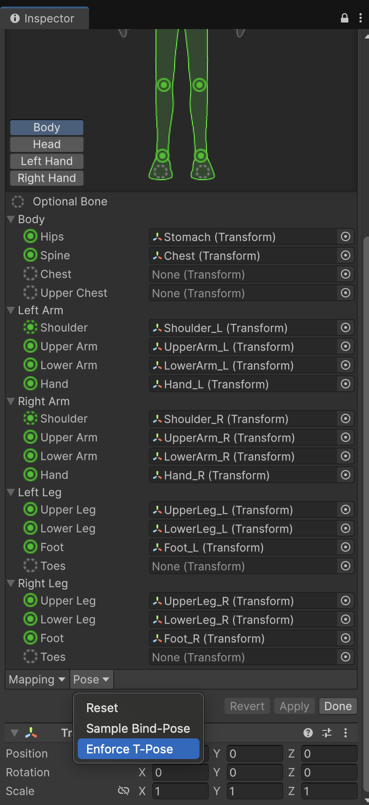

 

- **Important!** Apreta el botó **"Apply"**
- Apreta el botó **"Done"**

Ara cal substitur l'antic personatge sene **Humanoid** pel nou:

- Esborra el personatge de l'escena
- Mou el nou personatge **.fbx** a l'escena

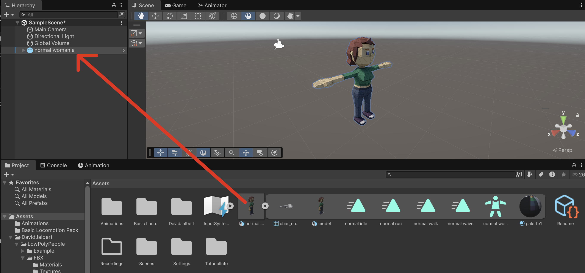

 

Si no està oberta, obre la finestra d'animació:

*Window > Animation > Animation*

Crea un controlador d'animació i guarda'l a *"Assets > Animation"* amb nom *"PlayerAnimations"*

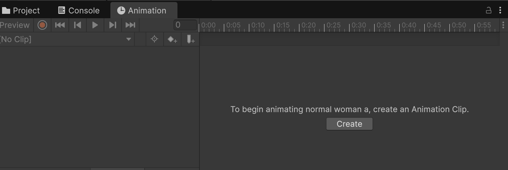

 

Comprova que el personatge té assignat el controlador i l'avatar:

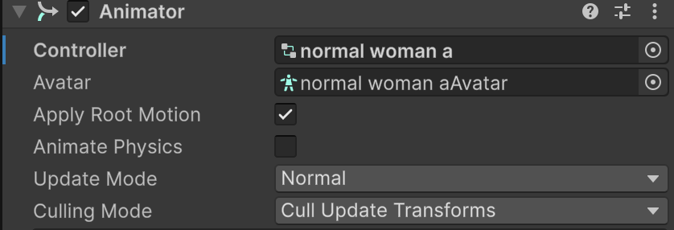

 

Si no està oberta, obre la finestra d'*animator*:

*Window > Animation > Animator*

Des de la carpeta **"Assets"** escull l'objecte del personatge tipus **.fbx** i copia les animacions a la carpeta **"Assets > Animations"**

- Sel·lecciona les animacions
- Ctrl+C per copiar
- Anar a la carpeta "Animations"
- Ctrl+V per enganxar

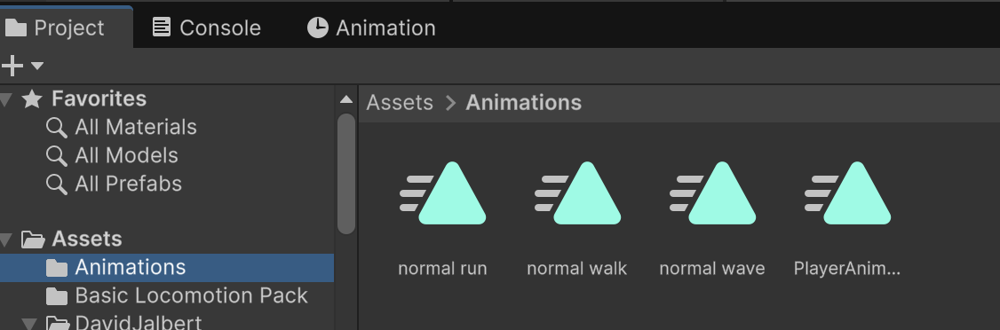

 

Amb el personatge sel·leccionat, arrossega les animacions de la carpeta **"Assets"** cap a l'animator.

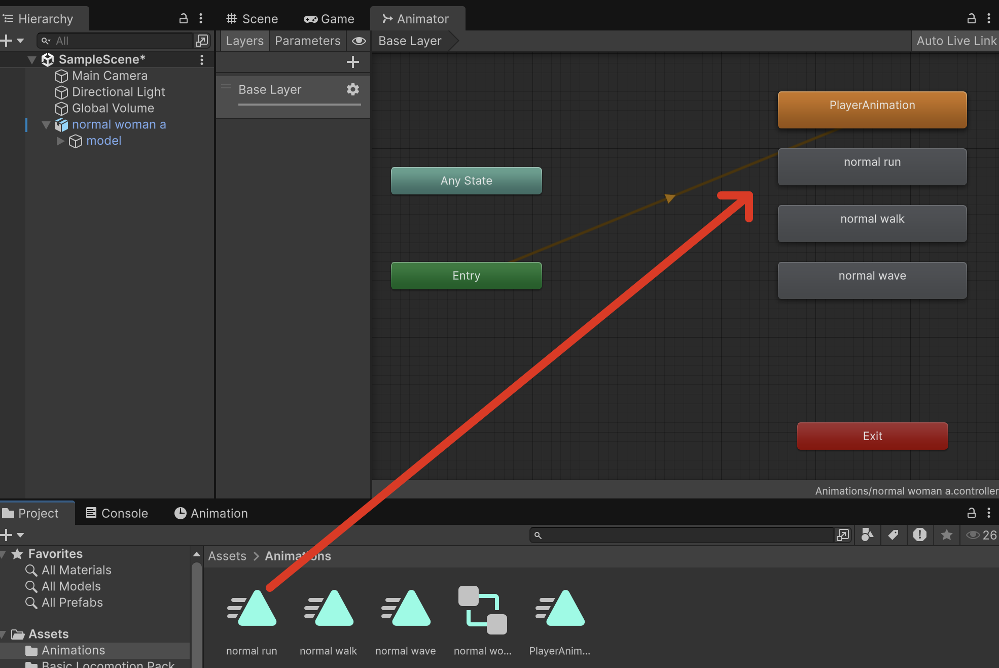

 

Comprova que les animacions tipus "humanoide" funcionen:

 

<video src="./assets/humanoides-animationcheck0.mov" width="600" controls></video>

## Importar Animacions humanoides

Definir animacions per personatges és molt complicat, normalment es fa amb eines de captura de moviment.

La pàgina [Mixamo](https://www.mixamo.com/#/), ofereix gratuïtament moltes animacions de personatges.

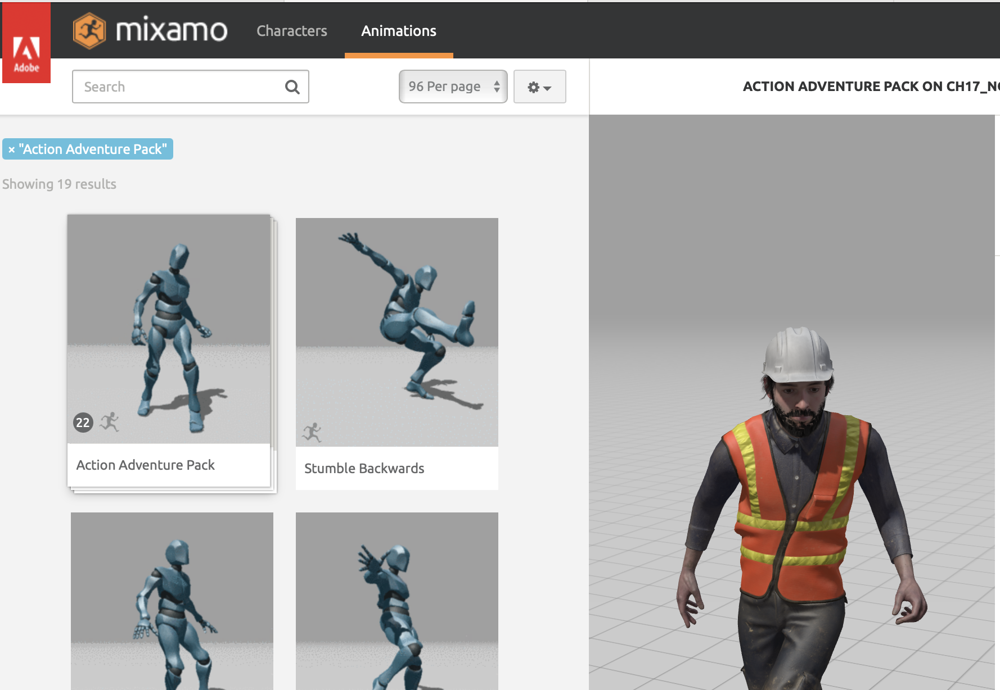

 

Registra't i busca:

**Action adventure pack**

Descarrega la versió amb format **"FBX for Unity"**

 

Arrossega la carpeta descomprimida **"Action Adventure Pack"** cap a la carpeta **"Assets"** del projecte.

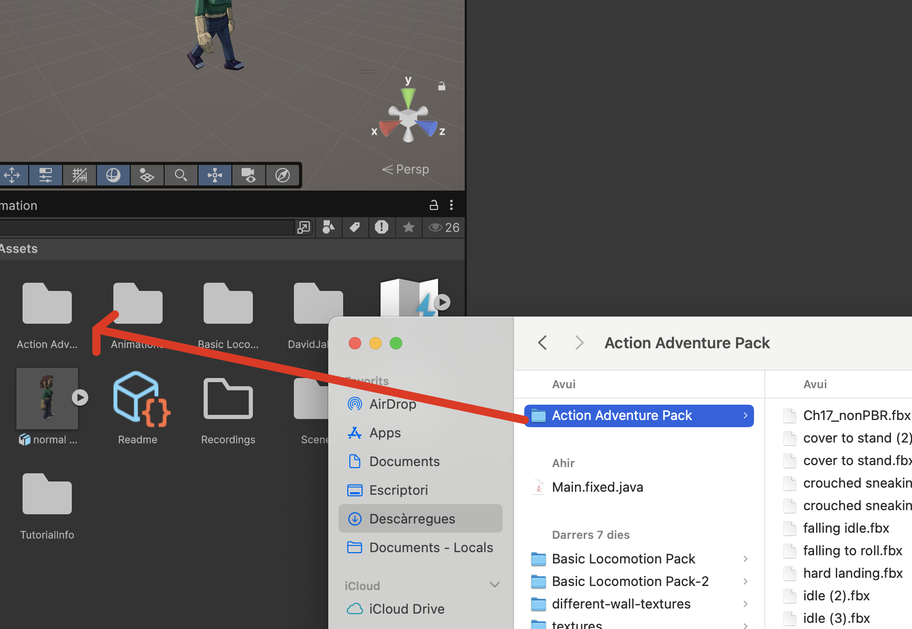

 

> **Nota:** Veuràs que no es pot fer preview de les animacions, almenys no fins que estiguin els *Humanoids* definits.

Ves a la carpeta **"Assets > Action Adventure Pack"** i escull **"Jumping Up"**, a la pestana **"Inspector"** escull:

- Pestanya: **"Rig"**
- Animation Type: **"Humanoid"**
- Avatar Definition: **"Create From This Model"**
- Apreta **"Apply"**
- Fixa't que s'ha activat el botó **"Configure"**

 

- Apreta el botó **"Configure"**
- Escull la opció **"Pose > Enfoce T-Pose"**

 

- **Important!** Apreta el botó **"Apply"**
- Apreta el botó **"Done"**

Ara ja tenim un nou objecte **.fbx** amb les animacions tipus **humanoide** i pots veure el *preview*. Desplegar l'arxiu **.fbx**, ara hi ha dos icones:

- Una personeta que és l'*humanoide*
- Un triangle que és l'animació

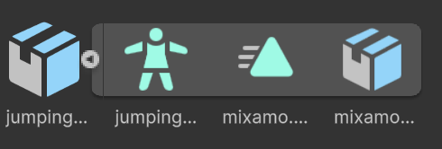

 

Apreta sobre del tirangle, i a l'apartat de **preview** apreta **"play"** per veure l'animació:

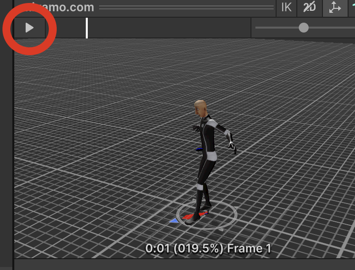

 

Fes el mateix amb l'animació **"crouched sneaking left.fbx"**

- A l'**"Inspector"** pestanya **"Rig"**
- Animation Type: **"Humanoid"**
- Avatar Definition: **"Create from this model"**
- Apretar **"Apply"**
- S'activa **"Configure"**
- Apretar **"Configure"**
- Desplegable **"Pose"** escull **"Enforce T-Pose"**
- Apreta **"Apply"**
- Apreta **"Done"**

Repeteix amb totes les animacions que volguis tenir disponibles (o veure'n la previsualització).

Desplega l'arxiu **"crouched sneaking left.fbx"** i escull l'icona triangular anomenada *"mixamo.com"*.

Copia aquest objecte amb **"Ctrl+C"** a la carpeta **"Assets > Animations"** i renomana'l com a **"Senaking"**

Sel·lecciona el personatge, mostra la pestanya **"Animator"** i arrossega la nova animació **"Jump"** cap a l'*animator*:

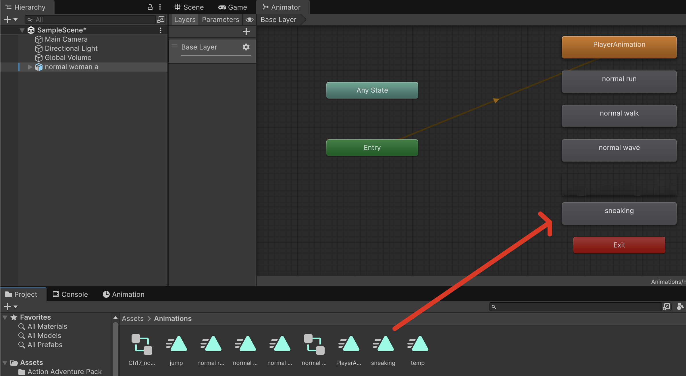

 

Comprova a l'escena, i a la pestanya **"Animation"** que la nova animació **"Sneaking"** està disponible:

 

<video src="./assets/humanoides-sneakinganim.mov" width="600" controls></video>

