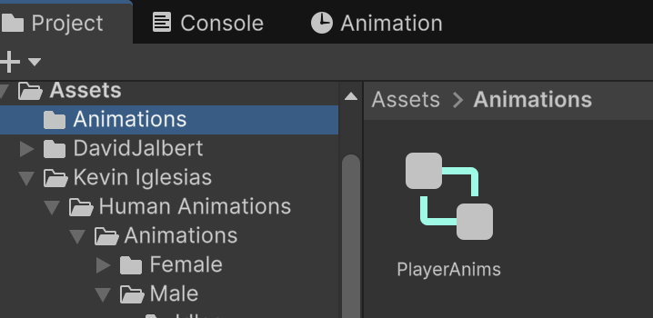
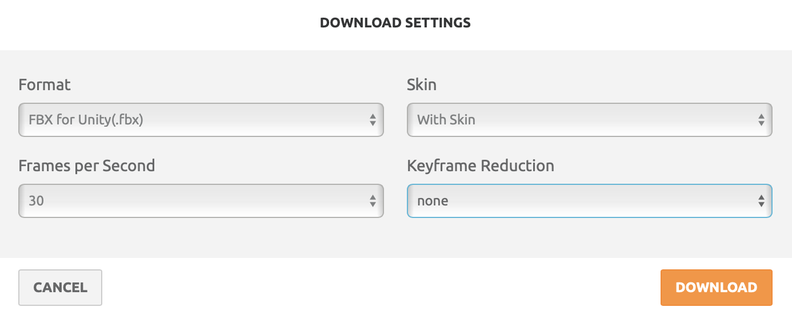

# Humanoides

Animar persones és complicat, i normalment es fa amb eines de captura de moviment.

**Unity Editor** permet fer compartir animacions entre personatges tipus *Humanoid*.

Per fer-ho, tant el personatge com les animacions han de ser compatibles.

## Projecte

Fes un nou projecte tipus **"Universal 3d"** anomenat **Humanoids**

## Assets

A la carpeta **"Asseets"** crea les carpetes:

- Animations
- Scripts

Per fer un personatge animat, cal:

- Model tipus *"Humanoid"*
- Animacions tipus *"Humanoid"*
- Model original de les animacions

Farem servir dos models amb casuístiques diferents necessitarem aquests *assets*:

[Low Poly Cowboy](https://assetstore.unity.com/packages/3d/characters/humanoids/humans/low-poly-cowboy-49698)

[Low Poly People](https://assetstore.unity.com/packages/3d/characters/humanoids/low-poly-people-by-david-jalbert-274814)

[Basic Motions FREE](https://assetstore.unity.com/packages/3d/animations/humanoides-basic-motions-free-154271)

- Cal actualitzar el model a la nova *pipeline* amb:

*Menú Window > Rendering > Render Pipeline Converter*

- Activa totes les opcions
- Apreta **"Initialize And Convert"**

## Càmera

Escull l'objecte **"Main Camera"** i al *Inspector*:

- Position X: 0.5
- Position Y: 2
- Position Z: 5.5
- Rotation X: 14
- Rotation Y: 182
- Rotation Z: 0

## Pla (terra)

Afegeix un nou **"3D Object > Plane"** que faci de terra i posa'l a:

- Position X: 0
- Position Y: 0
- Position Z: 0

## Afegir models amb avatar (Cowboy)

- Ves a la carpeta:

*Assets > Malbers Animations > Cowboy > Model*

Sel·lecciona el model de la carpeta **"Model"** (**NO** facis servir el *Prefab*)

<center>

</center>
<br/>

En aquest cas, ja tenim un **"Avatar"** i per tant no cal crear-lo.

>**Important!** El model s'ha de relacionar amb el seu avatar (**MAI** amb l'avatar de l'animació)

- Arrossega el model a l'escena.

- Mou el model a:
    - Position X: -1
    - Position Y: 0
    - Position Z: 1.5

## Afegir models sense avatar (LowPolyPeople)

- Ves a la carpeta:

*Assets > David Jalbert > LowPolyPeople > FBX*

Escull un model, veurà que no té *Avatar*, caldrà crear-lo:

<center>

</center>
<br/>

- Al **"Inspector"** apreta la pestanya **"RIG** i escull:

    - Animation Type: Humanoid
    - Avatar Definition: Create from this model
    - Apreta **"Apply"**

- Veuràs que s'actia la tecla **"Configure..."**

- Apreta **"Configure..."**

- Obre el desplegable **"Pose"**

- Escull la opció **"Enforce T-Pose"**

- Apreta **"Apply"** (molt **Important**)

- Apreta **"Done"**

- Veuràs que ara té un *avatar* (el ninot verd)

<center>

</center>
<br/>

- Mou el model a:
    - Position X: 1
    - Position Y: 0
    - Position Z: 1

## Retargeting

**Retargeting** és l'acció d'assignar un avatar creat per un model diferent.

- Ves a la carpeta:

*Assets > Kevin Iglesias > Human Animations > Animations > Male > Movement > Run*

- Desplega l'animació **"HumanM@Run01_Forward.fbx"**
- Apreta el triangle verd
- Pots veure un *preview* de l'animació

<center>

</center>
<br/>

- Ja hauría de tenir escollit l'avatar del paquet automàticament. Així que no hem de fer res, per si acàs, l'avatar està a:

*Assets > Kevin Iglesias > Human Humanoids > Models > HumanM_Model*

<center>

</center>
<br/>

>**Important!** L'avatar es pot compartir **només entre animacions del mateix projecte**. Mai amb els models o animacions d'altres projectes.

- A la carpeta:

*Assets > Animations*

- Crea un nou **"Animation Controller"** amb el *boto dret* i anomena'l **PlayerAnims**:

**Create > Animation > Animation Controller**

<center>

</center>
<br/>

Per cada personatge:

- Arrossega el nou controlador **"PlayerAnim"** cap a **"Animator > Controller"**
- Desmarca la opció **"Apply Root Motion"**

<center>

</center>
<br/>

- Fes doble click al nou controlador **"PlayerAnim"**, per obrir la finestra **"Animator"**

> **Nota**: Si no sobre l'a carpeta **"Animator"** la pots trobar a **"Menu Window > Animation > Animator"**

### Estats

- Amb el botó dret dins de **"Animator"**, crea un nou estat **"Empty"**

<center>

</center>
<br/>

Anomena aquest estat com a **"Idle"**

> **Nota**: És de color taronja, perquè és l'estat que s'executa per defecte.

A l'inspector, a l'apartat **"Motion"** busca l'animació **"HumanM@Idle01"**

<center>

</center>
<br/>

<center>

</center>
<br/>

- Crea un nou **Create State > Empty"**
- Anomena'l **"Run"**
- A motion escull **"HumanM@Run01_Forward"**

<center>

</center>
<br/>

- Crea un nou **Create State > Empty"**
- Anomena'l **"IdleJump"**
- A motion escull **"HumanM@Jump01"**

<center>

</center>
<br/>

### Transicions

Per canviar d'estat necessitem transicions.

- Amb el *botó dret* a sobre de **"Idle"** escull **"Make Transition"** fins a l'estat **"Run"**

<center>

</center>
<br/>

- Amb el *botó dret* a sobre de **"Run"** escull **"Make Transition"** fins a l'estat **"Idle"**

<center>

</center>
<br/>

> **Nota**: Si simules el joc ara, veuràs que farà un bucle amb les animacions **"Idle"** i **"Run"**

### Estats

- A la pestanya **"Parameters"**, apreta el símbol **"+"** i escull **"Trigger"** per afegir un *disparador*

<center>

</center>
<br/>

- Anomena'l **RunTrigger"**

<center>

</center>
<br/>

- Sel·lecciona la fletxa que va des de **"Idle"** fins a **"Run"**

- A l'inspector:

    - Treu la sel·lecció de **"Has Exit Time"**
    - Desplega **"Settings"** i posa **"Transition Duration"** a 0.1
    - A **"Conditions"** apreta la tecla **"+"** per afegir el *disparador* **"RunTrigger"**

<center>

</center>
<br/>

- A la pestanya **"Parameters"**, apreta el símbol **"+"** i escull **"Trigger"** per afegir un segon *disparador*

- Anomena'l **StopTrigger"**

- Sel·lecciona la fletxa que va des **"Run"** fins a **"Idle"**

- A l'inspector:

    - Treu la sel·lecció de **"Has Exit Time"**
    - Desplega **"Settings"** i posa **"Transition Duration"** a 0.1
    - A **"Conditions"** apreta la tecla **"+"** per afegir el *disparador* **"StopTrigger"**

- Amb el *botó dret* a sobre de **"Idle"** crea una nova transició cap a **"IdleJump"**

- Amb el *botó dret* a sobre de **"IdleJump"** crea una nova transició cap a **"Idle"**

- Crea un nou disparador a l'apartat **"Parameters > + > Trigger"** i anomena'l **"JumpTrigger"**

- A l'inspector de la fletxa que va des de **"Idle"** fins a **"IdleJump"**:

    - Treu la sel·lecció de **"Has Exit Time"**
    - Desplega **"Settings"** i posa **"Transition Duration"** a 0.1
    - Afegeix el nou disparador **"JumpTrigger"** 

- Sel·lecciona la fletxa que va des de **"IdleJump"** cap a **Idle**, a l'apartat  **"Settings"** de l'inspector:

    - Deixa la sel·lecció de **"Has Exit Time"** marcada
    - Posa **"Exit Time"** a 0.8
    - Posa **"Transition Duration"** a 0.25

<center>

</center>
<br/>

## Script

- Afegeix un nou script a la carpeta **"Scripts"** anomenat **"Player"** de tipus **"MonoBehaviour Script"**

- Posa el següent codi a l'script, i arrossega'l a l'inspector de tots dos personatges.

```csharp
using UnityEngine;
using UnityEngine.InputSystem;

[RequireComponent(typeof(Animator))]
[RequireComponent(typeof(CharacterController))]
public class PlayerMoveAnimator : MonoBehaviour
{
    [Header("Refs")]
    public Camera cam;                        
    public Animator animator;                 
    public CharacterController cc;            

    [Header("Animator params (Triggers)")]
    public string runTriggerName  = "RunTrigger";
    public string stopTriggerName = "StopTrigger";
    public string jumpTriggerName = "JumpTrigger";   // Idle -> IdleJump
    public string idleJumpStateName = "IdleJump";        // --- JUMP LOCK --- (nom de l’estat)

    [Header("Moviment")]
    public float moveSpeed = 3.5f;
    public float turnSpeed = 720f;            
    public float inputDeadzone = 0.05f;

    [Header("Física bàsica")]
    public float gravity = -9.81f;
    public float groundedGravity = -2f;       

    private InputAction moveAction;
    private InputAction jumpAction;

    private int runHash, stopHash, jumpHash;
    private bool isRunning = false;
    private float verticalVel = 0f;

    void OnEnable()
    {
        if (!animator) animator = GetComponentInChildren<Animator>(true);
        if (!cc) cc = GetComponent<CharacterController>();
        if (!cam) cam = Camera.main;

        runHash  = Animator.StringToHash(runTriggerName);
        stopHash = Animator.StringToHash(stopTriggerName);
        jumpHash = Animator.StringToHash(jumpTriggerName);

        moveAction = new InputAction("Move", type: InputActionType.Value);
        moveAction.AddCompositeBinding("2DVector")
            .With("Up", "<Keyboard>/w").With("Up", "<Keyboard>/upArrow")
            .With("Down", "<Keyboard>/s").With("Down", "<Keyboard>/downArrow")
            .With("Left", "<Keyboard>/a").With("Left", "<Keyboard>/leftArrow")
            .With("Right", "<Keyboard>/d").With("Right", "<Keyboard>/rightArrow")
            .With("Up", "<Gamepad>/leftStick/up").With("Down", "<Gamepad>/leftStick/down")
            .With("Left", "<Gamepad>/leftStick/left").With("Right", "<Gamepad>/leftStick/right");
        moveAction.Enable();

        jumpAction = new InputAction("Jump", binding: "<Keyboard>/space");
        jumpAction.AddBinding("<Gamepad>/buttonSouth");
        jumpAction.Enable();
    }

    bool HasParam(Animator anim, string name, AnimatorControllerParameterType type)
    {
        foreach (var p in anim.parameters)
            if (p.name == name && p.type == type)
                return true;
        return false;
    }

    void OnDisable()
    {
        moveAction?.Disable();
        jumpAction?.Disable();
    }

    void Update()
    {
        // Estat Animator
        var st = animator.GetCurrentAnimatorStateInfo(0);
        // --- JUMP LOCK ---
        bool inIdleJump = st.IsName(idleJumpStateName) || st.IsName("Base Layer." + idleJumpStateName);

        // 1) Input 2D
        Vector2 input = moveAction.ReadValue<Vector2>();
        if (input.magnitude < inputDeadzone) input = Vector2.zero;

        // 2) Direcció segons càmera
        Vector3 forward = cam ? cam.transform.forward : Vector3.forward;
        forward.y = 0f; forward.Normalize();
        Vector3 right = cam ? cam.transform.right : Vector3.right;
        right.y = 0f; right.Normalize();

        Vector3 moveDir = (forward * input.y) + (right * input.x);
        if (moveDir.sqrMagnitude > 1e-6f) moveDir = moveDir.normalized;

        // --- JUMP LOCK: bloqueja moviment horitzontal durant IdleJump ---
        if (inIdleJump) moveDir = Vector3.zero;

        // 3) Moure
        Vector3 horizontalVel = moveDir * moveSpeed;

        if (cc.isGrounded) verticalVel = groundedGravity;
        else               verticalVel += gravity * Time.deltaTime;

        Vector3 velocity = horizontalVel + Vector3.up * verticalVel;
        cc.Move(velocity * Time.deltaTime);

        // 4) Rotació (només si no estem saltant i hi ha direcció)
        if (!inIdleJump && moveDir.sqrMagnitude > 1e-6f)
        {
            Quaternion targetRot = Quaternion.LookRotation(moveDir, Vector3.up);
            transform.rotation = Quaternion.RotateTowards(transform.rotation, targetRot, turnSpeed * Time.deltaTime);
        }

        // 5) Idle <-> Run (evita canvis mentre saltes)
        bool moving = horizontalVel.sqrMagnitude > 1e-6f;
        if (!inIdleJump)
        {
            if (moving && !isRunning)
            {
                animator.ResetTrigger(stopHash);
                animator.SetTrigger(runHash);
                isRunning = true;
            }
            else if (!moving && isRunning)
            {
                animator.ResetTrigger(runHash);
                animator.SetTrigger(stopHash);
                isRunning = false;
            }
        }
        else
        {
            // Assegura estat "no corrent" mentre dura el salt
            if (isRunning)
            {
                animator.ResetTrigger(runHash);
                animator.SetTrigger(stopHash);
                isRunning = false;
            }
        }

        // 6) Disparar IdleJump (només si estem a Idle i no en transició)
        if (jumpAction.WasPressedThisFrame() && !animator.IsInTransition(0))
        {
            // només permet saltar des d'Idle (tu ja ho tens així a l'Animator)
            if (st.IsName("Idle") || st.IsName("Base Layer.Idle"))
            {
                animator.SetTrigger(jumpHash);
            }
        }
    }

    bool IsGroundedByRaycast()
    {
        Vector3 origin = transform.position + Vector3.up * 0.1f;
        float dist = 0.3f;
        return Physics.Raycast(origin, Vector3.down, out _, dist, ~0, QueryTriggerInteraction.Ignore);
    }
}
```

Un cop afegit l'script, automàticament s'afegeix un *"Component"* anomenat **"Character Controller"**, per cada personatge:

- Modifica l'apartat **"Center"** del **"Character Controller"** per posar la **Y** a 1.1

<center>

</center>
<br/>

## Animacions externes (Mixamo)

Fixa't que en aquest pack d'animacions no n'hi ha cap per saltar mentre el personatge corre. N'hem de buscar una.

[Mixamo](https://www.mixamo.com/) és una pàgina web d'**Adobe** que ofereix animacions de personatges. Registra't i ves a la pàgina:

- Primer cal escollir un personatge a l'apartat **"Characters"**

<center>

</center>
<br/>

> **Nota**: Tot i que només volem l'animació, necessitem l'avatar relacionat amb ella i per això descarreguem també un personatge, encara que no el necessitem.

- A l'apartat **"Animations"** busca **"forward running jump"** i escull l'animació de la imatge:

<center>

</center>
<br/>

- Apreta el botó **"Download"** i escull el format **"FBX for Unity (.fbx)"**

<center>

</center>
<br/>

- Arrossega l'arxiu descarregat cap a la carpeta **"Assets > Animations"**

- Veuràs que no té avatar.

<center>

</center>
<br/>

- Sel·lecciona l'objecte, i a l'inspector escull la pestanya **"Rig"** amb les opcions:

    - Animation Type: Humanoid
    - Avatar definition: Create from this model
    - Apreta el botó **"Apply"**
    - S'ha activat el botó **"Configure..."**
    - Apreta el botó **"Configure..."**
    - Desplega el camp **"Pose"**
    - Escull la opció **Enforce T-Pose"**
    - Apreta **"Apply"** 
    - Apreta **"Done"**

- A la finstra animator crea un nou estat amb el *botó dret* i **"Create State > Empty"**
- Anomena'l **"RunJump"**
- Assigna l'animació **Jump** de mixamo al camp **Motion** de l'estat **RunJump**

<center>

</center>
<br/>

- Crea dues transicions noves, entre **Run** i **RunJump**

<center>

</center>
<br/>

- Escull la transició de **Run** cap a **RunJump** i:

    - Desactiva la opció **Has Exit Time**
    - Afegeix una nova **"Condition"** i escull **"JumpTrigger"**

Modifica l'script del **Player**, per tenir en compte la nova animació:

```csharp
using UnityEngine;
using UnityEngine.InputSystem;

[RequireComponent(typeof(Animator))]
[RequireComponent(typeof(CharacterController))]
public class PlayerMoveAnimator : MonoBehaviour
{
    [Header("Refs")]
    public Camera cam;
    public Animator animator;
    public CharacterController cc;

    [Header("Animator params (Triggers)")]
    public string runTriggerName  = "RunTrigger";
    public string stopTriggerName = "StopTrigger";
    public string jumpTriggerName = "JumpTrigger";   // Idle/Run -> IdleJump / RunJump
    public string idleJumpStateName = "IdleJump";
    public string runJumpStateName  = "RunJump";

    [Header("Moviment")]
    public float moveSpeed = 3.5f;
    public float turnSpeed = 720f;
    public float inputDeadzone = 0.05f;

    [Header("Física bàsica")]
    public float gravity = -9.81f;
    public float groundedGravity = -2f;
    public float jumpForce = 4f;

    private InputAction moveAction;
    private InputAction jumpAction;

    private int runHash, stopHash, jumpHash;
    private bool isRunning = false;
    private float verticalVel = 0f;

    // --- recorda direcció de salt en moviment ---
    private Vector3 jumpDir = Vector3.zero;

    void OnEnable()
    {
        if (!animator) animator = GetComponentInChildren<Animator>(true);
        if (!cc) cc = GetComponent<CharacterController>();
        if (!cam) cam = Camera.main;

        runHash  = Animator.StringToHash(runTriggerName);
        stopHash = Animator.StringToHash(stopTriggerName);
        jumpHash = Animator.StringToHash(jumpTriggerName);

        moveAction = new InputAction("Move", type: InputActionType.Value);
        moveAction.AddCompositeBinding("2DVector")
            .With("Up", "<Keyboard>/w").With("Up", "<Keyboard>/upArrow")
            .With("Down", "<Keyboard>/s").With("Down", "<Keyboard>/downArrow")
            .With("Left", "<Keyboard>/a").With("Left", "<Keyboard>/leftArrow")
            .With("Right", "<Keyboard>/d").With("Right", "<Keyboard>/rightArrow")
            .With("Up", "<Gamepad>/leftStick/up").With("Down", "<Gamepad>/leftStick/down")
            .With("Left", "<Gamepad>/leftStick/left").With("Right", "<Gamepad>/leftStick/right");
        moveAction.Enable();

        jumpAction = new InputAction("Jump", binding: "<Keyboard>/space");
        jumpAction.AddBinding("<Gamepad>/buttonSouth");
        jumpAction.Enable();
    }

    void OnDisable()
    {
        moveAction?.Disable();
        jumpAction?.Disable();
    }

    void Update()
    {
        // --- Estat actual ---
        var st = animator.GetCurrentAnimatorStateInfo(0);
        bool inIdleJump = st.IsName(idleJumpStateName) || st.IsName("Base Layer." + idleJumpStateName);
        bool inRunJump  = st.IsName(runJumpStateName)  || st.IsName("Base Layer." + runJumpStateName);
        bool inJump = inIdleJump || inRunJump;

        // --- Input 2D ---
        Vector2 input = moveAction.ReadValue<Vector2>();
        if (input.magnitude < inputDeadzone) input = Vector2.zero;

        // --- Direcció segons càmera ---
        Vector3 forward = cam ? cam.transform.forward : Vector3.forward;
        forward.y = 0f; forward.Normalize();
        Vector3 right = cam ? cam.transform.right : Vector3.right;
        right.y = 0f; right.Normalize();
        Vector3 moveDir = (forward * input.y) + (right * input.x);
        if (moveDir.sqrMagnitude > 1e-6f) moveDir = moveDir.normalized;

        // --- MOVIMENT DURANT EL SALT ---
        if (inIdleJump)
        {
            // IdleJump: no moviment horitzontal
            moveDir = Vector3.zero;
        }
        else if (inRunJump)
        {
            // RunJump: conserva la direcció del moment del salt
            moveDir = jumpDir;
        }

        // --- Càlcul de velocitat horitzontal ---
        Vector3 horizontalVel = moveDir * moveSpeed;

        // --- Gravetat i impuls de salt ---
        if (cc.isGrounded)
        {
            if (verticalVel < 0f)
                verticalVel = groundedGravity;

            // SALT físic (només quan a terra)
            if (jumpAction.WasPressedThisFrame())
            {
                verticalVel = jumpForce;

                // Decideix quin tipus de salt fer
                if (isRunning)
                {
                    jumpDir = moveDir;        // memoritza direcció
                }
                else
                {
                    jumpDir = Vector3.zero;   // salt vertical pur
                }

                animator.SetTrigger(jumpHash);
            }
        }
        else
        {
            verticalVel += gravity * Time.deltaTime; // caiguda
        }

        // --- Aplica moviment ---
        Vector3 velocity = horizontalVel + Vector3.up * verticalVel;
        cc.Move(velocity * Time.deltaTime);

        // --- Rotació (no durant IdleJump, però sí durant RunJump) ---
        if (!inIdleJump && moveDir.sqrMagnitude > 1e-6f)
        {
            Quaternion targetRot = Quaternion.LookRotation(moveDir, Vector3.up);
            transform.rotation = Quaternion.RotateTowards(transform.rotation, targetRot, turnSpeed * Time.deltaTime);
        }

        // --- Idle <-> Run (no canviïs durant salts) ---
        bool moving = horizontalVel.sqrMagnitude > 1e-6f;
        if (!inJump)
        {
            if (moving && !isRunning)
            {
                animator.ResetTrigger(stopHash);
                animator.SetTrigger(runHash);
                isRunning = true;
            }
            else if (!moving && isRunning)
            {
                animator.ResetTrigger(runHash);
                animator.SetTrigger(stopHash);
                isRunning = false;
            }
        }
        else
        {
            if (isRunning)
            {
                animator.ResetTrigger(runHash);
                animator.SetTrigger(stopHash);
                isRunning = false;
            }
        }
    }
}
```

Prova el joc, amb el moviment i salts del personatge en mode **"Iddle"** i mode **"Run"**
