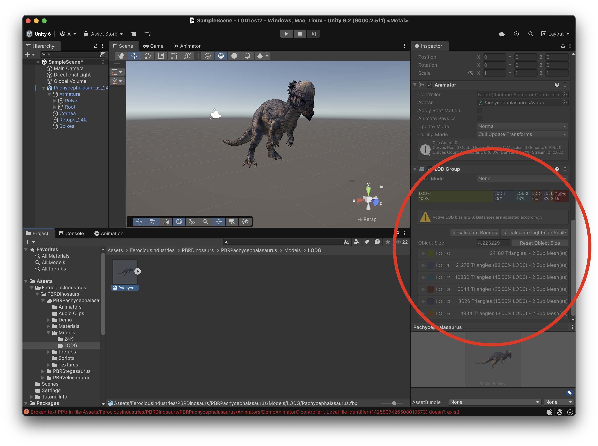
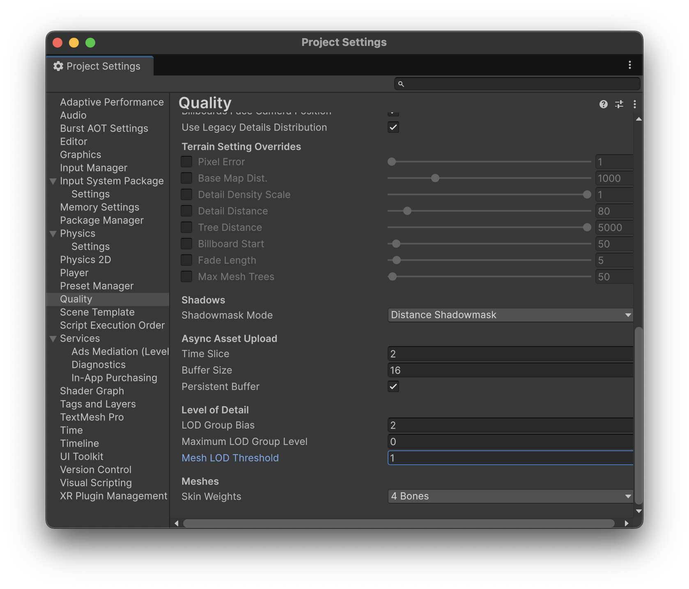
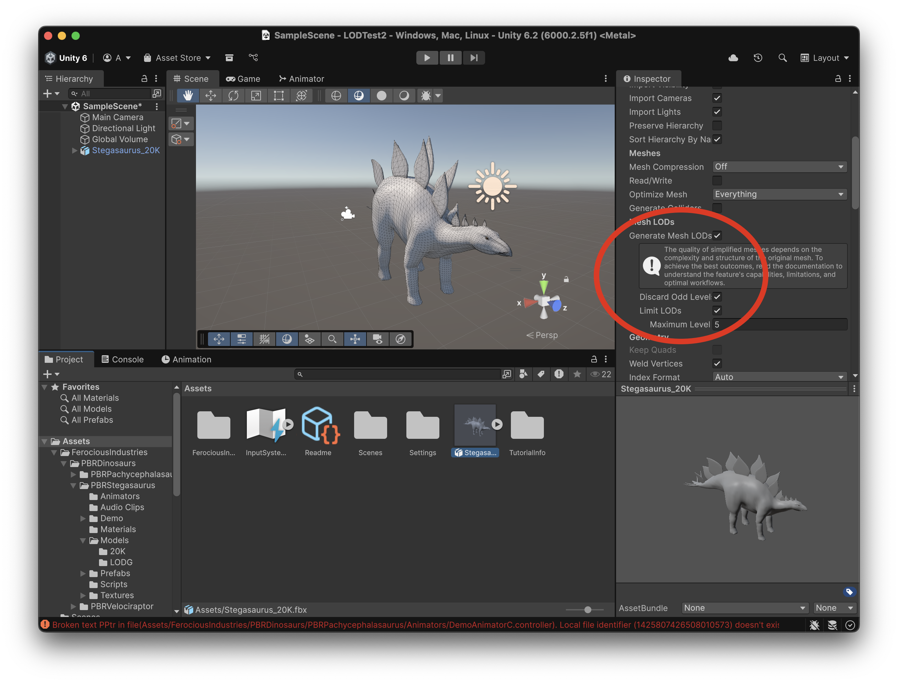
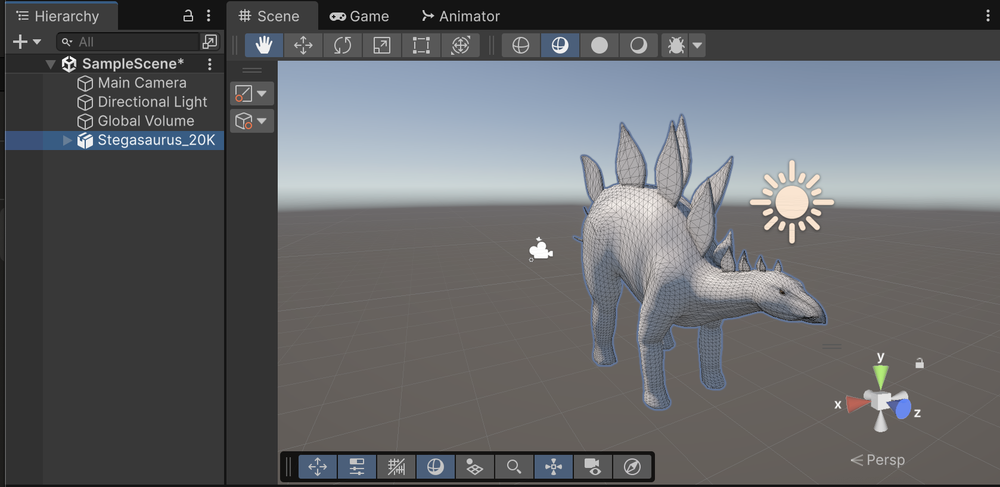
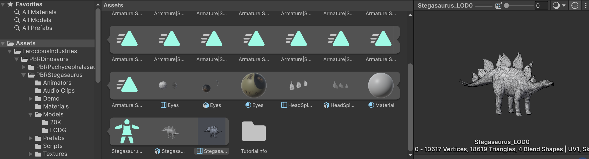
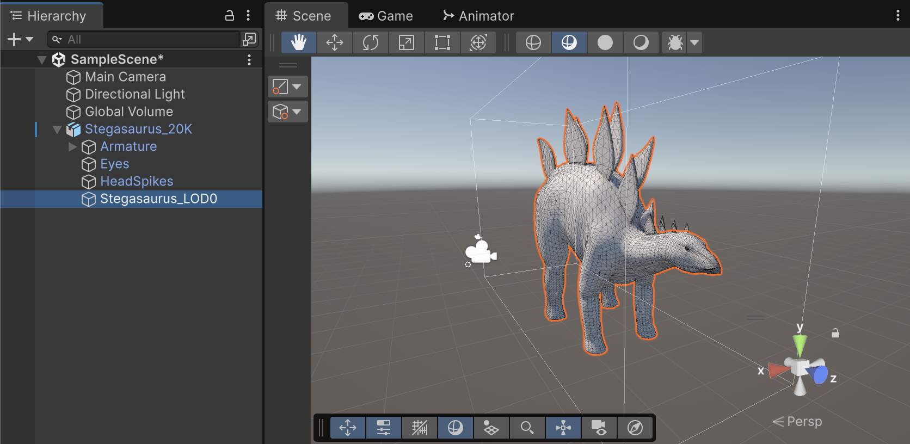
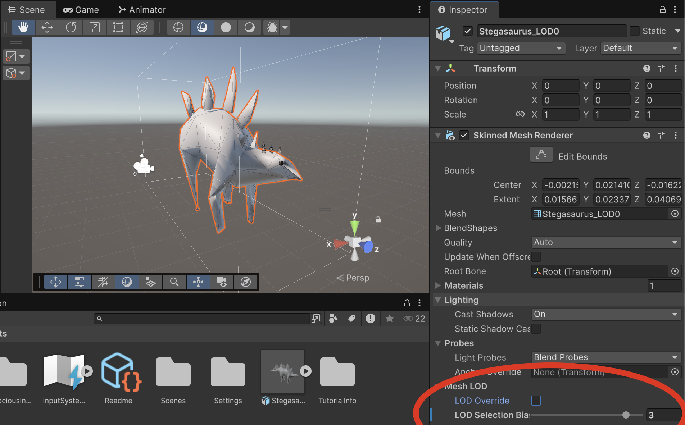

# LOD

**LOD** significa **"Level of Detail"** *(nivell de detall)* i és una tècnica utilitzada en gràfics 3D per optimitzar el rendiment dels jocs o aplicacions visuals.

- **Quan un objecte està a prop** de la càmera, es veu gran i cal mostrar-lo amb **molts detalls** (més polígons, textures d’alta resolució, etc.).
- **Quan està lluny**, ocupa molt poc espai a la pantalla, i tots aquests detalls no es noten. En lloc de dibuixar sempre el model complet, es dibuixa **una versió més senzilla** de l’objecte.

L'objectiu és:

- Millorar el rendiment 
- Mantenir la qualitat visual
- Evitar caigudes de FPS
- Poder mostrar més objectes

## Projecte

Fes un nou projecte tipus **"Universal 3d"** anomenat **LODTest**

## Assets

Importa aquests *Assets* al projecte:

[PBR Animated Dinosaurs](https://assetstore.unity.com/packages/3d/characters/animals/pbr-animated-dinosaurs-256019)

## Objectes amb LOD

Navega a la carpeta:

*Assets > FerociousIndustries > PBRDinosaurs > PBRPachycephalasaurus > Models > LODG*

Escull l'arxiu **"Pachycephalasaurus"**, a l'inspector veuràs que aquest model ja té els nivells de detall definits:

En aquest cas han definit 5 nivells de detall.

A la carpeta :

*Assets > FerociousIndustries > PBRDinosaurs > PBRPachycephalasaurus > Models > LODG*

Arrossega aquest objecte a l'escena:

- **"Pachycephalasaurus"**

Comprova a l'inspector com es poden modificar les distàncies on s'aplica LOD i fins i tot els objectes de cada distància:

<video src="./assets/lod-modifydistances.mov" width="400" controls></video>

> **Nota**: El *component* **"LOD Group"** permet definir els nivells de *LOD*, així com els objectes i distàncies de cada nivell.

## Settings del projecte

La manera en que **Unity** decideix com es mostren els diferents nivells de detall, es configura a:

*Edit > Project Settings ... > Quality > Level Of Detail*

En aquesta configuració, canviar **"Mesh LOD Threshold"** canvia la distància a la que es mostren el nivells LOD.

> **Nota**: Habitualment ho deixarem a 1, però per forçar els nivells de detall més baixos podriem posar *20*:

## Nivells LOD automàtics

En aquest exemple, copiarem un model sense nivell de detall i el generarem amb *Unity* automàticament.

Navega a la carpeta:

*Assets > FerociousIndustries > PBRDinosaurs > PBRStegasaurus > Models > 20K*

- Copia l'arxiu **"Stegasaurus_20K"** a la carpeta **"Assets"** amb *Ctrl+C*/*Ctrl+V*

- Desde la carpeta **Assets**, escull l'arxiu **"Stegasaurus_20K"**, i a l'inspector:

- Activa la opció **"Generate Mesh LODs"**
- Activa la opció **"Discard Odd Levels"**, per generar només els nivells 0, 2 i 4
- Activa **"Limit LODs"** amb valor **5**, per generar només fins a 5 nivells (4 perquè només generem parells)

- Guarda la nova configuració quan ho demana

- Arrossega el nou objecte amb LOD, **"Stegasaurus_20K"**, a l'escena.

 

- Desplega l'objecte **"Stegasaurus_20K"** i sel·leciona **"Stegasaurus_LOD0"**

 

- Fixa't que pots veure els objectes LOD creats:

<video src="./assets/lod-viewlods.mov" width="500" controls></video>

- Es pot sobrescriure la configuració **LOD** per objecte, si no es vol fer servir la dels **"Project Settings..."**, però s'ha de fer a nivell de *Mesh*

- Escull *Hierarchy > Stegasaurus_20K > Stegasaurus_LOD0*

 

- Al Inspector canvia les opcions de la secció **"Mesh LOD"** per veure l'efecte:

 

Les opcions:

- **"LOD Override"** permet escollir quin grup LOD es mostra, per forçar-ne sempre un
- **"LOD Selection Bias"** permet canviar la *tolerància* en que *Unity* mostra els **LODs**, és a dir fer que els de pitjor qualitat es mostrin abans del què toca

> **Nota**: Aquestes dues opcions, són interessants si tenim objectes amb molts polígons i realment no ens interessa gastar tant càlcul per objectes sense importància.

