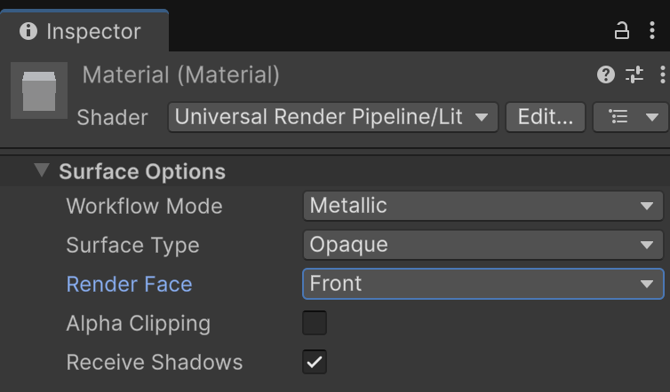
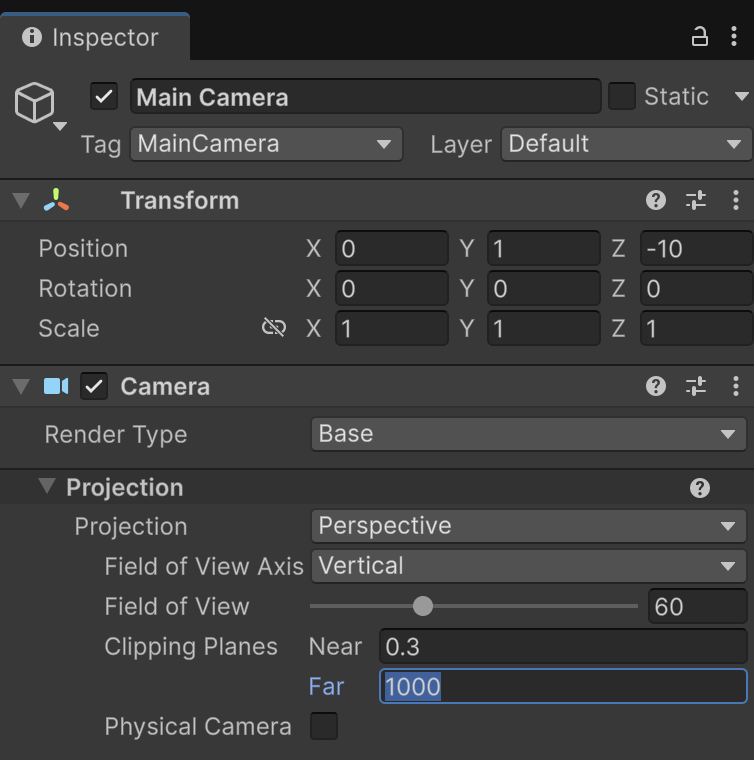
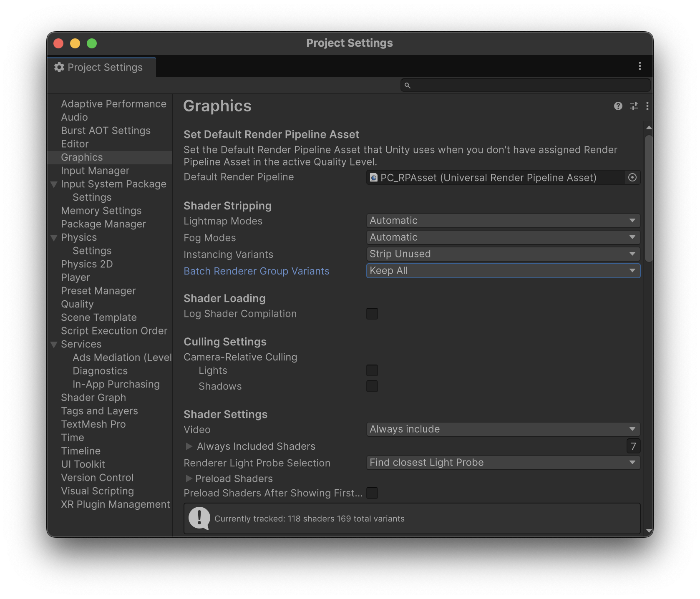
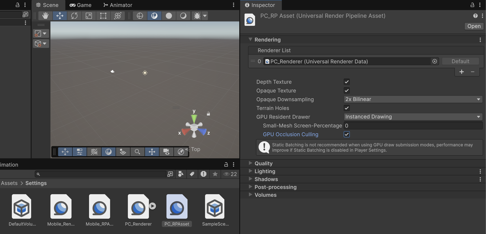

# Culling

**Culling** són tècniques que permeten decidir quins objectes es dibuixen de manera selectiva, per optimitzar el rendiment *dels jocs*.

- **Backface Culling** no dibuixa les cares del darrera dels polígons.

- **Distance Culling** amaga el què estàn lluny de la càmera.

- **Frustrum Culling** amaga el què està fora de la visió de la càmera.

- **Occlusion Culling** amaga el què queda tapat per altres objectes.

**Important!** A **Unity** només es pot fer culling d'objectes estàtics *(que no es mouen)*

## Backface culling

**Backface culling** és deixar de dibuixar les cares del darrera dels polígons *(malles)*.

Això es defineix a nivell de material amb la opció **"Render Face"**.

- **Front**: dibuixar la cara del davant (per defecte)
- **Back**: dibuixar la cara del darrera
- **Both**: dibuixar totes dues cares

<center>

</center>

<center>
<video src="./assets/culling-materialbackface.mov" width="500" controls></video>
</center>

## Distance culling

**Frustrum culling** és deixar de dibuixar els objectes que estàn massa lluny (o aprop) de la càmera.

A la configuració de la càmera es defineixen els **"Clipping planes"** i tot el què queda fora no es dibuixa.

<center>

</center>

<center>
<video src="./assets/culling-camerafar.mov" width="500" controls></video>
</center>

## Frustrum culling

**Frustrum culling** és deixar de dibuixar el què no és visible per la càmera.

**Unity** el fa automàticament, el què no està davant de la càmera no es dibuixa.

Amb aquest script es marca el què queda dins de càmera i per tant es dibuixa, i el què no. Cal assignar-lo a la **"Main Camera"**.

<center>
<video src="./assets/culling-frustrum.mov" width="500" controls></video>
</center>

Fes una escena com l'anterior, amb 10 cubs espaiats a les posicions X: 0, 2, 4, 6, 8, ... i comprova amb el següent script quan queden dins/fora de càmera.

```csharp
using UnityEngine;

[ExecuteAlways]
public class FrustumCullingDebugger : MonoBehaviour
{
    public Camera targetCamera;         // Si és null, usa Camera.main
    private Transform scopeRoot;         // Arrel a inspeccionar (si és null, tota l'escena via FindObjectsOfType)

    void OnDrawGizmos()
    {
        var cam = targetCamera != null ? targetCamera : Camera.main;
        if (cam == null) return;

        var planes = GeometryUtility.CalculateFrustumPlanes(cam);
        Renderer[] renderers;

        if (scopeRoot != null)
            renderers = scopeRoot.GetComponentsInChildren<Renderer>(true);
        else
            renderers = FindObjectsOfType<Renderer>(true);

        foreach (var r in renderers)
        {
            if (r == null) continue;
            bool visible = GeometryUtility.TestPlanesAABB(planes, r.bounds);
            Gizmos.color = visible ? Color.green : Color.red;
            var b = r.bounds;
            Gizmos.DrawWireCube(b.center, b.size);
        }
    }
}
```

## Occlusion culling

**Occlusion culling** és deixar de dibuixar el què queda tapat per altres objectes. 

Antigament calia configurar-ho manualment definint els objectes de dos tipus:

- **"Occluder"**: objectes que tapen altres objectes (parets)
- **"Ocludee"**: objectes que són tapats (darrera de parets)

<br/>

# GPU Resident Drawer

La configuració **"GPU Resident Drawer"** aplica **"Occlusion culling"** automàticament *(a partir de Unity 6)*.

Fa servir la **GPU** per gestionar quins objectes pot descartar durant la fase de dibuix.

*Menú Edit > Project Settings... > Graphics > 

Escollir la opció:

- **Batch Renderer Group Variants"**: Keep All

<center>

</center>

A la carpeta per defecte:

*Assets > Setting*

Configurar als arxius:

- *Mobile_RPAsset*
- *PC_RPAsset*

La opció:

- **GPU Resident Drawing**: Instance Drawing
- Activar **GPU Occlusion Culling**

<center>

</center>
<br/>