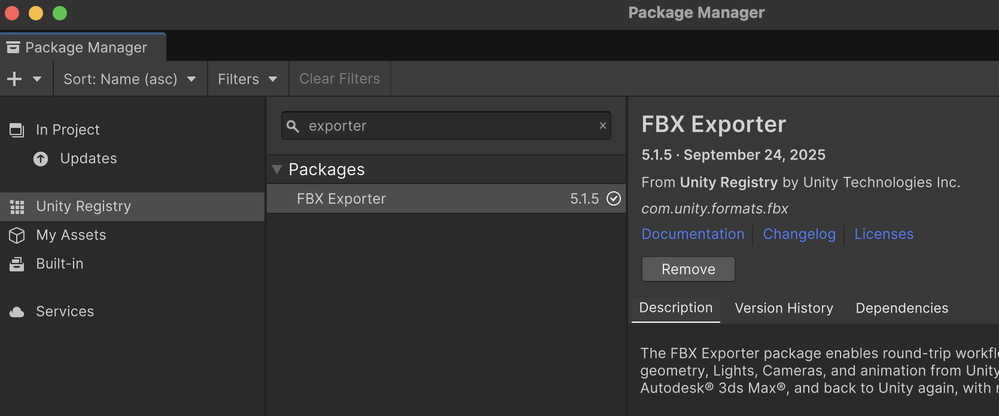

# Exportar Assets

Els *Assets* es poden compartir amb altres projectes *Unity* o eines 3D, per fer-ho cal exportar els *Assets* a:

- **Unitypackage**: per compartir-ho amb projectes *Unity*
- **FBX**: per compartir-ho amb altres eines 3D

## Format Unitypackage

Unity té una eina pròpia per *guardar* assets en arxius **.unitypackage**.

Si s'ha de compartir amb altres projectes *Unity*, enlloc d'altres eines 3D és millor fer servir **Unitypackage**

Per crear arxius **.unitypackage**:

- Des d'alguna carpeta dins de **"Assets"**
- *Botó dret sobre un arxiu > Export package...*
- Escollir el què es vol exportar
- Apretar **"Export..."**

**Unitypackage** conserva scripts, materials, referències i dependències internes.

## FBX Exporter

Sovint volem exportar objectes d'un projecte per poder-los compartir amb altres projectes.

 **FBX Exporter** permet crear arxius **.fbx**

Amb el **Package Manager** instal·la **FBX Exporter**

- *Window > Package Management > Package Manager*

- Pestanya: *"Unity Registry"*

- Busca: *"FBX Exporter"*

- Afegeix el paquet

 

### Crear arxius ".fbx"

Amb el paquet **"FBX Exporter"** serveix per convertir objectes o escenes de **Unity** a arxius **.fbx**, que després pots obrir en altres programes 3D (Blender, Maya, 3ds Max) o en altres projectes Unity.

**Què es pot exportar amb FBX Exporter**

| Tipus d’element | Descripció |
|-----------------|-------------|
| **Models 3D (Meshes)** | Objectes amb `MeshFilter` o `SkinnedMeshRenderer` (malla estàtica o esquelètica). |
| **Jerarquies d’objectes** | Exporta un GameObject amb tots els fills mantenint la jerarquia. |
| **Animacions** | Clips d’animació amb keyframes, rotacions i posicions associades a un Animator o Animation component. |
| **Materials bàsics** | Exporta referències a materials (nom i shader tipus Standard). Shaders personalitzats es simplifiquen. |
| **Llum i càmeres** | Pot incloure posició i tipus de llums i càmeres si està habilitat. |
| **Transformacions** | Manté posició, rotació i escala de cada objecte. |
| **Normals i tangents** | S’inclouen automàticament per conservar la informació de superfície. |

Però hi ha elements que no s'exporten completament o es simplifiquen:

- Textures
- Shaders personalitzats
- Scripts *'csharp'*
- Partícules o *Prefabs* complexes
- Físiques

## Casos típics d’ús

- Exportar models fets amb **ProBuilder** a un format estàndard **.fbx**.
- Portar models a Blender, Maya o 3ds Max per fer-hi retocs.
- Fer “backup” d’una escena 3D en format universal.

