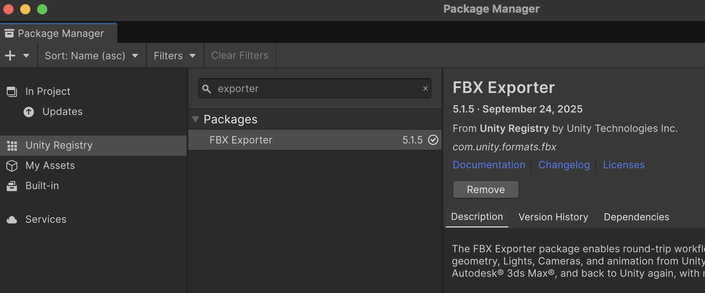

## FBX Exporter

Sovint volem exportar objectes d'un projecte per poder-los compartir amb altres projectes.

 **FBX Exporter** permet crear arxius **.fbx**

Amb el **Package Manager** instal·la **FBX Exporter**

- *Window > Package Management > Package Manager*

- Pestanya: *"Unity Registry"*

- Busca: *"FBX Exporter"*

- Afegeix el paquet

 