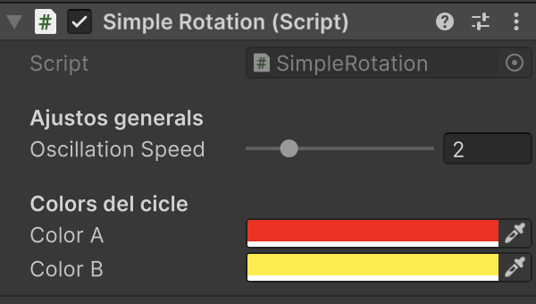

# Objectes Unity

Tots els objectes *Unity* permeten afegir un o més arxius de codi per afectar-ne el comportament.

## MonoBehaviour

**El codi que s'associa a un objecte** s'ha de derivar de *MonoBehaviour*, i aquestes són les principals funcions:

- Afegeix un objecte tipus *"3D Object > Cube"* a l'escena
- Crea un nou script amb nom **"SimpleRotation"**, amb el següent codi
- Afegeix aquest script com a component del cub
- Fes play, s'ha de veure com gira el cub 
- A la pestanya **"Terminal"** es veuen els missatges de *"Debug.Log"*

Aquest codi té explicacions de les principals funcions dels objectes *MonoBehaviour*

```csharp
using UnityEngine;
using UnityEngine.InputSystem;

/// Exemple complet per entendre el cicle de vida dels scripts Unity.
/// Mostra les funcions més importants i la seva execució en ordre.
public class SimpleRotation : MonoBehaviour
{
    /// Es crida automàticament quan el component es carrega.
    /// Ideal per inicialitzar referències i valors que no depenen d'altres scripts.
    void Awake()
    {
        Debug.Log("Awake(): inicialització de components i variables.");
    }


    /// S'executa quan el component s'activa (després de Awake).
    /// Perfecte per subscriure's a events o reactivar estats.
    void OnEnable()
    {
        Debug.Log("OnEnable(): component activat.");
    }

    /// OnValidate s'executa automàticament quan canvia algun valor a l’Inspector o es recompila l’script.
    void OnValidate()
    {
        Debug.Log("OnValidate(): validant camps.");
    }

    /// Es crida un cop, abans del primer frame.
    /// Ideal per configurar valors inicials quan ja s’han inicialitzat tots els Awake().    void Start()
    void Start()
    {
        Debug.Log("Start(): preparació inicial completada.");
    }

    /// S'executa cada frame (freqüència variable segons FPS).
    /// Perfecte per llegir inputs i fer moviments visuals.
    void Update()
    {
        // multiplicar per Time.deltaTime 
        // permet mantenir la velocitat de rotació, 
        // encara que hi hagi variacions de FPS
        float deltaTime = Time.deltaTime;
        transform.Rotate(0, 60f * deltaTime, 0);
    }


    /// S'executa després de tots els Update().
    /// Ideal per càmeres o ajustos finals que depenen del moviment d’altres objectes.
    void LateUpdate()
    {
        // Exemple: seguir el jugador
        // cameraTransform.position = player.position + offset;
    }


    /// S'executa a intervals fixos (per defecte cada 0.02s).
    /// Ideal per a física, forces o moviments amb Rigidbody.
    void FixedUpdate()
    {
        // Exemple: rb.AddForce(Vector3.up * 10f);
    }

    /// Es crida quan el component es desactiva.
    /// Ideal per desubscriure events o aturar processos.
    void OnDisable()
    {
        Debug.Log("OnDisable(): component desactivat.");
    }


    /// Es crida just abans d'eliminar l'objecte o tancar l’escena.
    /// Perfecte per alliberar recursos o guardar dades.
    void OnDestroy()
    {
        Debug.Log("OnDestroy(): objecte eliminat.");
    }
}
```

## Propietats de l'objecte

Cada objecte de la escena pot tenir components associats, 
Aquests components es poden veure i configurar des de *l’Inspector*.

**Unity** dóna accés directe a alguna informació de l'objecte:

- **gameObject**: el propi objecte vinculat
- **name**: nom de l'objecte
- **tag**: etiqueta assignada a l'objecte
- **transform**: posició, rotació, escalat

### Propietats de *gameObject*

- **"active"*: si es visualitza l'objecte:
```csharp
// Desactiva completament l'objecte (no s'actualitza ni es veu)
gameObject.SetActive(false);

// Torna a activar-lo
gameObject.SetActive(true);

// Consultar si està actiu actualment
bool actiu = gameObject.activeSelf;
Debug.Log("Objecte actiu? " + actiu);
```

- **"static"**: si es poden modificar les propietats de l'objecte durant l'execució
```csharp
// Marca l'objecte com a estàtic
gameObject.isStatic = true;

// Consultar si és estàtic
bool esStatic = gameObject.isStatic;
Debug.Log("És estàtic? " + esStatic);
```

- **"tag"**: etiqueta de l'objecte
```csharp
// Obtenir el tag actual
string etiqueta = gameObject.tag;
Debug.Log("Etiqueta: " + etiqueta);

// Comparar amb una etiqueta concreta
if (gameObject.tag == "Player")
{
    Debug.Log("És el jugador!");
}

// Assignar una nova etiqueta
gameObject.tag = "Enemy";
```

- **"name"**: nom de l'objecte
```csharp
// Obtenir el nom actual
string nom = gameObject.name;
Debug.Log("Nom de l’objecte: " + nom);

// Assignar un nou nom
gameObject.name = "CuboMovible";
```

### Propietats de transformació

- **"position"**: posició global de l'objecte
```csharp
// Canviar la posició global
transform.position = new Vector3(0, 2, 0);

// Desplaçar l’objecte cap amunt
transform.position += Vector3.up * 1f;

// Llegir la posició actual
Debug.Log("Posició global: " + transform.position);
```

- **"localPosition"**: posició relativa al pare si està dins d'un altre objecte
```csharp
// Canviar la posició local dins del seu pare
transform.localPosition = new Vector3(1, 0, 0);

// Consultar posició relativa
Debug.Log("Posició local dins del pare: " + transform.localPosition);
```

- **"rotation"**: rotació global de l'objecte
```csharp
// Assignar una rotació global específica
transform.rotation = Quaternion.Euler(0, 90, 0);

// Girar contínuament
transform.Rotate(0, 60f * Time.deltaTime, 0);

// Consultar rotació actual
Debug.Log("Rotació global: " + transform.rotation.eulerAngles);
```

- **"localRotation"**: rotació relativa al pare si està dins d'un altre objecte
```csharp
// Configurar una rotació relativa dins del seu pare
transform.localRotation = Quaternion.Euler(0, 45, 0);

// Mostrar angles locals
Debug.Log("Rotació local: " + transform.localRotation.eulerAngles);
```

- **"localScale"**: mida relativa al pare si està dins d'un altre objecte
```csharp
// Fer l’objecte el doble de gran
transform.localScale = new Vector3(2, 2, 2);

// Reduir-lo a la meitat
transform.localScale *= 0.5f;

// Consultar escala local
Debug.Log("Escala local: " + transform.localScale);
```

- **"lossyScale"**: escala global si té pares escalats 
```csharp
// Calcular l’escala global 
Vector3 worldScale = transform.lossyScale;
Debug.Log("Escala global efectiva: " + worldScale);
```

> **Important!** la propietat **"loosyScale"** és només de lectura.

## Propietats d'altres components

Les propietats de l'objecte, depenen dels components que té associats.

### Forçar components

Algunes vegades el codi necessita que l'objecte tingui components específics, si l'usuari no els ha afegit *manualment* a través de l'inspector, els podem incloure automàticament amb atributs **"RequireComponent"**:

```csharp
using UnityEngine;

// Components requerits en aquest objecte
// per tal que el codi funcioni
[RequireComponent(typeof(Rigidbody))]
[RequireComponent(typeof(Collider))]   
public class PlayerMover : MonoBehaviour
{
    // Unity s’assegura que aquest GameObject tingui Rigidbody i Collider.
}
```

## Referències a components de l'objecte

Hi ha diverses maneres d'obtenir referències als components de l'objecte.

| Tipus                                    | Exemple                                                   | Com s’assigna                          |
| :--------------------------------------- | :-------------------------------------------------------- | :------------------------------------- |
| `GetComponent<>()`** | `_rb = GetComponent<Rigidbody>();`                        | Unity busca dins el mateix objecte     |
| **Arrossegar a l’Inspector**      | `[SerializeField] private Light llum;`                    | Manual (assignes a mà a l’Inspector)   |
| **Buscar amb `Find` o `tag`**       | `GameObject.FindWithTag("Player");`                       | Busca a tota l’escena (poc eficient)   |
| **Per fills o pares**                 | `GetComponentInChildren<>()` / `GetComponentInParent<>()` | Busca en jerarquia propera             |
| **Per injecció (paràmetre)**          | `Init(Light l)` o via Singleton                           | Passada directament per altres scripts |

### Definició de les referències

Totes les referències a components o altres objectes s’han de definir a la capçalera de la classe,
com a variables.

- **private**: si només es fan servir dins l'objecte i l'usuari no les ha de poder configurar a l'inspector
- **public**: si s'han d'accedir des d'altres objectes i/o l'usuari **les pot configurar des de l'inspector**

Les referències a components del pròpi objecte s'inicien a la funció **"Awake()"**
```csharp
using UnityEngine;

[RequireComponent(typeof(Rigidbody))]
public class PlayerMove : MonoBehaviour
{
    private Rigidbody _rb;   // Component del mateix objecte

    void Awake()
    {
        // Obtenim el component Rigidbody del mateix objecte
        _rb = GetComponent<Rigidbody>();
    }

    void FixedUpdate()
    {
        // Utilitzem la referència cachejada
        _rb.AddForce(Vector3.forward * 5f, ForceMode.Acceleration);
    }
}
```

Les referències a components d'altres objectes s'inicien a la funció **"Start()"**
```csharp
using UnityEngine;

public class LightFollower : MonoBehaviour
{
    private Light _sceneLight;     // Referència a un altre objecte (la llum principal)
    [SerializeField] private Transform _target;  // Assignable per Inspector

    void Awake() {
    }

    void Start()
    {
        // Busquem la primera llum de l’escena
        _sceneLight = FindObjectOfType<Light>();

        // Si hi ha una llum, la situem sobre el nostre objectiu
        if (_sceneLight != null && _target != null)
            _sceneLight.transform.position = _target.position + Vector3.up * 2f;
    }
}
```

> **Nota:** Les referències d'un fill o un pare es poden assignar a totes dues funcions **"Awake()"** i **"Start()"**

Les referències assignades des de l'inspector:

- No cal iniciar-les. 
- Cal que siguin **public** (o [SerializeField])
- Es pot comprovar si s'han referenciat 

```csharp
using UnityEngine;

public class TargetFollower : MonoBehaviour
{
    [SerializeField] private Transform target;  // Assigna’l des de l’Inspector

    void Start()
    {
        // Comprovem si la referència ha estat assignada
        if (target == null)
        {
            Debug.LogWarning("⚠️ No s'ha assignat cap objectiu al camp 'target'.");
        }
    }

    void Update()
    {
        // Només mou l'objecte si la referència és vàlida
        if (target != null)
            transform.position = target.position + Vector3.up * 2f;
    }

    void OnValidate()
    {
        if (target == null)
            Debug.LogWarning("Assigna un objectiu al component TargetFollower.");
    }
}
```

## Atributs

Els atributs com [Header], [Tooltip], [Range] o [SerializeField] són anotacions que Unity llegeix a l’editor, no en temps d’execució.

Serveixen per fer més clar, segur i visual l’ús de variables a l’Inspector.

| Atribut                              | Exemple                                                  | Ús                                            |
| :----------------------------------- | :------------------------------------------------------- | :-------------------------------------------- |
| `[SerializeField]`                   | `[SerializeField] private int vida;`                     | Mostra una variable privada a l’Inspector     |
| `[Header("Títol")]`                  | `[Header("Ajustos de moviment")]`                        | Agrupa variables a l’Inspector                |
| `[Tooltip("Velocitat del jugador")]` | `[Tooltip("Velocitat del jugador")] public float speed;` | Mostra ajuda a l’Inspector                    |
| `[Range(0, 10)]`                     | `[Range(0,10)] public float volum;`                      | Slider numèric a l’Inspector                  |
| `[DisallowMultipleComponent]`        | `[DisallowMultipleComponent]`                            | Evita duplicar el component al mateix objecte |

Aquest exemple:
```csharp
using UnityEngine;

/// Exemple d’ús d’atributs i validació automàtica a l’editor.
[DisallowMultipleComponent]                     // Evita afegir el script més d’un cop al mateix objecte
[RequireComponent(typeof(Light))]               // Assegura que hi hagi un component Light
public class LightController : MonoBehaviour
{
    [Header("Ajustos generals")]                 // Títol de secció a l’Inspector
    [Tooltip("Velocitat d'oscil·lació de la intensitat (Hz)")]
    [Range(0f, 10f)]                             // Slider de 0 a 10
    public float oscillationSpeed = 2f;

    [Header("Colors del cicle")]
    [SerializeField] private Color colorA = Color.red;
    [SerializeField] private Color colorB = Color.yellow;

    private Light _light;  // Referència al component Light
}
```

Apareix a l'inspector, a l'apartat del codi, com:

<center>

</center>
<br/>

## Cicle de vida dels objectes

A Unity, tots els elements d’una escena són objectes *"GameObject"* amb components **"MonoBehaviour"**.

Unity segueix una seqüència de vida molt concreta:

**Creació o “Spawn”**

- Crea una còpia de l’objecte original
- L’afegeix a l’escena actual.
- Executa en aquest ordre: Awake(), OnEnable(), Start()

**Objecte actiu**

S'executen: Update(), FixedUpdate(), OnTrigger ...

**Desactivació**

Quan un objecte s’amaga o desactiva (gameObject.SetActive(false)):

- Es deixa d’actualitzar (no es criden Update() ni OnTrigger...)
- S’executa OnDisable()

**Destrucció**

Quan es vol eliminar definitivament un objecte:

- Es OnDisable() si estava actiu
- Es crida OnDestroy()
- Unity elimina l’objecte de l’escena i allibera memòria

### Exemple:

- Crear una plantilla assignada a partir d'un objecte o prefab a l'inspector
- Clonar objectes apretant la tecla 'a'
- Destruir l'objecte més antic apretant la tecla 'espai'

```csharp
using System.Collections.Generic;
using UnityEngine;

public class TemplateABSpawner : MonoBehaviour
{
    [Header("Template source (Prefab o objecte d'escena)")]
    public GameObject source;

    GameObject template;                 // plantilla (inactiva)
    readonly List<GameObject> spawned = new(); // instàncies vives en ordre de creació

    void Awake()
    {
        if (source == null)
        {
            Debug.LogWarning("Falta 'source' (objecte/prefab) al spawner.", this);
            return;
        }

        // Fem un clon per usar-lo com a plantilla (quedarà inactiu)
        template = Instantiate(source);
        template.name = source.name + "_Template";
        template.SetActive(false);                 // plantilla no visible
        template.transform.SetParent(transform);   // opcional: ordenar a la jerarquia
        // Nota: els Awake dels components del template ja s'hauran executat
    }

    void Update()
    {
        // Spawn amb tecla 'A'
        if (Input.GetKeyDown(KeyCode.A) && template != null)
        {
            var go = SpawnFromTemplate(template, new Vector3(+1f, 0f, 0f));
            spawned.Add(go);
        }

        // Destruir el més vell amb ESPAI
        if (Input.GetKeyDown(KeyCode.Space))
        {
            DestroyOldest(spawned);
        }
    }

    GameObject SpawnFromTemplate(GameObject tpl, Vector3 offset)
    {
        var go = Instantiate(tpl, transform.position + offset, Quaternion.identity);
        go.SetActive(true); // per si el template era inactiu
        return go;
    }

    void DestroyOldest(List<GameObject> list)
    {
        // Salta nuls del cap de la llista
        while (list.Count > 0 && list[0] == null) list.RemoveAt(0);
        if (list.Count == 0) return;

        var oldest = list[0];
        list.RemoveAt(0);
        if (oldest) Destroy(oldest);
    }
}
```