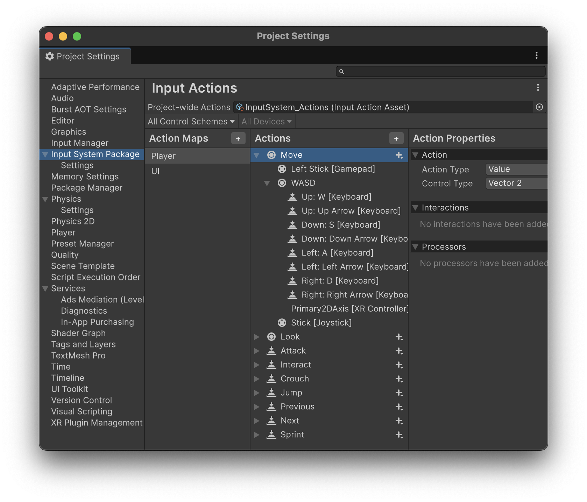

# Input system

Es sistema d'entrada d'events de **Unity** permet definir accions (moure, saltar, disparar...) que poden ser mapejades a teclat, ratolí, comandaments o pantalles tàctils sense canviar el codi.

Les accions disponibles, i els disparadors (tecles) que les activen, es configuren des de:

*Menu Edit > Project Settings... > Input System Package*

<center>

</center>

Els mètodes més habituals són:

| Acció        | Dispositiu / Tecla         | Funció cridada   |
| :----------- | :------------------------- | :--------------- |
| Moure        | WASD / Stick esquerre      | `OnMove`         |
| Mirar        | Ratolí / Stick dret        | `OnLook`         |
| Saltar       | Space / Botó A             | `OnJump`         |
| Disparar     | Click esquerre / Botó dret | `OnFire`         |
| Apuntar      | Click dret / LT            | `OnAim`          |
| Córrer       | Shift / Stick clicat       | `OnSprint`       |
| Ajupir-se    | Ctrl / B                   | `OnCrouch`       |
| Interactuar  | E / X                      | `OnInteract`     |
| Recarregar   | R                          | `OnReload`       |
| Pausa        | Esc / Start                | `OnPause`        |
| Navegar menú | Fletxes / D-pad            | `OnMenuNavigate` |
| Confirmar    | Enter / A                  | `OnSubmit`       |
| Cancel·lar   | Esc / B                    | `OnCancel`       |


```csharp
using UnityEngine;
using UnityEngine.InputSystem;

/// Exemple complet per entendre les funcions del nou Input System (Unity 6).
/// Cada funció es crida automàticament quan es detecta una acció d'entrada.
public class SimpleInputCallbacks : MonoBehaviour
{
    // --- MOVIMENT I CÀMERA ---
    
    /// Es crida quan l’usuari es mou.
    /// Normalment amb **WASD** o **Stick esquerre** del gamepad.
    public void OnMove(InputValue value)
    {
        Vector2 move = value.Get<Vector2>();
        Debug.Log($"OnMove(): direcció {move}");
    }

    /// Es crida quan es mou el ratolí o el stick dret.
    /// Serveix per rotar la càmera o mirar al voltant.
    public void OnLook(InputValue value)
    {
        Vector2 look = value.Get<Vector2>();
        Debug.Log($"OnLook(): moviment de càmera {look}");
    }

    // --- ACCIONS DE JOC ---
    
    /// Es crida quan es prem **Space Bar** (o el botó A del comandament).
    /// Normalment s’utilitza per fer saltar el jugador.
    public void OnJump(InputValue value)
    {
        Debug.Log("OnJump(): salt iniciat amb Space o A");
    }

    /// Es crida quan es prem **Click esquerre del ratolí** o **botó dret del gamepad**.
    /// S’utilitza per atacar o disparar.
    public void OnFire(InputValue value)
    {
        Debug.Log("OnFire(): atac o dispar amb click esquerre / botó dret");
    }

    /// Es crida quan es manté premut **Click dret** o **LT** del comandament.
    /// Serveix per apuntar amb un arma o activar una visió especial.
    public void OnAim(InputValue value)
    {
        Debug.Log("OnAim(): apuntant amb click dret o LT");
    }

    /// Es crida quan es manté **Shift esquerre** o **stick esquerre clicat**.
    /// Permet córrer o augmentar la velocitat.
    public void OnSprint(InputValue value)
    {
        Debug.Log("OnSprint(): corrent amb Shift o stick clicat");
    }

    /// Es crida quan es prem **Ctrl esquerre** o **B** al comandament.
    /// S’utilitza per ajupir-se o cobrir-se.
    public void OnCrouch(InputValue value)
    {
        Debug.Log("OnCrouch(): ajupir-se amb Ctrl o B");
    }

    /// Es crida quan es prem **E** o **X** al comandament.
    /// Interacció amb objectes o portes.
    public void OnInteract(InputValue value)
    {
        Debug.Log("OnInteract(): interacció amb objecte (E o X)");
    }

    /// Es crida quan es prem **R**.
    /// Normalment per recarregar l’arma o repetir una acció.
    public void OnReload(InputValue value)
    {
        Debug.Log("OnReload(): recarregar amb R");
    }

    // --- MENÚ I CONTROL ---
    
    /// Es crida quan es prem **Esc** o el botó Start del comandament.
    /// S’utilitza per pausar el joc o obrir el menú principal.
    public void OnPause(InputValue value)
    {
        Debug.Log("OnPause(): pausa del joc amb Esc o Start");
    }

    /// Es crida quan es mouen les **fletxes** o el **D-pad** del comandament.
    /// Permet moure’s pels menús.
    public void OnMenuNavigate(InputValue value)
    {
        Vector2 nav = value.Get<Vector2>();
        Debug.Log($"OnMenuNavigate(): moviment menú {nav}");
    }

    /// Es crida quan es prem **Enter** o **A** al comandament.
    /// Confirmar una selecció o acció en un menú.
    public void OnSubmit(InputValue value)
    {
        Debug.Log("OnSubmit(): confirmar acció amb Enter o A");
    }

    /// Es crida quan es prem **Esc** o **B** al comandament.
    /// Cancel·lar una acció o tancar un menú.
    public void OnCancel(InputValue value)
    {
        Debug.Log("OnCancel(): cancel·lar amb Esc o B");
    }
}
```

## Exemples de com fer servir l'*Input System*

Aquests petits exemples de codi, mostren com fer servir l'input system per diferents objectius.

### Exemple 1: Moure un cub amb WASD/fletxes

- **Objectiu**: moure un cub pel pla amb el teclat.
- **Inputs**: 
    - WASD o fletxes → moure X/Z
    - Alt/Shift/Ctrl + Up/Down → moure Y

1 - Afegeix un Plane i un Cube a l’escena.
2 - Afegeix l’script MoveCube.cs al Cube.

```csharp
using UnityEngine;
using UnityEngine.InputSystem;

[RequireComponent(typeof(PlayerInput))]
public class MoveCube : MonoBehaviour
{
    private PlayerInput _input;
    private Vector2 moveInput;
    [SerializeField] private float speed = 3f;

    void Awake()
    {
        _input = GetComponent<PlayerInput>();
    }

    void Start()
    {
        // (Opcional) desactivar mapes addicionals
        foreach (var map in _input.actions.actionMaps)
            map.Disable();
        _input.actions.FindActionMap("Player").Enable();
    }

    public void OnMove(InputValue value)
    {
        moveInput = value.Get<Vector2>();
    }

    void Update()
    {
        Vector3 move = Vector3.zero;

        // Comprovem si alguna tecla modificadora està premuda
        bool modifierHeld =
            Keyboard.current.leftShiftKey.isPressed ||
            Keyboard.current.rightShiftKey.isPressed ||
            Keyboard.current.leftAltKey.isPressed ||
            Keyboard.current.rightAltKey.isPressed ||
            Keyboard.current.leftCommandKey.isPressed ||
            Keyboard.current.rightCommandKey.isPressed;

        // Si prems Shift/Alt/Cmd + Amunt/Avall → moviment vertical
        if (modifierHeld)
        {
            move.y = moveInput.y;
        }
        else
        {
            // Sense modificador → moviment horitzontal (XZ)
            move = new Vector3(moveInput.x, 0f, moveInput.y);
        }

        transform.Translate(move * speed * Time.deltaTime, Space.World);
    }
}
```

### Exemple 2: Canviar el color del cub

- **Objectiu**: canviar de color en prémer les tecles 1–9
- **Inputs**: 
    - 1–9 (fila numèrica) → colors predefinits
    - 0 o Numpad0 → color aleatori

1 - Afegeix un Cube a l’escena (assegura’t que té MeshRenderer amb un material).

2 - Crea l’script ColorChangeNumbers.cs i afegeix-lo al Cube.

```csharp
using UnityEngine;
using UnityEngine.InputSystem;
using UnityEngine.InputSystem.Controls;

[RequireComponent(typeof(PlayerInput))]
[RequireComponent(typeof(Renderer))]
public class ColorChangeNumbers : MonoBehaviour
{
    private Renderer _rend;

    // Paleta bàsica 1..9 
    private static readonly Color[] palette = new Color[]
    {
        Color.red,       // 1
        Color.green,     // 2
        Color.blue,      // 3
        Color.yellow,    // 4
        Color.magenta,   // 5
        Color.cyan,      // 6
        Color.white,     // 7
        Color.gray,      // 8
        Color.black      // 9
    };

    private int GetKeyNumber()
    {
        var kb = Keyboard.current;
        if (kb == null) return -1;

        KeyControl[] keys = {
            kb.digit0Key, kb.digit1Key, kb.digit2Key, kb.digit3Key, kb.digit4Key,
            kb.digit5Key, kb.digit6Key, kb.digit7Key, kb.digit8Key, kb.digit9Key,
            kb.numpad0Key, kb.numpad1Key, kb.numpad2Key, kb.numpad3Key, kb.numpad4Key,
            kb.numpad5Key, kb.numpad6Key, kb.numpad7Key, kb.numpad8Key, kb.numpad9Key
        };

        for (int i = 0; i < keys.Length; i++)
            if (keys[i]?.wasPressedThisFrame ?? false)
                return i % 10;

        return -1;
    }

    private void SetColorIndex(int value)
    {
        int idx = Mathf.Clamp(value, 1, 9) - 1; 
        _rend.material.color = palette[idx];
        Debug.Log($"Color {value}: {_rend.material.color}");
    }

    private void SetRandomColor()
    {
        Color c = Random.ColorHSV(0f, 1f, 0.6f, 1f, 0.6f, 1f); // saturació i valor agradables
        _rend.material.color = c;
        Debug.Log($"Color aleatori: {c}");
    }

    void Awake()
    {
        _rend = GetComponent<Renderer>();
    }

    void Update()
    {
        var kb = Keyboard.current;
        if (kb == null) return;

        var num = GetKeyNumber();
        if (num == -1) return;

        if (num == 0)
        {
            SetRandomColor();
        }
        else
        {
            SetColorIndex(num);
        }
    }
}
```

### Exemple 3: Arrossegar amb el ratolí

- **Objectiu**: drag & drop d’un objecte 3D amb el ratolí
- **Inputs**: 
    - botons del ratolí i arrossegar

1 - Crea un Plane i un Cube

2 - Al Cube, assegura’t que hi ha BoxCollider

3 - Afegeix l’script DragObject al Cube.

```csharp
using UnityEngine;
using UnityEngine.InputSystem;

[RequireComponent(typeof(Collider))]
public class DragObjectCameraPlane : MonoBehaviour
{
    private Camera cam;
    private bool dragging;
    private Vector3 offset;          // diferència entre posició de l'objecte i punt d'impacte
    private Plane dragPlane;         // pla fix paral·lel a la càmera
    private Vector3 vel;             // per a SmoothDamp

    void Awake()
    {
        cam = Camera.main;
    }

    void Update()
    {
        var mouse = Mouse.current;
        if (mouse == null) return;

        // Inici del drag si cliques aquest objecte
        if (mouse.leftButton.wasPressedThisFrame)
        {
            Ray r = cam.ScreenPointToRay(mouse.position.ReadValue());

            // Definim el pla a la profunditat actual de l'objecte, paral·lel a la càmera
            dragPlane = new Plane(cam.transform.forward, transform.position);

            // Intersecció del raig del cursor amb el pla
            if (dragPlane.Raycast(r, out float enter))
            {
                Vector3 hitOnPlane = r.GetPoint(enter);

                // Confirmem que realment has clicat l'objecte (opcional però recomanable)
                if (Physics.Raycast(r, out RaycastHit hit) && hit.transform == transform)
                {
                    dragging = true;
                    offset = transform.position - hitOnPlane;
                }
            }
        }

        // Allibera
        if (mouse.leftButton.wasReleasedThisFrame)
            dragging = false;

        if (!dragging) return;

        // Mentre arrossegues, torna a projectar el cursor sobre EL MATEIX PLA
        Ray ray = cam.ScreenPointToRay(mouse.position.ReadValue());
        if (dragPlane.Raycast(ray, out float t))
        {
            Vector3 target = ray.GetPoint(t) + offset;
            transform.position = target;
        }
    }
}
```