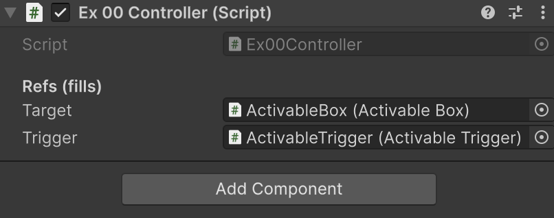
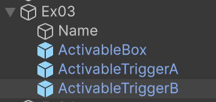

# Referències

Els objectes a *Unity* s'organitzen dins la jerarquia de l'escena. 

En un objecte el component **"transform"** fa referència a:

- On està l’objecte (position)
- Com està orientat (rotation)
- Quina mida té (scale)
- **A quin objecte “pare” pertany (parent)**
- **Quins fills té (children)**

Així podem *"navegar"* per la jerarquia a través dels components **"transform"**

Hi ha diferents maneres d'aconseguir referències a altres objectes.

## Des de l'inspector

Quan es defineix una variable pública, es pot *arrosegar* la referència directament des de l'inspector.
```csharp
public class Ex00Controller : MonoBehaviour
{
    [Header("Refs (fills)")]
    public ActivableBox target;
    public ActivableTrigger trigger;
}
```

<center>

</center>
<br/>

## Buscar per **tipus** d'objecte

Es pot aconseguir la referència a un altre objecte, a partir del *"Tipus"* d'objecte, en aquest exemple de tipus *"ActivableBox"*

Buscar entre els fills:
```csharp
public class Ex00Controller : MonoBehaviour
{
    [Header("Refs (fills)")]
    public ActivableBox target;
    public ActivableTrigger trigger;

    void Awake()
    {
        // "true" fa que també es busqui entre els fills inactius
        if (target == null) target = GetComponentInChildren<ActivableBox>(true);
        if (trigger == null) trigger = GetComponentInChildren<ActivableTrigger>(true);
    }
}
```

Buscar de manera global:
```csharp
// El primer objecte de l'escena d'un tipus
ActivableTrigger trigger = FindObjectOfType<ActivableTrigger>();

// La llista de tots els objectes de l'escena d'aquell tipus
ActivableTrigger[] triggers = FindObjectsOfType<ActivableTrigger>();
```

## Buscar per **nom** de l'objecte

Si un objecte pare té diversos fills del mateix tipus, podem agafar-ne la referència a partir del nom:

<center>

</center>
<br/>

```csharp
public class Ex03Controller : MonoBehaviour
{
    [Header("Refs (fills)")]
    public ActivableBox target;
    public ActivableTrigger triggerA;
    public ActivableTrigger triggerB;

    void Awake()
    {
        // El "find" torna un transform, 
        // igualment hem d'agafar el tipus per tenir el cast
        if (target == null)  target  = GetComponentInChildren<ActivableBox>(true);
        if (triggerA == null) triggerA = transform.Find("ActivableTriggerA")?.GetComponent<ActivableTrigger>();
        if (triggerB == null) triggerB = transform.Find("ActivableTriggerB")?.GetComponent<ActivableTrigger>();
    }
}
```

## Buscar per etiqueta **(tag)** de l'objecte

Si l’objecte té una tag (com ara "Player", "Enemy", "MainCamera"...), es pot trobar així:
```csharp
// El primer element de l'escena amb aquest tag
GameObject player = GameObject.FindGameObjectWithTag("Player");

// Tots els elements de l'escena amb aquest tag
GameObject[] enemies = GameObject.FindGameObjectsWithTag("Enemy");
```

## Entre *"germans"*

Es pot obtenir una referència al pare, i buscar entre els germans:
```csharp
Transform parent = transform.parent;         // Pare immediat
Transform child = transform.GetChild(0);     // Primer fill
int count = transform.childCount;            // Nombre de fills

// Buscar entre els germans
transform.parent.Find("ActivableTriggerA")?.GetComponent<ActivableTrigger>()

// Recorre tots els fills
foreach (Transform t in transform)
    Debug.Log(t.name);
```

# Comparacions

A vegades no n'hi ha prou en tenir una referència, necessitem compar-la per saber si és la que necessitem o descartar-la.

## Comparar per **nom** de l'objecte

```csharp
// Validar si el nom de l'objecte que col·lisiona
// és diferent a "Floor" o "Player"
void OnCollisionEnter(Collision collision)
{
    if (collision.gameObject.name == "Floor" 
        || collision.gameObject.name == "Player"
        || collision.gameObject.transform.parent.name == "Player") return;
    UpdateColor(true);
}
```

## Comparar per etiqueta **(tag)** 

```csharp
void OnCollisionEnter(Collision c)
{
    // Comprova el root (per si el collider és un fill del Player)
    if (c.transform.root.CompareTag("Player")) return;

    if (c.gameObject.CompareTag("Floor")) return;

    UpdateColor(true);
}
```

### Comparar per **tipus** d'objecte

```csharp
void OnTriggerEnter(Collider other)
{
    var anyComponent = other.GetComponent<MonoBehaviour>();
    if (anyComponent is MySpecialType)
    {
        Debug.Log("És o hereta de MySpecialType");
    }

    // Comparació per tipus exacte
    if (anyComponent?.GetType() == typeof(MyExactType))
    {
        Debug.Log("Exactament MyExactType");
    }
}
```

### Comparar si l'objecte té un **component**

```csharp
void OnTriggerEnter(Collider other)
{
    // Si l'altre objecte té el component PlatformRider, 
    // sortir (ignorar)
    if (other.TryGetComponent<PlatformRider>(out _))
        return;

    // Si l'altre objecte té el component ActivableTrigger,
    // en guardem la referència a 'trig' i en cridem Activate()
    if (other.TryGetComponent<ActivableTrigger>(out var trig))
    {
        trig.Activate();
        return; // opcional, només si no vols continuar amb més lògica
    }
}
```


