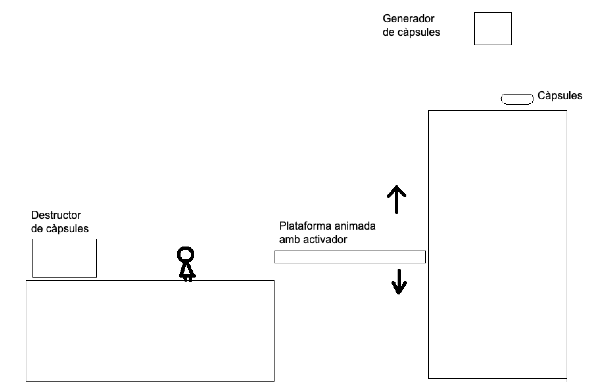

# Exercici

Fes una "demo" de plataformes en 3D en la que:

- Hi ha un personatge amb dues animacions "quiet", "caminant"
    * Opcional: posa una tercera animació "corrent" i que vagi a més velocitat que caminant

- Hi ha una plataforma animada que fa un cami "amunt / avall" quan el personatge s'hi posa al damunt
    * Opcional: si el personatge ha fet servir la plataforma per "baixar" ha de sortir per tornar a activar l'animació "amunt"

- A l'espai superior on només s'arriba amb la plataforma hi ha un generador de "capsules" quan es fa "click" amb el mouse
    * Opcional: el player pot portar les capsules d'una en una al principi de la pantalla on queden destruides

 