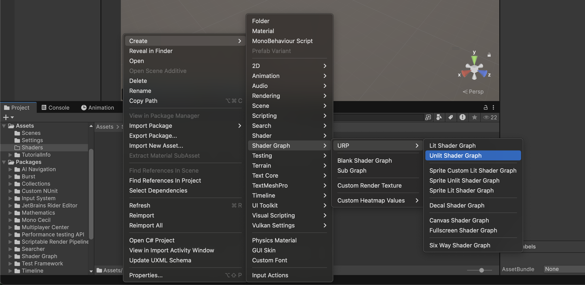
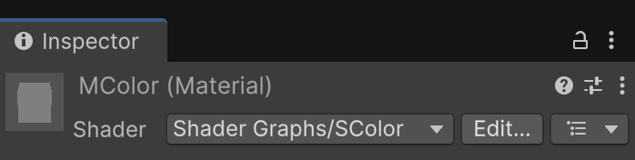
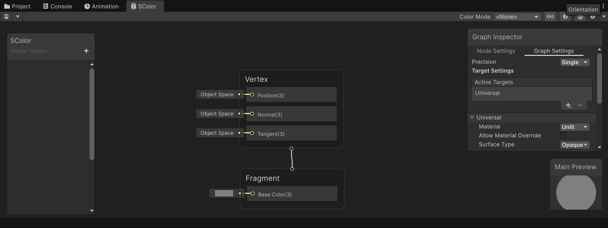
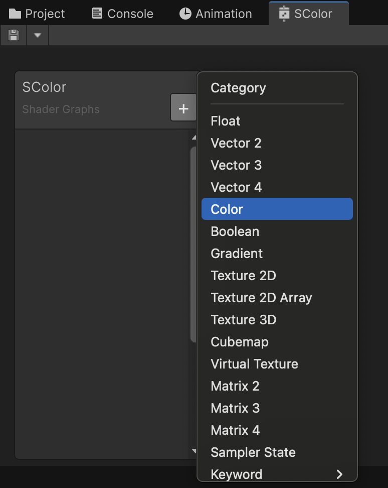
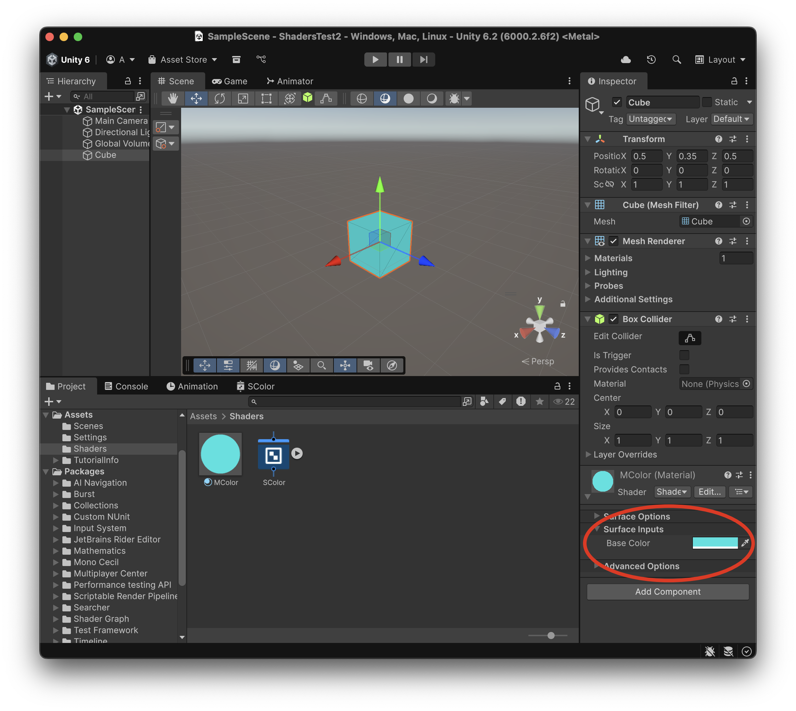

# Shaders

Els **shaders** permeten fer càlculs a la tarja gràfica, que seríen molt costosos de fer al processador.

Així es poden fer efectes especials, amb acceleració gràfica.

**Unity** a més, té una eina per definir *shaders* de manera gràfica, sense aprendre el llenguatge de programació de cada motor gràfic *(Vulkan, DirectX, Metal, ...)*

Els shaders d'aquest tutorial estàn a:

*Assets > DemoShaders.unitypackage*

*Cal tenir **ProBuilder** per veure els exemples.*

## Projecte

Fes un nou projecte tipus **"Universal 3d"** anomenat **ShadersTest**

Als *Assets* crea una nova carpeta **"Shaders"**

## Primer Shader

A la carpeta *Assets > Shaders* crea un nou **"Unlit Shader"** i anomena'l **"SColor"**

*Create > Shader Graph > URP > Unlit Shader Graph*

 

Amb el *"botó dret"* a sobre de l'icona del shader, crea un nou material amb:

- *Create Material*

Anomena al nou material **"MColor"**, fixa't a l'**Inspector** del material, que automàticament té el shader **"SColor"** assignat:

 

Fes doble click a sobre del *shader* per obrir la pestanya de definició del shader.

 

Inicialment només es veuen les sortides del material:

- **Vertex**: controla els valors que afecten la geometria de l’objecte (per exemple, la posició dels vèrtexs o la seva deformació).

- **Fragment** controla els valors que afecten el color, la llum i l’aparença visual de cada fragment (píxel) de la superfície.

A l'esquerra tenim un espai on podem definir els paràmetres que l'usuari podrà configurar del nostra *shader*.

Apreta el botó **+** i afegeix un paràmetre de tipus **Color** anomenat **"Base Color"**

 

Arrossega el nou paràmetre **"Base Color"** cap a l'area del gràfic, i connecta la seva sortida amb l'entrada de **"Fragment > Base Color(3)"**

<video src="./assets/primer-dragparameter.mov" width="600" controls></video>

Això farà, que el color escollit per l'usuari s'apliqui com a color de sortida del shader.

> **NOTA**: És **MOLT IMPORTANT!** guardar el shader apretant el **disquet** cada vegada que volguem aplicar els canvis a l'escena.

 

Crea un nou objecte tipus *3D Object > Cube* a l'escena:

- Posa'l a la posició X:0, Y:0, Z:0
- Aplica-li el material *"MColor"*

Veuràs que inicialment el material és completament negre, però que pots canviar el color amb el selecctor de:

*Inspector > MColor (Material) > Surface Inputs > Base Color*

 

