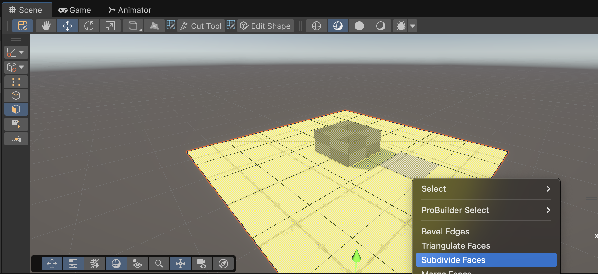
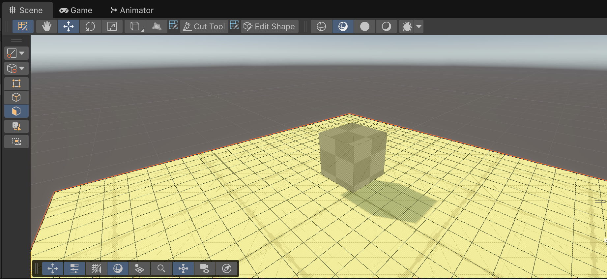
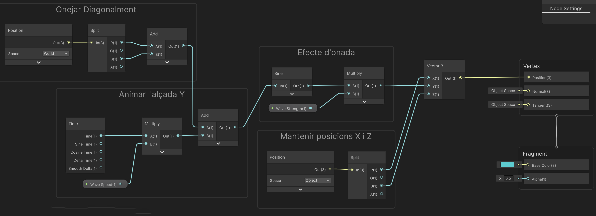
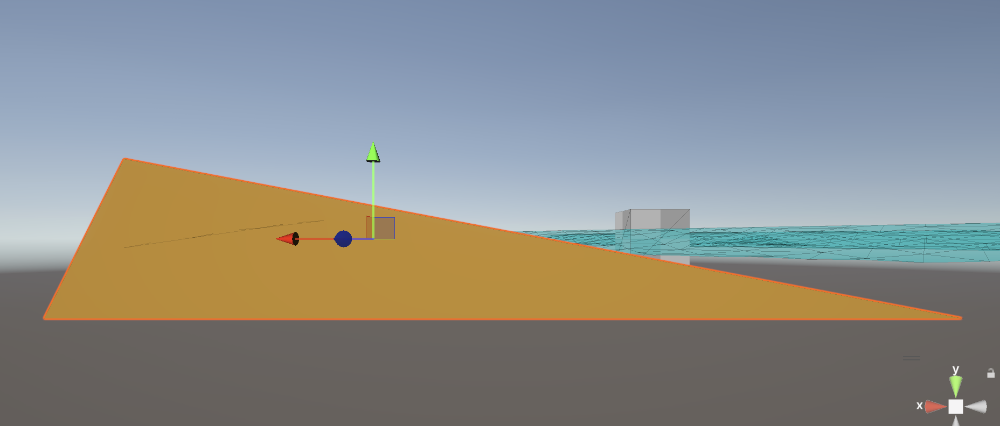
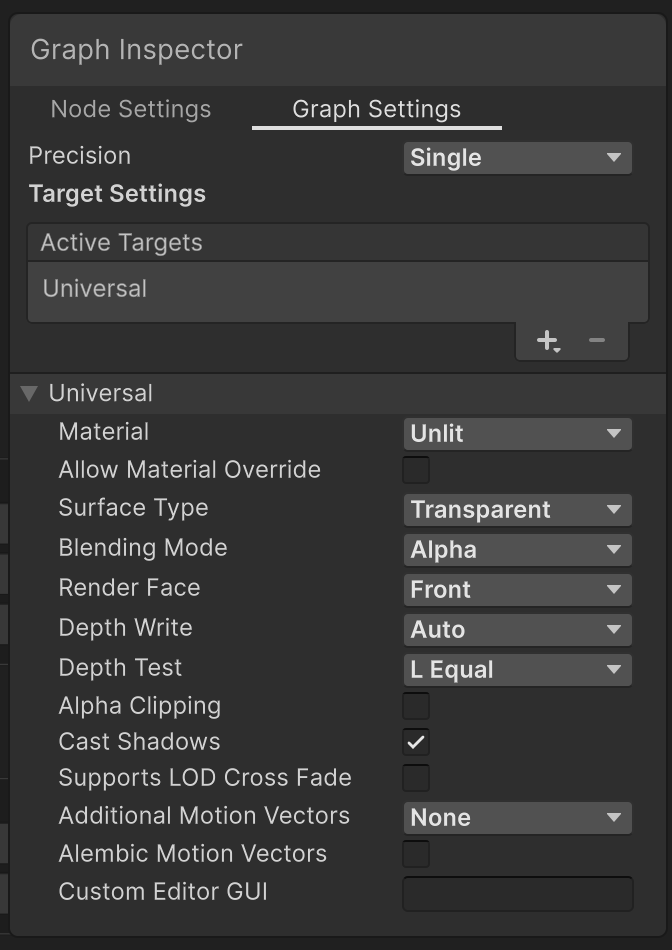
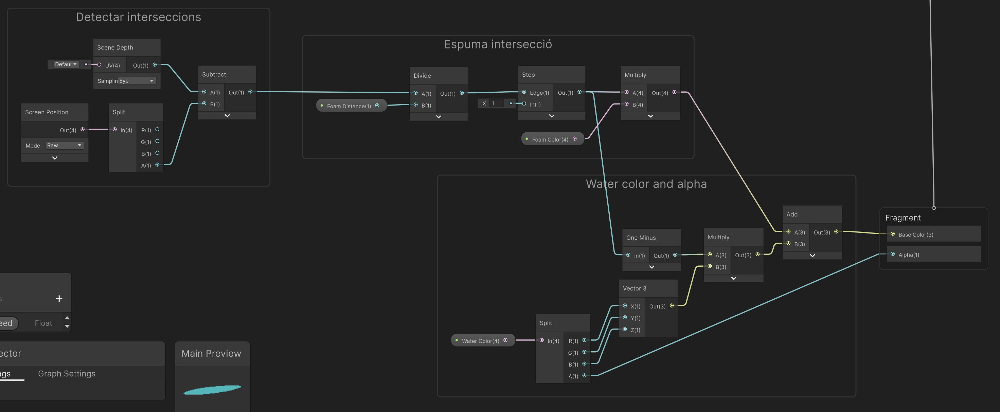
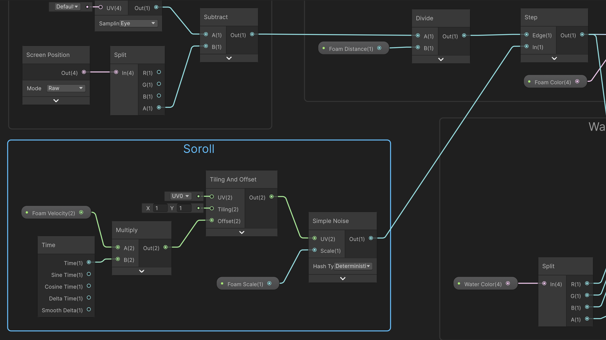

# Tècniques

> **Nota**: En aquest apartat s'expliquen algunes tècniques per definir *shaders*, hi ha maneres més òptimes i realistes de definir aigua (veure apartat **Llibreries**).

## Vertex Shader

Els *shaders* no només permeten modificar el color de cada píxel, també permeten modificar la posició dels vèrtex.

- Afegeix **"ProBuilder"** al projecte amb:

*"Menú Window > Package Management > Package Manager > Unity Registry > Cerca ProBuilder > Install"*

## Objecte pla

Crea un nou pla amb *ProBuilder > Plain*:

- Escull totes les seves cares amb *"Face Selection"* 
- Fes dos cops *"Subdivide Faces"*

 

- Posa'l a la posició > X:0, Y:0, Z: 0
- Escala'l a > X:2, Y:1, Z:2

 

## Onades

A la carpeta *Assets > Shaders*:

- Crea un nou *Create > Shader Graph > URP > Unlit Shader Graph* anomena'l **"SWave"**
- Amb el *"botó dret"* a sobre del shader crea un nou material anomenat **"MWave"**
- Arrosega el nou material sobre l'objecte del pla **"Plane"**

Fes doble click a *"SWave"* per obrir l'editor del *shader*, necessitem dos paràmetres de tipus *"Float"*:

- **Wave Speed**: valor per defecte *"Default Value"* a 0.5
- **Wave Strength**: valor per defecte *"Default Value"* a 0.25

Crea l'estructura de nodes de la imatge.

Per agrupar-los i anotar la funció de cada grup, selecciona els nodes del grup i amb el botó dret fes *"Group Selection"*

 

Fixa't que:

- El primer **Position** està en coordenades món, així unir diversos objectes amb aquest shader els connecterà correctament.
- El segon **Position** està en coordenades objecte, per mantenir les posicions X i Z on han d'estar
- Al animar l'alçada, multipliquem per la velocitat a la vol l'usuari l'animació.
- El moviment ondulant es fa amb una funció ["Sine"](https://en.wikipedia.org/wiki/Sine_and_cosine) té forma de ona.
- Finalment ajuntem les posicions Y generades amb les originals X i Z

S'ha de veure el pla animat com si fóssin onades:

<video src="./assets/tec-wavesanim.mov" width="600" controls></video>

## Platja

Modifica el color del material **"MColor"** perquè sigui ataronjat.

Afegeix un nou *"ProBuilderPrism"*, assigna-li el color anterior i fes que:

- **Position** > X:5, Y:0, Z:0
- **Scale** > X:1, Y:1, Z:10

Estira la cara que dóna a l'aigua per donar forma a la platja, de costat hauria de quedar:

 

## Interseccions

Les **interseccions** són aquelles zones on l'objecte xoca amb altres objectes, en aquest cas voldrem "dibuixar-hi" espuma.

Canvia la configuració del *shader* a *Graph Inspector > Graph Settings*

- **Surface Type**: Transparent
- **Depth Test**: L Equal (less than or equal)

> **Nota**: Fixa't que al fer la superfície transparent, apareix l'entrada *"Alpha(1)"* al **"Fragment"**

 

Afegeix nous paràmetres al *shader*:

- **Foam Distance**: de tipus slider amb valor mínim 0, màxim 10 i per defecte 0.15
- **Foam Color**: amb valor per defecte *"color blanc"*
- **Water Color**: amb valor per defecte blau (R: 0, G: 205, B: 209, A: 200)

Aleshores genera aquest graf al shader i connecta'l a:

- *"Fragment > Base Color(3)"*
- *"Fragment > Alpha(1)"*

 

La feina d'aquests shaders és mostrar una "espuma/foam" al col·lisionar l'aigua amb altres polígons.

- Detecta les interseccions mirant la matriu de profunditat entre l'aigua i altres objectes (només funciona per objectes opacs)

- Defineix quanta distància activa l'espuma, i el color d'aquesta

- Barreja el resultat anterior (dibuix de l'escuma) amb el color de l'aigua, però manté l'alpha definit amb el color de l'aigua.

<video src="./assets/tec-foamanim.mov" width="600" controls></video>

## Soroll

Afegir *soroll* permetrà donar cert realisme a l'escuma. Afegeix dos nous paràmetres:

- **Foam Velocity**: de tipus Vector2 i valors per defecte X:0.02 i Y:0.01
- **Foam Scale**: de tipus Float i valor per defecte X: 500

Aleshores genera aquest graf al shader i connecta'l a:

- *"Step > In(1)"*

 

En aquesta part: 

- Generem una imatge de soroll *"Simple Noise"* que animem amb un temporitzador.
- Fem que aquest soroll decideixi si es mostra escuma o no.

<video src="./assets/tec-noiseanim.mov" width="600" controls></video>

El resultat és que ja no es veu una franja d'escuma sencera, sinó que la textura de soroll fa que sigui més realista.

<video src="./assets/tec-finalresult.mov" width="600" controls></video>

