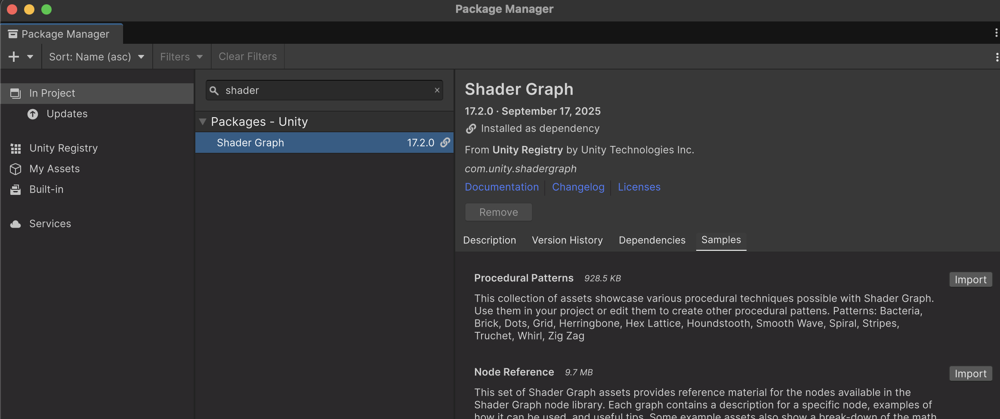
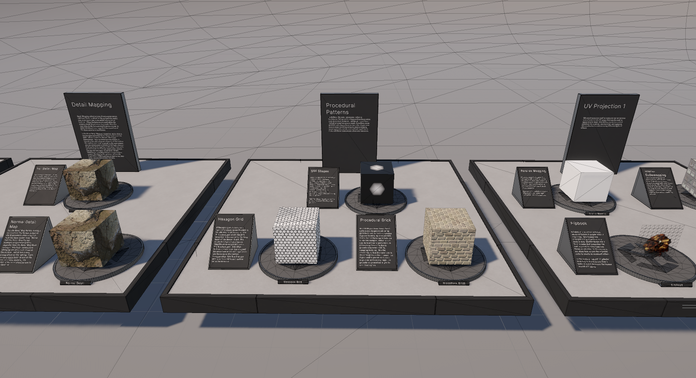
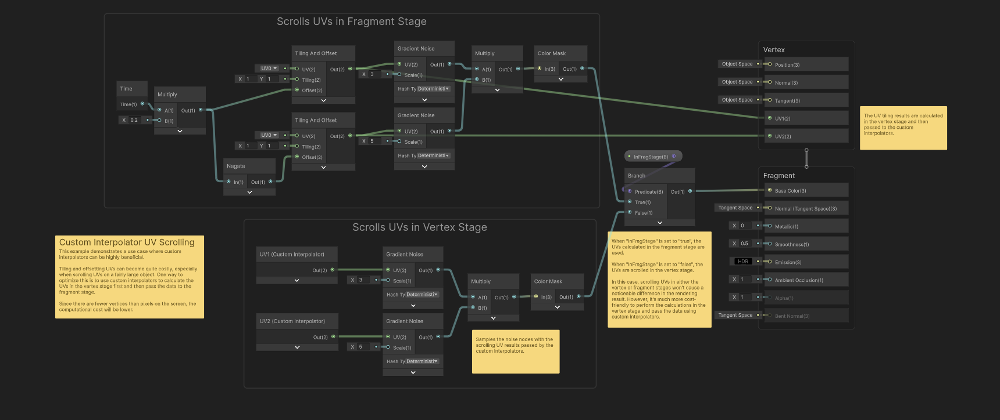
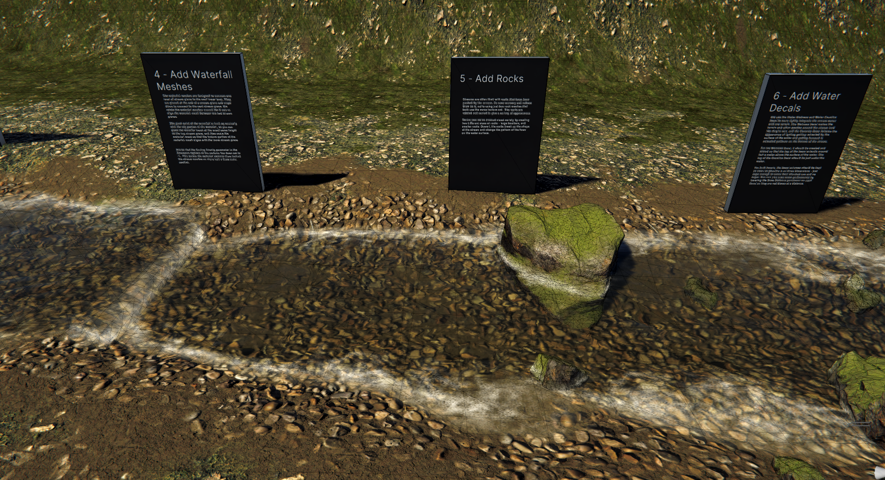

# Llibreries

**Unity** té un paquet amb shaders professionals pre-definits, per a veure tècniques i aprendre a fer-ne de nous.

Al package manager:

*Menú Window > Package Management > Package Manager*

A la pestanya **"In Project"** buscar: **"Shader Graph"**

El paquet està instal·lat, però no tots els seus mòduls, cal anar a **"Samples"**

 

## Feature Examples

Exemples simples, obrir l'escena de demostració a:

*Assets > Samples > Shader Graph > XX.Y.Z > Feature Examples > Scenes > URPFeatureExamplesScene.unity*

 

Els shaders estàn comentats amb notes explicatives:

 

## Production Ready

Exemples professionals avançats, obrir l'escena de demostració a:

*Assets > Samples > Shader Graph > XX.Y.Z > Production Ready Shaders > Scenes > URPProductionReadyShaders.unity*

 