# Nodes

Els **shaders** es formen a partir de diferents tipus de nodes:

- Generadors
    - **Checkerboard**: crea un patró quadriculat repetitiu.
    - **Voronoi**: genera cel·les irregulars amb aspecte orgànic.
    - **Noise**: produeix textures aleatòries i naturals.
    - **Gradient**: crea transicions suaus entre colors o valors.
    - **UV**: dona la posició de cada píxel dins la textura.

- Modificadors
    - **Clamp**: limita un valor dins un mínim i un màxim.
    - **Remap**: transforma un rang de valors en un altre.
    - **Smoothstep**: fa una transició suau entre dos límits.

- Operacions de múltiples entrades
    - **Add**: suma dos valors.
    - **Subtract**: resta dos valors.
    - **Multiply**: multiplica dos valors (ús freqüent per intensitat).
    - **Divide**: divideix un valor per un altre.
    - **Dot Product**: calcula semblança de direcció entre vectors.
    - **Cross Product**: calcula un vector perpendicular a dos vectors.
    - **Lerp**: barreja entre dos valors segons un factor.

- Colors i transparència
    - **Color**: defineix un color constant.
    - **Blend**: combina dos colors segons un mode.
    - **RGB / HSV**: converteix i modifica components del color.
    - **Alpha:** controla la transparència final del píxel.
    - **Alpha**: controla la transparència final del píxel.

- Animacions
    - **Time**: proporciona el temps del joc per animar valors.
    - **Sine Time**: crea moviments ondulats amb el temps.
    - **Scroll UV**: desplaça una textura al llarg del temps.
    - **Rotate**: gira coordenades UV per animacions circulars.

- Sortides
    - **Vertex**: modifica la posició dels vèrtexs per deformacions.
    - **Fragment (Color)**: defineix el color final del píxel.

## Generadors

Al definir generadors deixa escollir "Channels" de textura, UV0 ... un model 3D pot tenir diversos desplegaments UV simultanis (textura principal, lightmaps, detalls, animacions)

**Checkerboard**: 

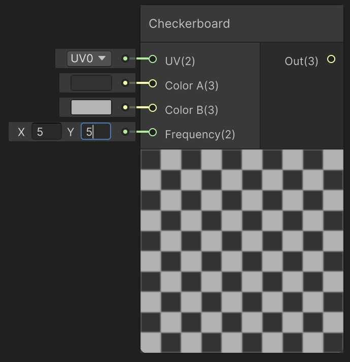

 

**Voronoi**: 

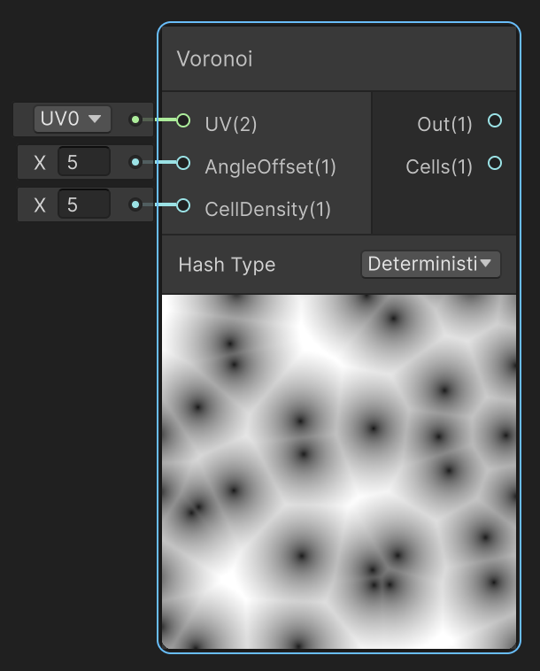

 

**Noise**: 

 

**Gradient / Gradient Noise**: 

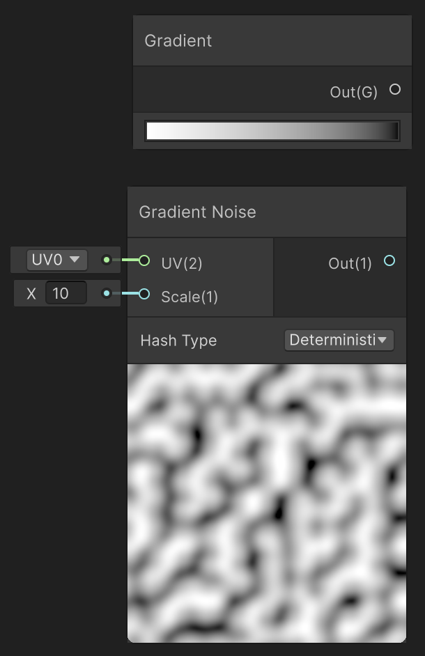

 

**UV**: 

 

## Modificadors

Com que unity té definits objectes amb tres valors com a X,Y,Z aquests poden fer referència a coordenades (X, Y, Z) o també a colors Red, Green, Blue (R, G, B)

**Clamp**

Limita els valors entre un mínim i un màxim, en aquest exemple es limita el color vermell (X = Red) a estar sempre entre 0.2 i 0.8

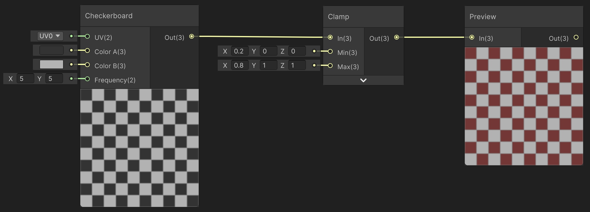

 

**Remap**

Transforma rangs de valors, a l'exemple:

- In X = 0.1 aclareix el negre
- In Y = 0.1 enfosqueix el negre
- Out X = 0.1 enfosqueix el blanc
- Out Y = 0.1 fa el blanc menys brillant

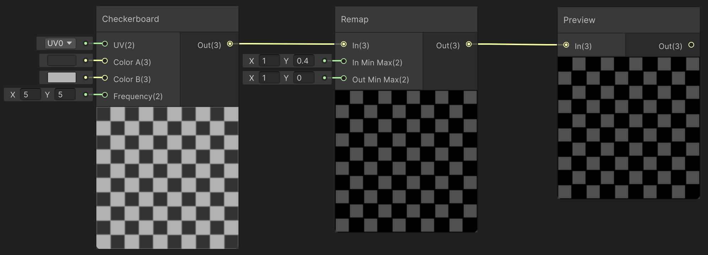

 

**Smoothstep**

Transforma rangs de valors, a l'exemple:

- In X = 0.1 aclareix el negre
- In Y = 0.1 enfosqueix el negre
- Out X = 0.1 enfosqueix el blanc
- Out Y = 0.1 fa el blanc menys brillant

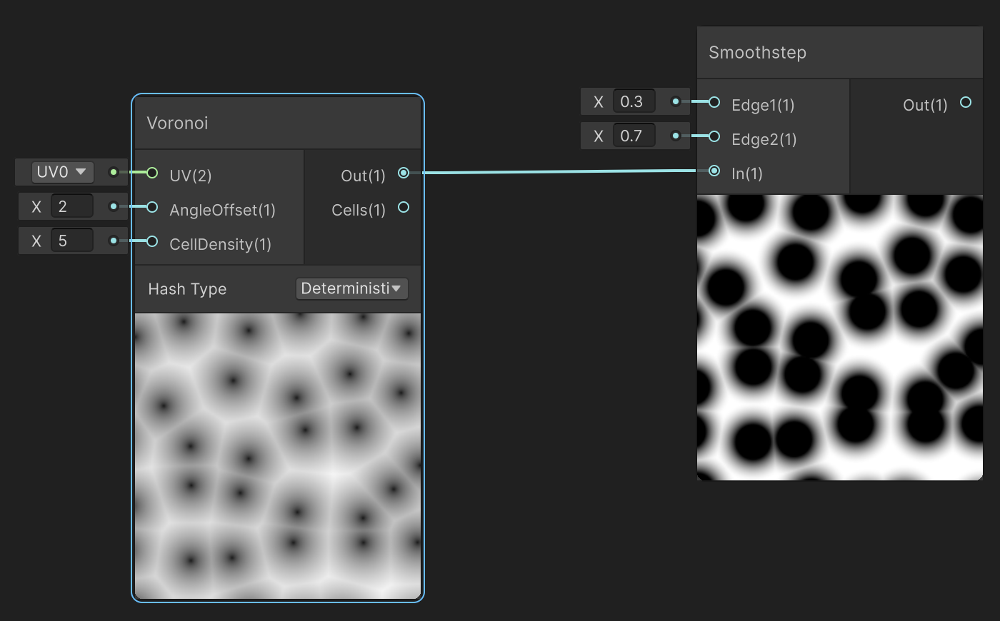

 

## Operacions de múltiples entrades

**Add** (sumar)

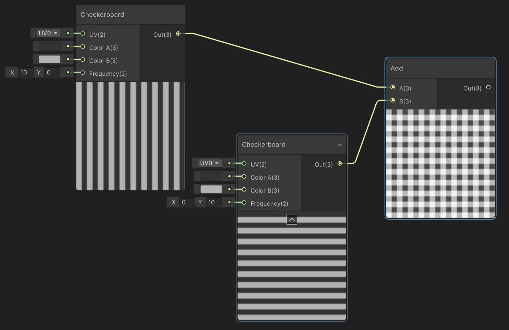

 

* *(Té la contrapart "Sub" restar)*

**Multiply** (multiplicar)

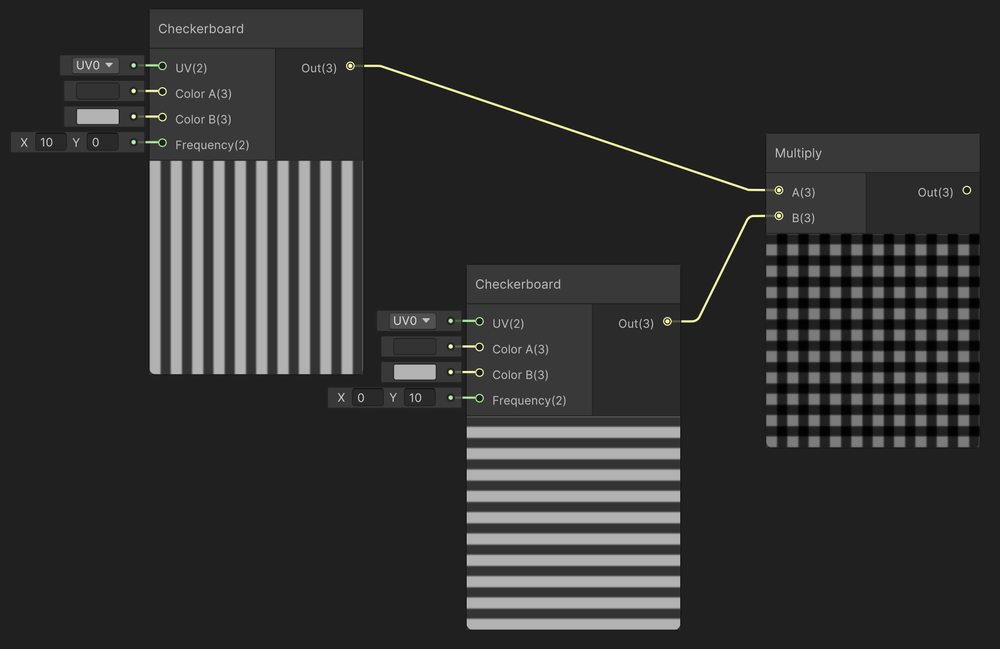

 

**Multiply** (multiplicar)

 

* *(Té la contrapart "Divide" dividir)*

**DotProduct**

Dot = (R_A * R_B) + (G_A * G_B) + (B_A * B_B)

- Si un píxel és negre en una de les textures 
    (A=0 o B=0) → Dot = 0
- Si és blanc en totes dues 
    (A=1 i B=1) → Dot = 1
- Si tens grisos intermigs → surt un valor entre 0 i 1

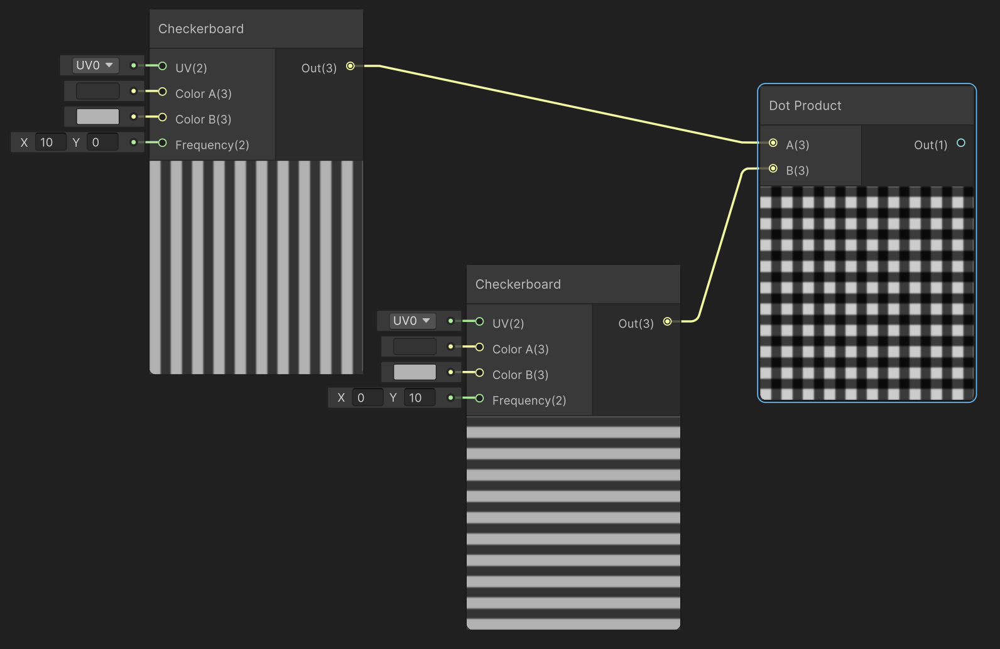

 

**Lerp**

Barreja entre dos valors segons un factor

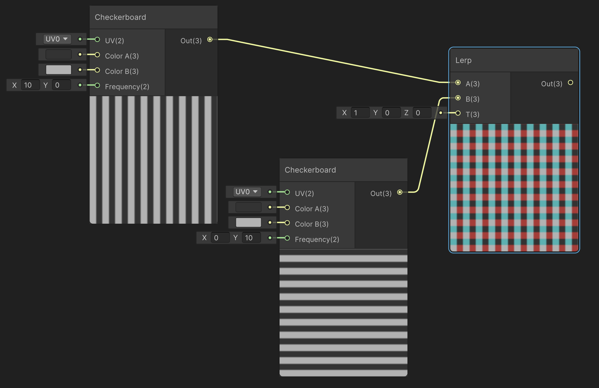

 

## Tractament de colors

Es poden canviar les operacions anteriors i els nodes de colors.

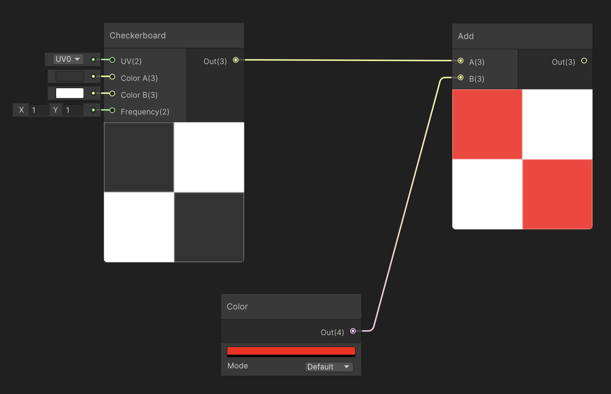

 

**Blend** combina dos colors segons un mode.

A l'exemple es veu per entrades 'voronoi' dos efectes d'aplicar *"Blend"* amd diferent mode:

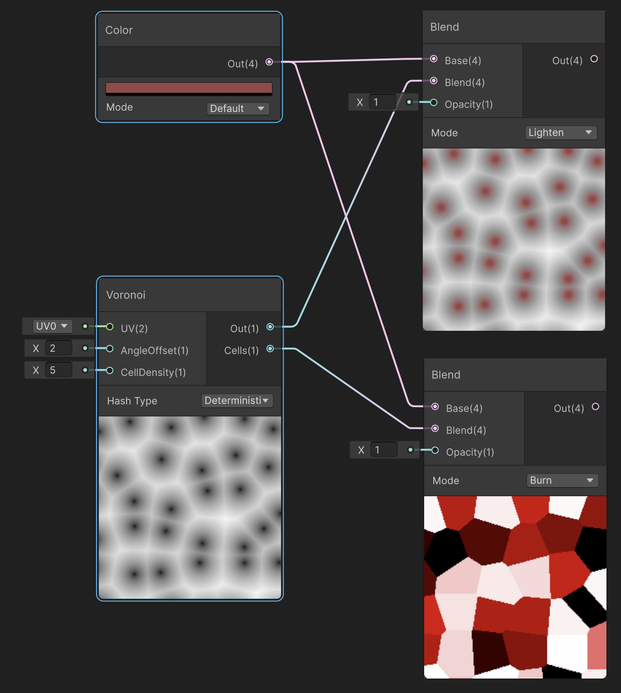

 

## Temps i animacions

**Coordenades UV**

Per poder animar les coordenades UV cal una entrada *"UV"* sumada amb el temps, però com que el temps va molt ràpid primer cal multiplicar-lo per un valor menor a 1.

En aquest exemple poser un "Vector 2" per animar només l'eix X, si volem animar tots dos eixos es pot connectar directament el Multiply amb l'entrada de l'Add.

<video src="./assets/nodes-animuvsin0.mov" width="600" controls loop></video>

**Pixels individuals**

Per modificar individualment els valors U i V de la posició UV de la textura es pot fer servir:

- **Split**: divideix les coordenades en components
- **Combine**: ajunta els components en coordenades

Un cop separades les coordenades en components, se'ls poden aplicar funcions i animacions, abans de tornar-les a combinar i fer-les servir com a coordenades UV:

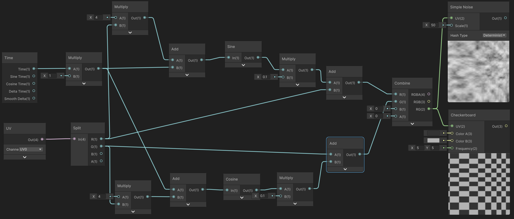

 

Cal recordar que la tarja gràfica fa aquests càlculs per cada píxel de manera paral·lela, el resultat és:

<video src="./assets/nodes-pixeluvanimvideo.mov" width="500" controls loop></video>

