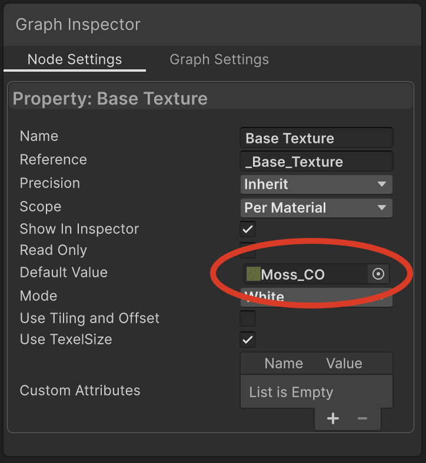
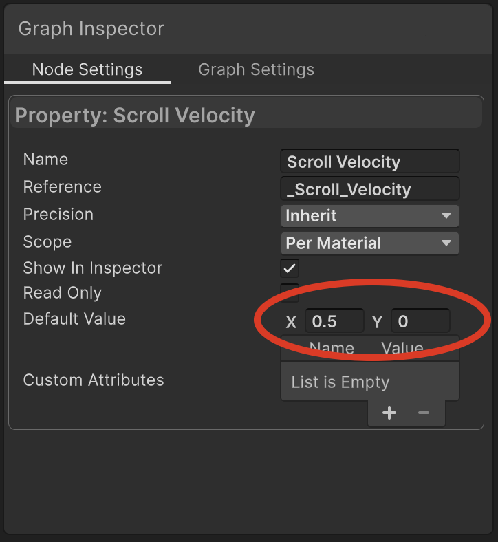
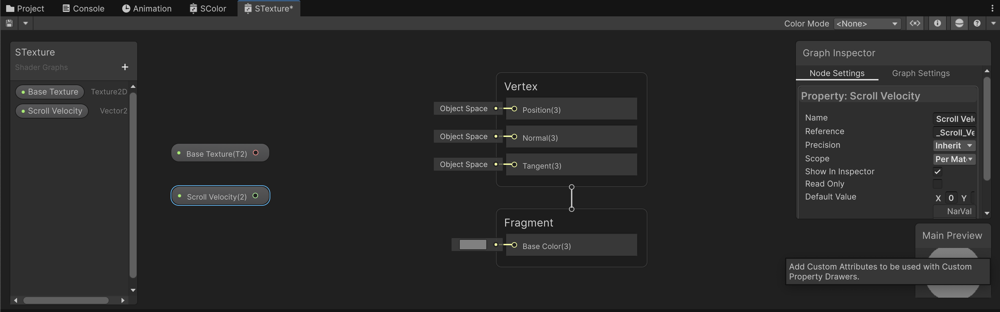
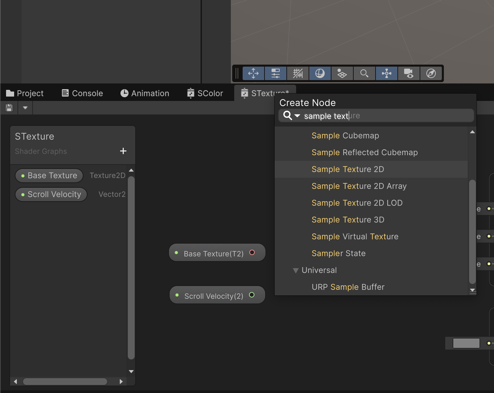
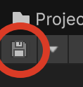
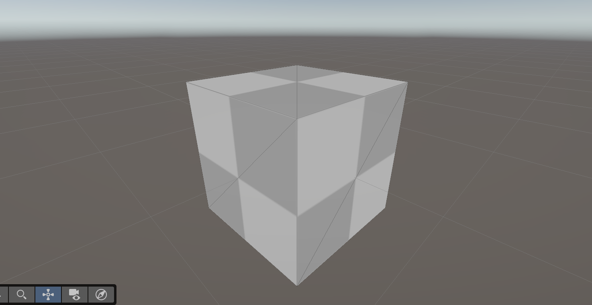
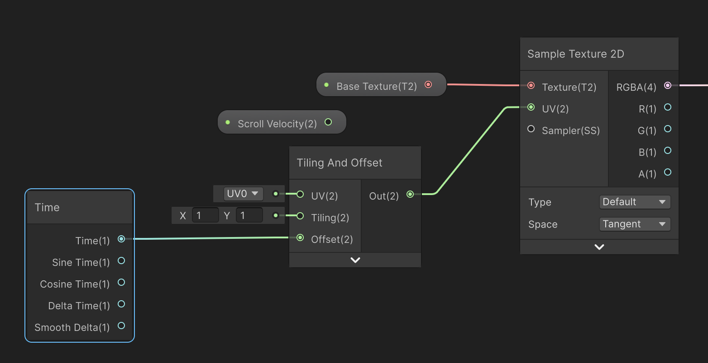
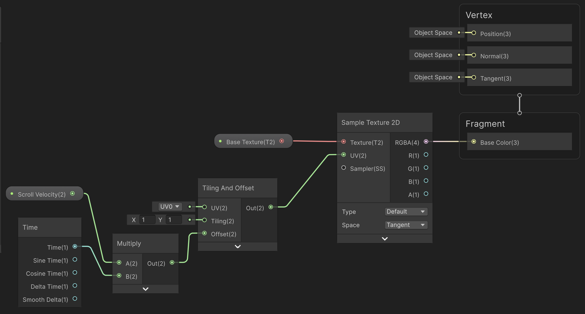
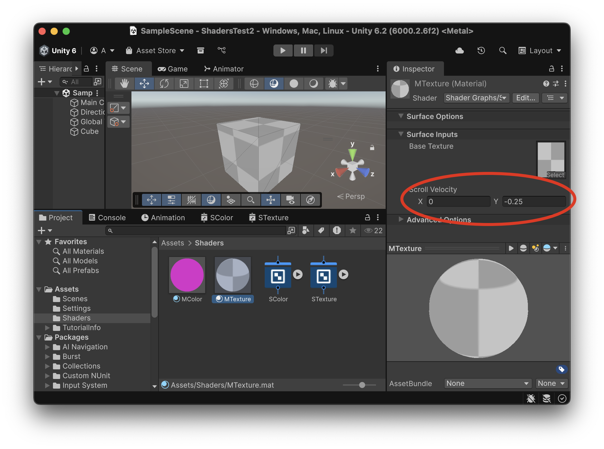

# Textura UV

Animar els paràmetres UV d’una textura directament dins d’un shader té diverses avantatges.

- Millor rendiment (GPU vs CPU)
- Animacions molt fluides
- Menys memòria i fitxers
- Efectes avançats

    - Scrolling
    - Mapes de soroll
    - Rotació

A la carpeta *Assets > Shaders* crea un nou *shader*:

*Create > Shader Graph > URP > Unlit Shader Graph*

i anomena'l **"STexture"**

## Material

Amb el botó dret a sobre del *shader* **"STexture"** crea un nou material, anomena'l **"MTexture"** i assigna'l a l'objecte **"Cube"**

Així podrem veure els canvis que fem al shader *"en temps real"*.

Obre la pestanya del *shader* fent *"doble click"* al seu damunt.

## Paràmetres

Per aquest shader necessitem els següents paràmetres:

- **Base Texture**: de tipus **"Texture 2D"**
    - Escull una textura a "Default Value", per exemple *"Default_Checker"*
- **Scroll Velocity**: de tipus **"Vector2"**
    - Default Value > X: 0.5
    - Default Value > Y: 0

 

 

Arrosega els nous paràmetres a l'àrea de definició del shader.

 

## Definir el shader

A part de crear paràmetres d'entrada, al shader s'hi poden afegir nodes amb funcions pre-definides que s'anomenen **nodes**.

Amb el *"botó dret"* a l'àrea de definició del shader, afegeix un nou node tipus:

*Create Node > Busca i escull "Sample Texture 2D"*

 

Connecta:

- La sortida del paràmetre **"Base Texture"** amb l'entrada **"Texture (T2)"**
- La sortida **"RGBA(4)"** amb **"Fragment > Base Color(3)"**

 

Apreta **"Save Disk"** per guardar:

 

Hauries de veure la textura aplicada a l'objecte:

 

### Moure posicions UV

Les posicions **"UV"** defineixen el desplaçament *"X i Y"* a la hora d'aplicar la textura.

- **"Sample Texture 2D"** llegeix el color d’una textura a partir de les coordenades UV que li dones. Però no permet desplaçar la textura.

- **"Tiling i Offset"** fa una transformació afegida sobre les UV originals i per tant les desplaça.

Afegeix un nou node tipus **"Tiling i Offset"** i connecta la seva sortida **"Out(2)"** a l'entrada **"UV(2)"**

Com que volem que el desplaçament sigui animat, necessitem un node tipus **"Time"** i connecta la seva sortida **"Time(1)"** a l'entrada **"Offest(2)"**

 

Guarda i comprova com ara la posició de la textura està animada en els dos eixos *X* i *Y*.

<video src="./assets/primer-preview01.mov" width="400" controls></video>

Però volem poder controlar la velocitat de moviment en cada eix, a través del paràmetre **"Scroll Velocity"**.

Afegeix un node tipus **"Multiply"** i connecta:

- La sortida del paràmetre **"Scroll Velocity(2)"** a l'entrada **"A(2)"**
- La sortida de **"Time(1)"** a l'entrada **"B(2)"**
- La sortida **"Out(2)"** a l'entrada **"Offset(2)**

Guarda el *shader* i ja està definit.

 

### Testejar valors

A l'inspector del material **"MTexture"** prova diferents valors pels paràmetres:

- X: -1, Y: 0
- X: 1,  Y: 1
- X: 0,  Y: 0.5
- X: 0,  Y:-0.25

 