# Exemples *"Super Mario 3D World"*

Recull de textures que semblen generades amb shaders:

## Parets i formacions rocoses:

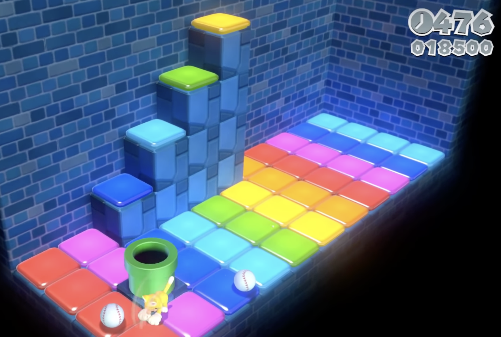

 

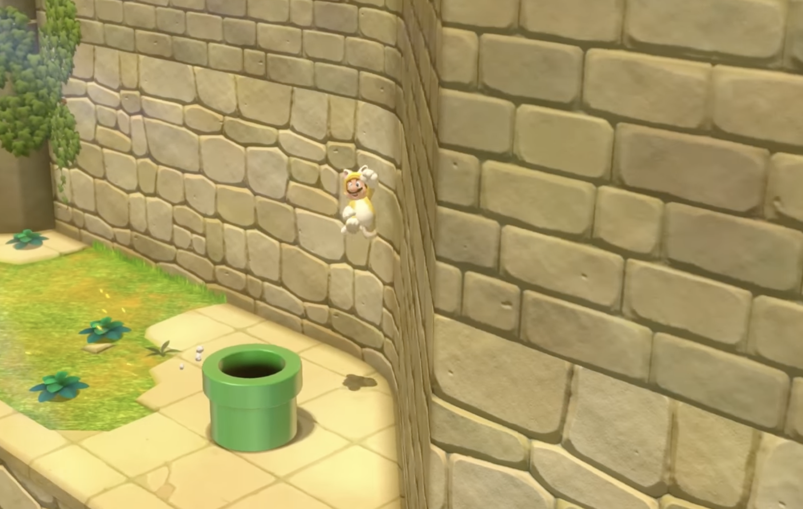

 

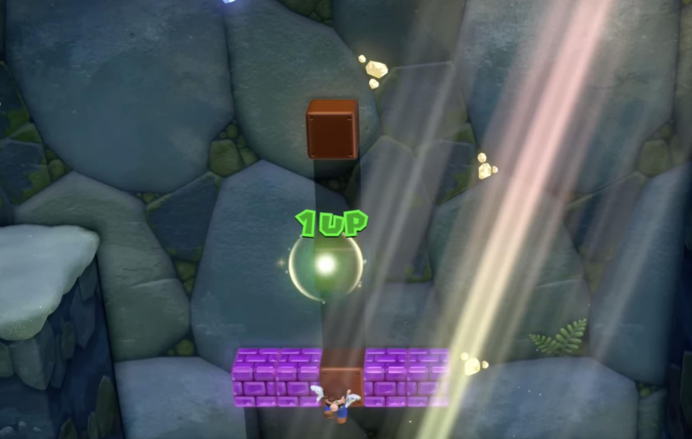

 

## Terres, aigua, sorra i gel:

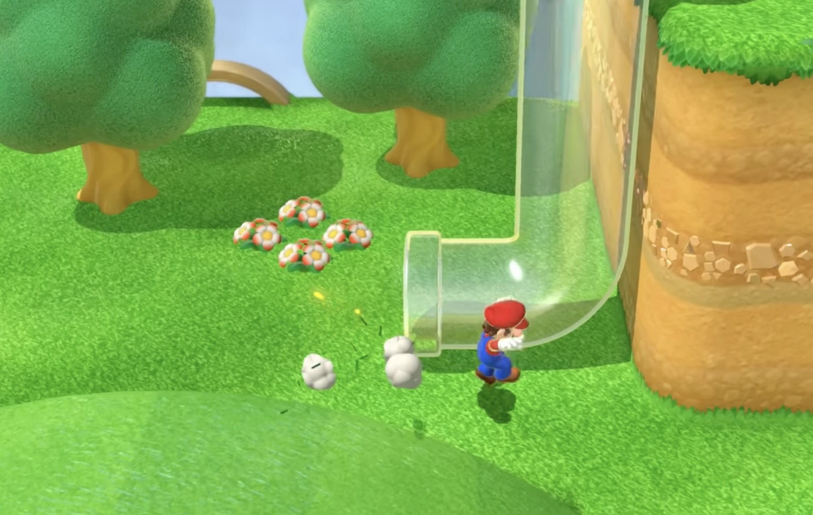

 

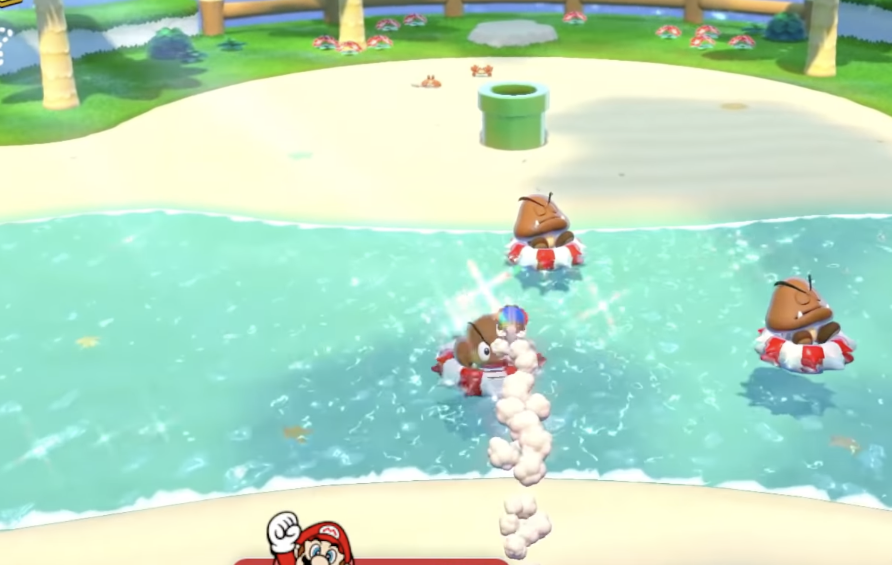

 

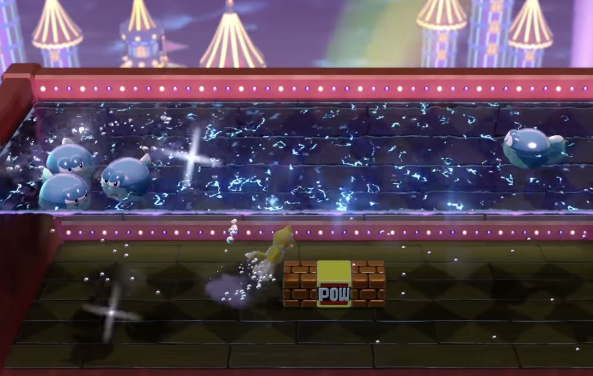

 

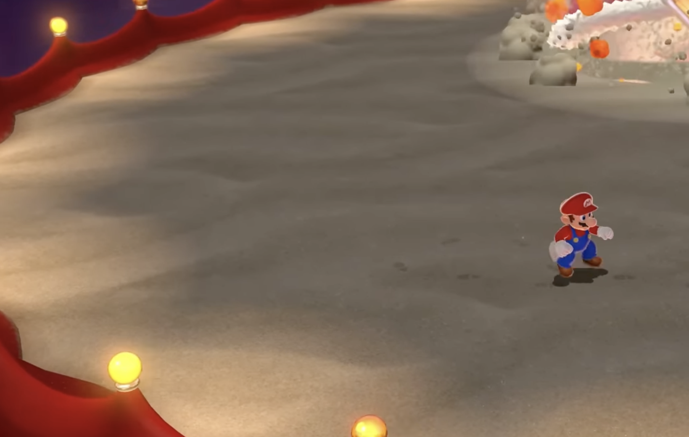

 

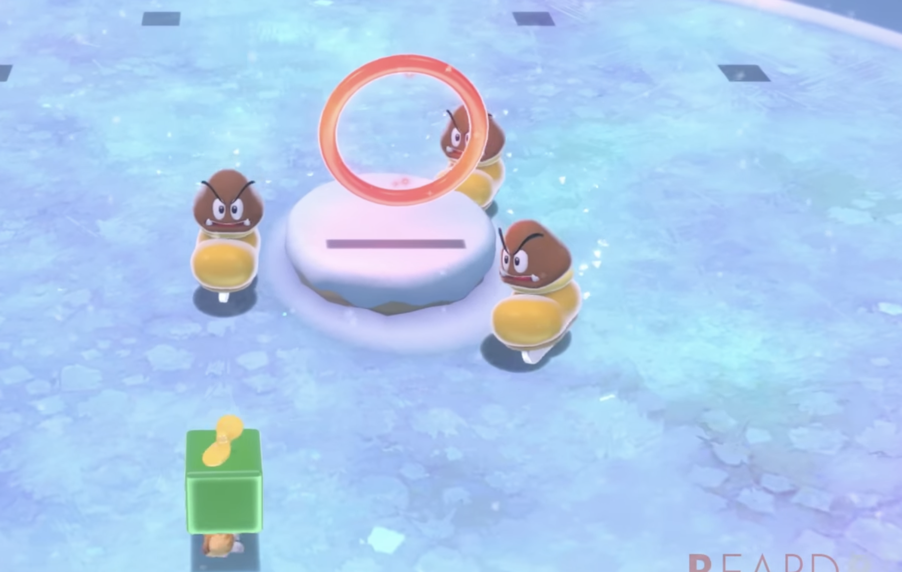

 

## Tecnologia, lava, fantasia:

 

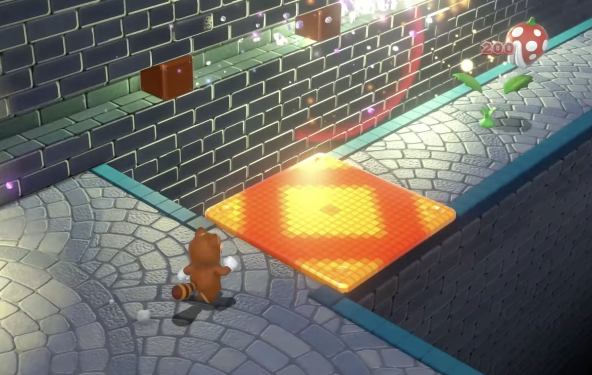

 

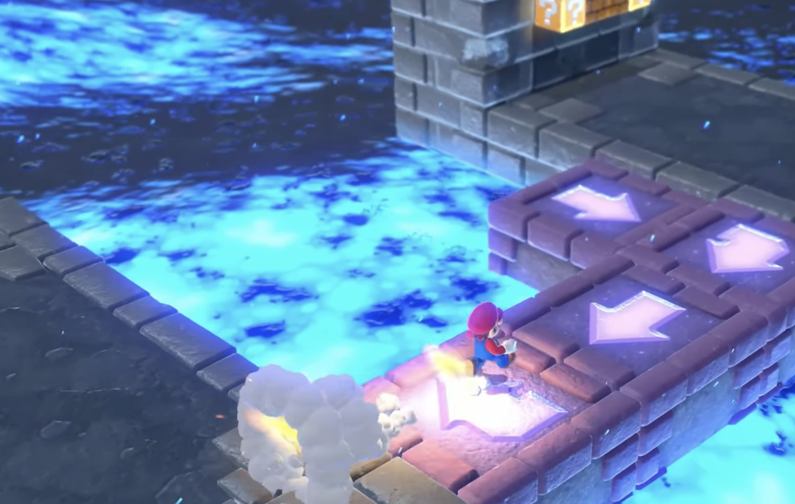

 

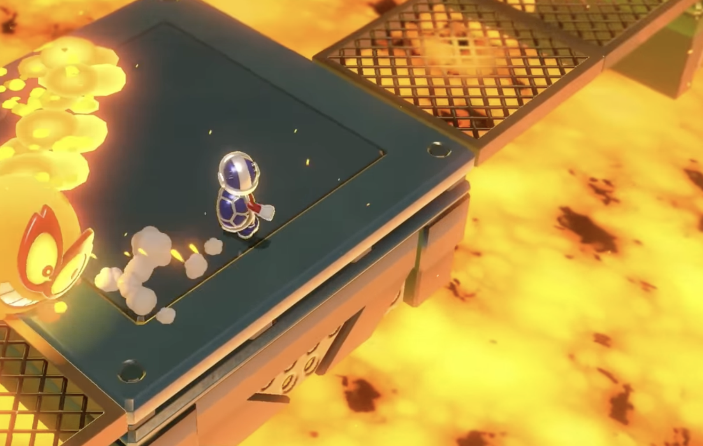

 

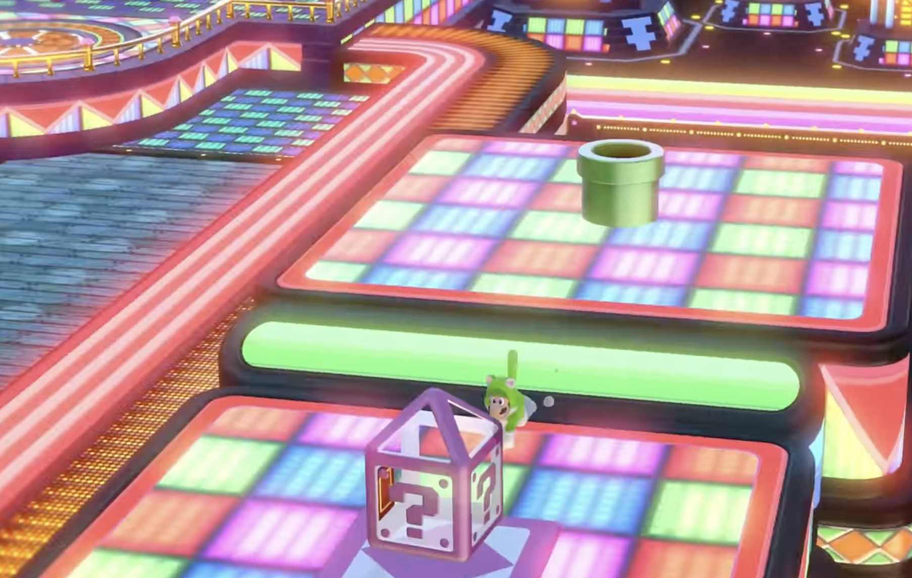

 

 

## Tèxtils:

 