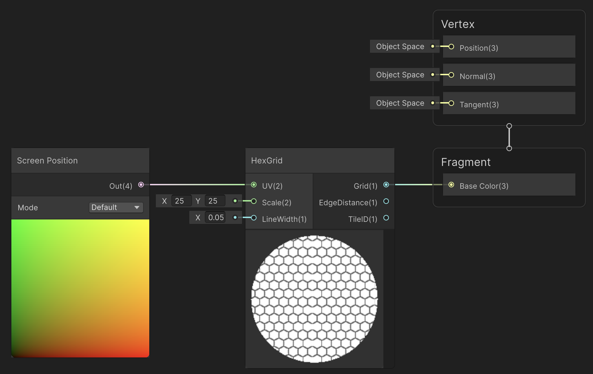
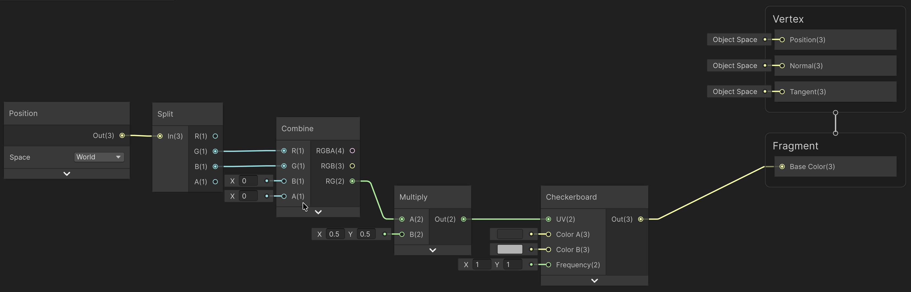
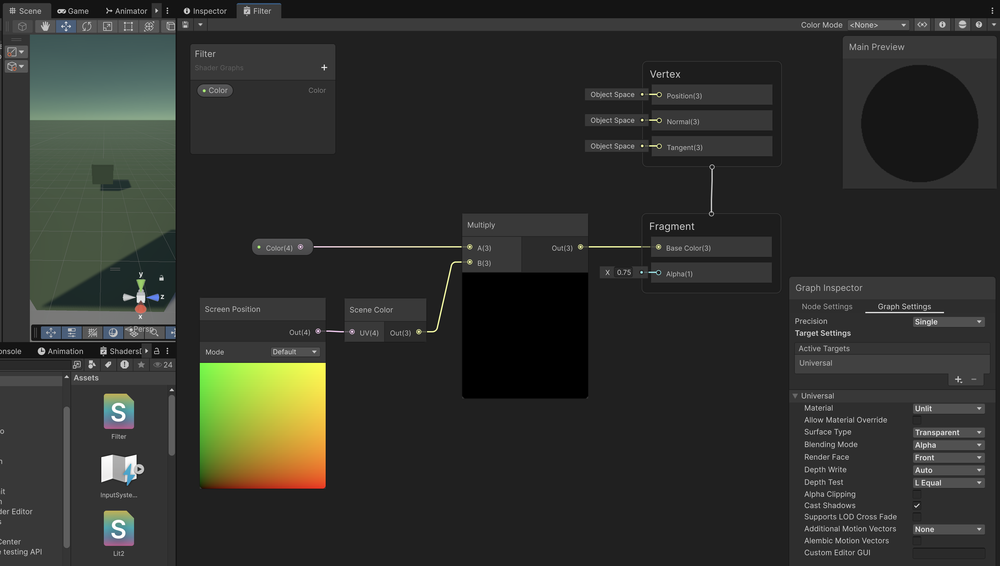

# Tècniques habituals

[Vídeo Guinxu, Shaders](https://www.youtube.com/watch?v=U21gkelGwiA)

## Coordenades

Els shaders poden tenir en compte diferents referències de coordenades:

- UV amb **coordenades pantalla**, encara que moguis la càmera o l'objecte mantenen la textura:

 

<video src="./assets/tecniques-coordsScreenDemo.mov" width="400" controls loop></video>

 

- **Coordenades món**, encara que moguis l'objecte manté la textura (però la càmera es pot moure):

 

<video src="./assets/tecniques-coordsWorldDemo.mov" width="400" controls loop></video>

 

## Filter

Filter els pixels per crear efectes com canvis de color o de posició dels píxels.

### Shader de canvi de color

Perquè funcioni és important que el shader sigui transparent:

Graph Inspector > Graph Settings > Surface Type > Transparent

- **Screen position** retorna la posició d'un pixel a la pantalla
- **Scene color** retorna el color del píxel en una escena

Després ja només queda operar aquell píxel per canviar-lo de color:

 

### Shader de canvi de posició

Igualment necessitem un shader transparent.

Apliquem un moviment de sinus a les coordenades UV.

 

<video src="./assets/tecniques-filterDeformDemo.mov" width="400" controls loop></video>

 

## Intersection Shader

Canvia el color quan un objecte està tocant un altre.

Per exemple fer 'escuma' a l'aigua quan toca els limits.

https://www.youtube.com/watch?v=Uyw5yBFEoXo

- Intersection shader
- Shader normals objecte
- Stencil
