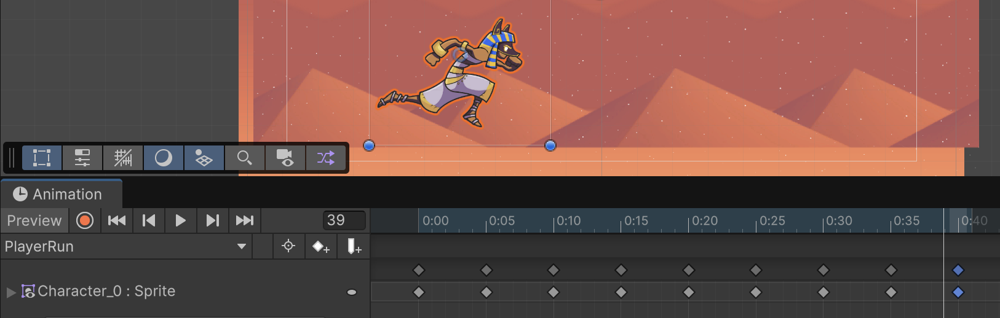
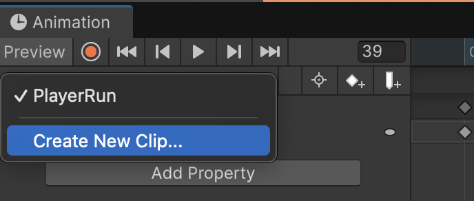
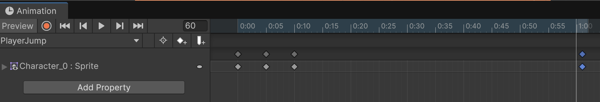

# Personatge

## Animacions

Navega als assets:
"Assets > Unity Technologies > EndlessRunner > Art"

Desplega *"Character"*

Arrosega *"Character_0"* a l'escena i anomena'l **"Player"** amb les propietats:

- Position X: -4
- Position Y: -2

Obre la finestra d'animacions i afegeix l'animació **"PlayerRun"** a la carpeta *"Animations"*

Afegeix, cada 5 segons, les imatges Character_0 fins a Character_8.

 

Crea una nova animació amb *"Create New Clip"*, anomenat **"PlayerJump"** a la carpeta *"Animations"*

 

Afegeix les imatges *"Character_9"*, *"Character_10"*, *"Character_11"*, a les posicions 0:00, 0:05, 0:10

Repeteix *"Character_11"* a la posició 1:00

 

Crea una nova animació amb *"Create New Clip"*, anomenat **"PlayerFall"** a la carpeta *"Animations"*

Afegeix únicament la imatge *"Character_12"*